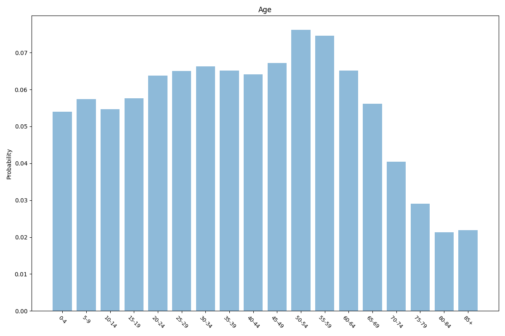
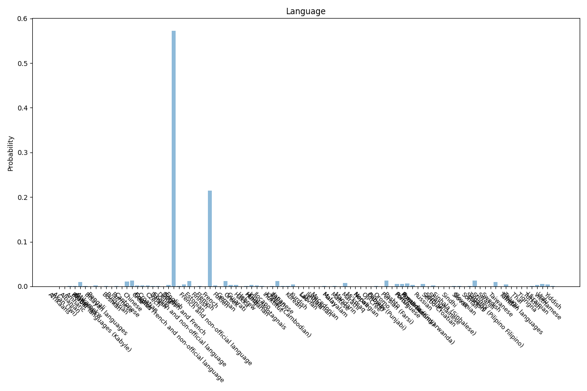

# Canada
3 features age, relationship, language.

## Age

## Relationship

## Language

## Sources

Age, relationship and language data sourced from 2011 Statistics Canada census report.

https://www12.statcan.gc.ca/census-recensement/2011/dp-pd/prof/details/page.cfm?Lang=E&Geo1=PR&Code1=01&Geo2=PR&Code2=01&Data=Count&SearchText=Canada&SearchType=Begins&SearchPR=01&B1=All&Custom=&TABID=1