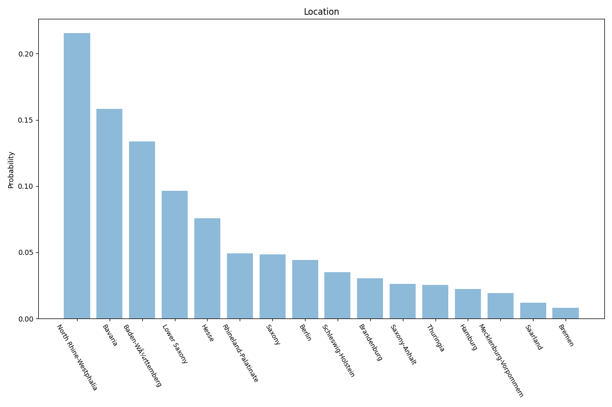
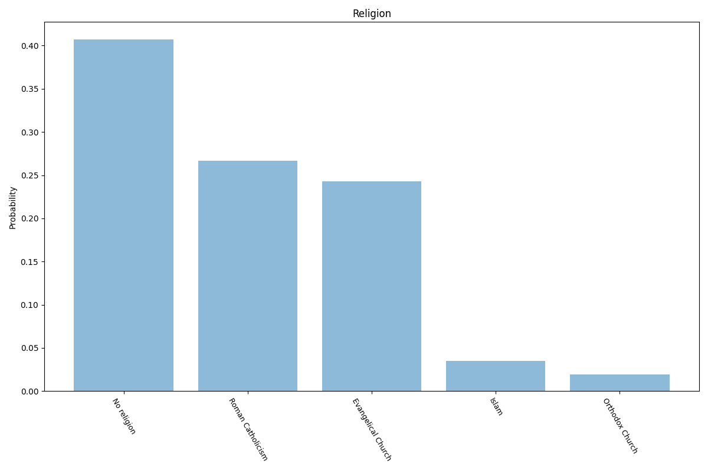
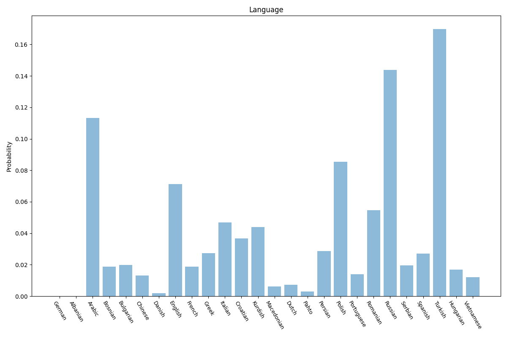

# Germany
3 features location, religion, language.

## Location

## Religion

## Language

## Sources

### Location

Bevölkerung nach Nationalität und Bundesländern https://www.destatis.de/DE/Themen/Gesellschaft-Umwelt/Bevoelkerung/Bevoelkerungsstand/Tabellen/bevoelkerung-nichtdeutsch-laender.html

### Language

Federal Statistical Office

https://www.destatis.de/DE/Themen/Gesellschaft-Umwelt/Bevoelkerung/Migration-Integration/Publikationen/Downloads-Migration/migrationshintergrund-2010220217004.pdf;jsessionid=AB98A48234888A7112E034C0E7328431.live712?__blob=publicationFile#page=503

### Religion

Religionszugehörigkeiten 2020 https://fowid.de/meldung/religionszugehoerigkeiten-2020