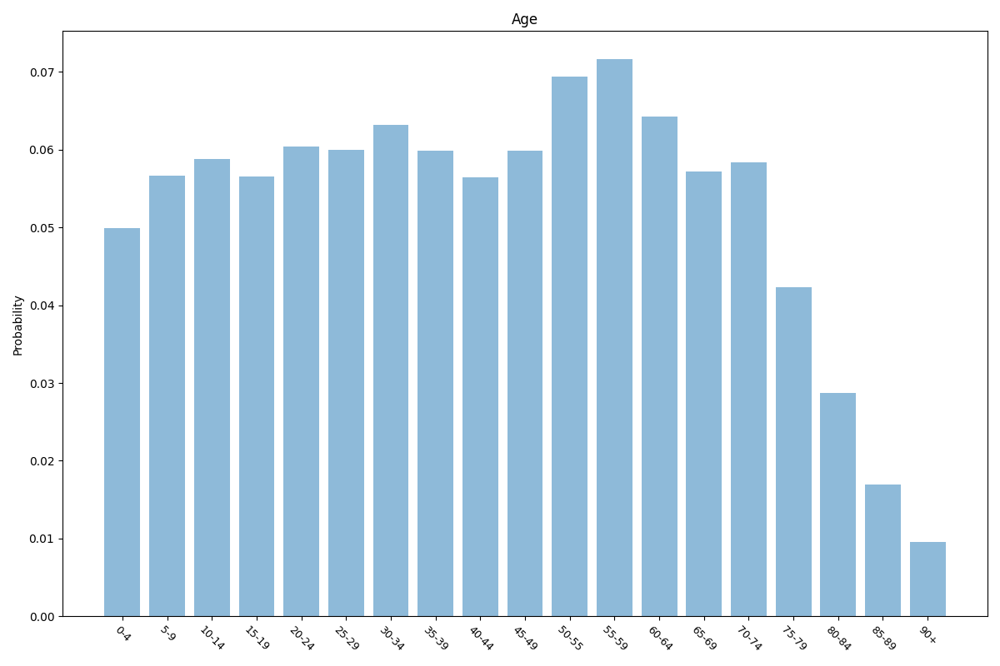
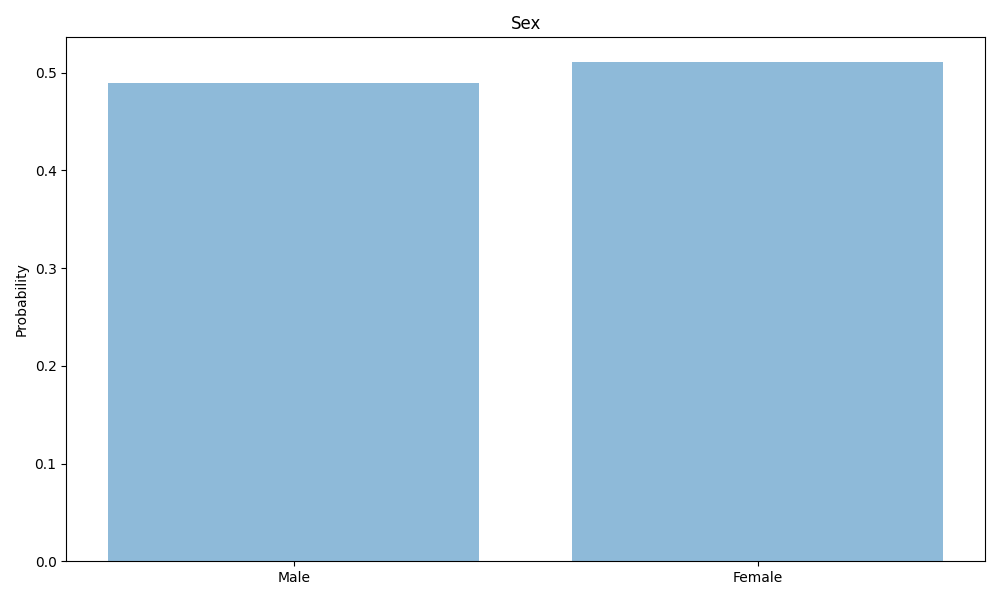
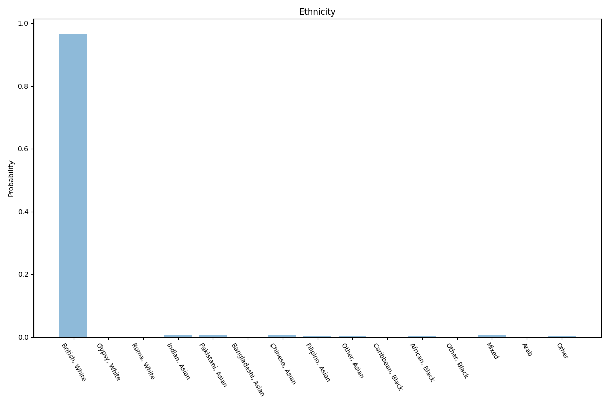
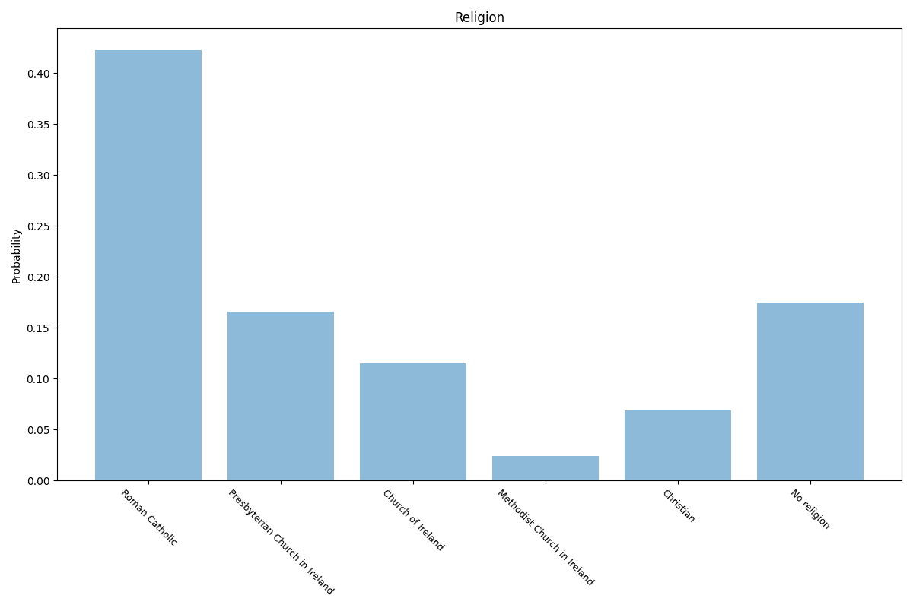
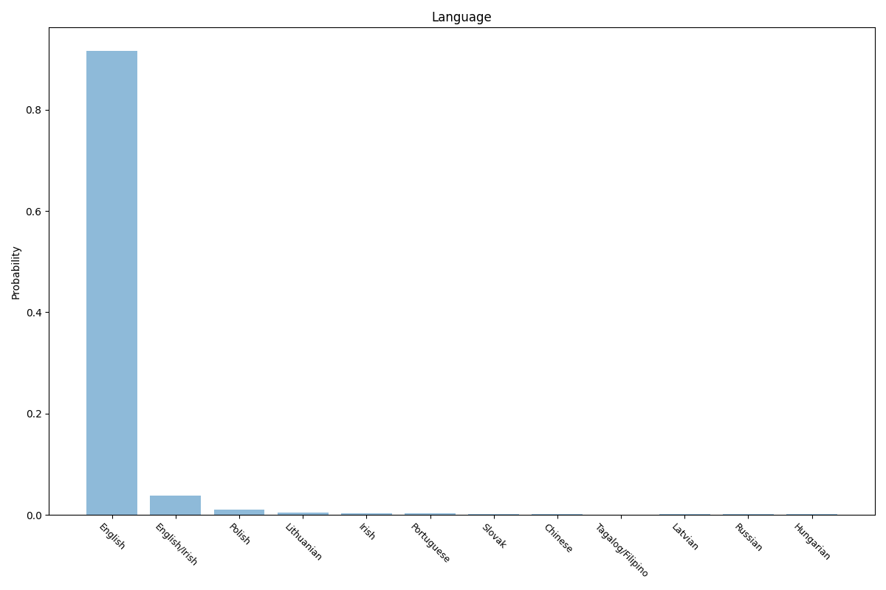
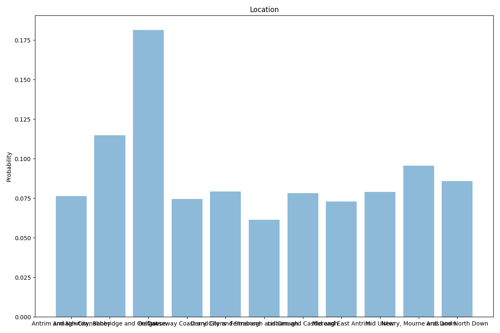

# Northern Ireland
7 features age, sex, sexuality, ethnicity, religion, language, location.

## Age

## Sex

## Sexuality

## Ethnicity

## Religion

## Language

## Location

## Sources

Location taken from 2021 NISRA Census data "Release: Census 2021 main statistics for Northern Ireland (phase 1)"

https://www.nisra.gov.uk/statistics/census/2021-census