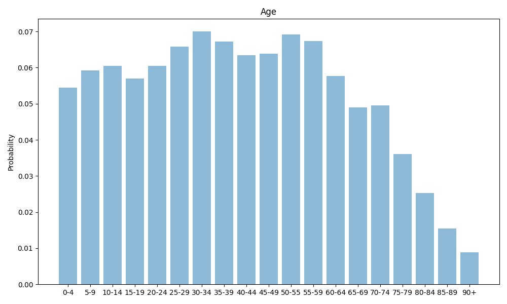
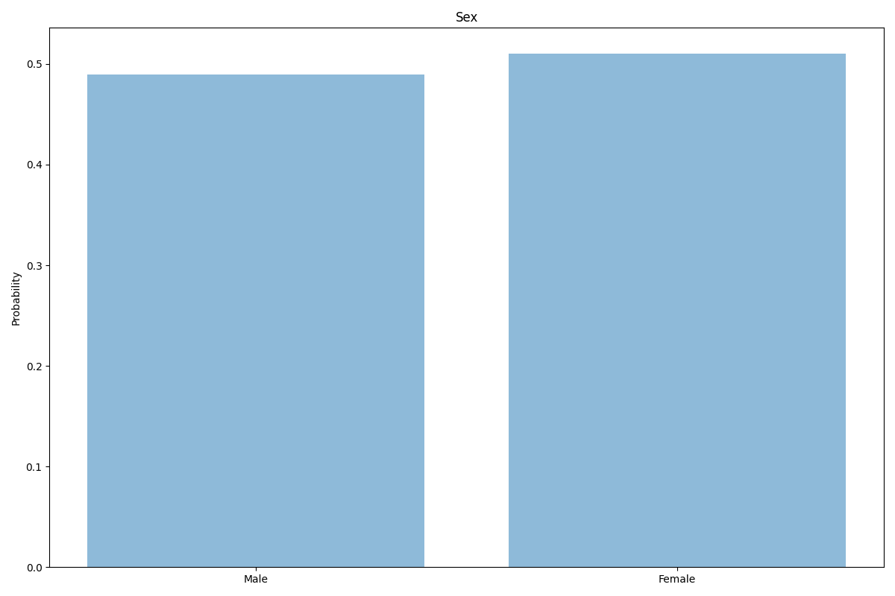
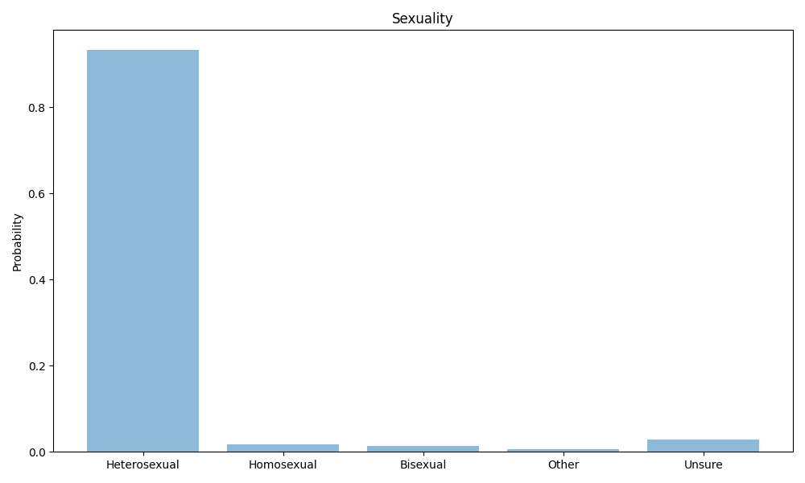
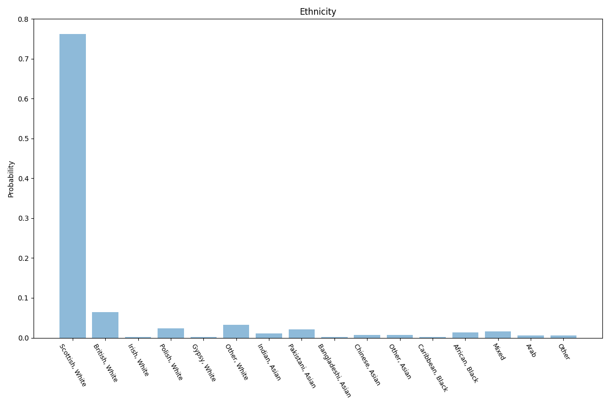
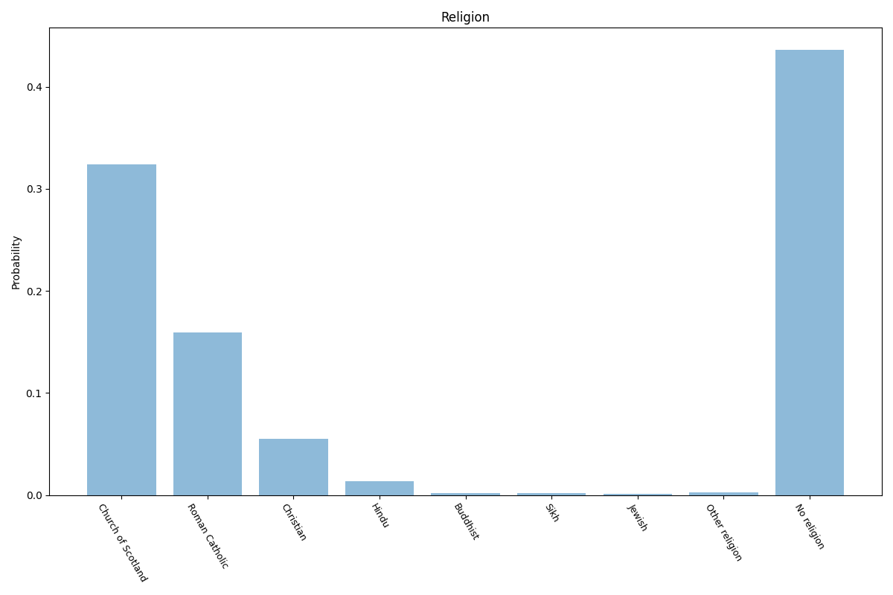
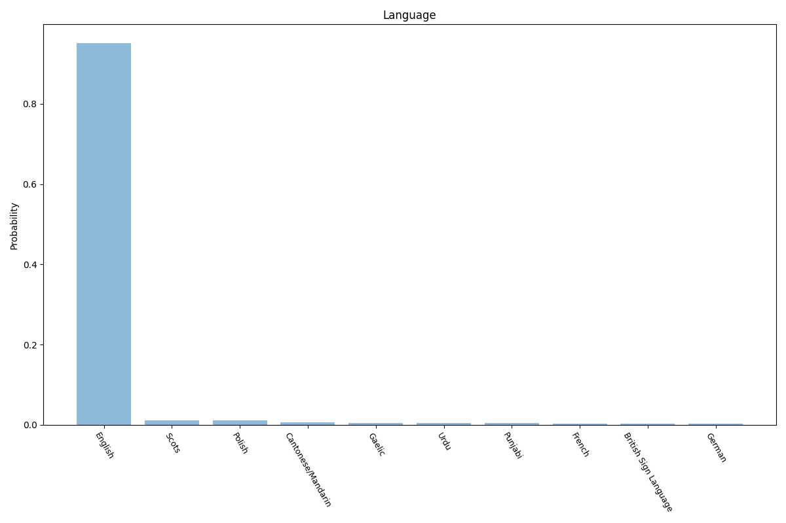
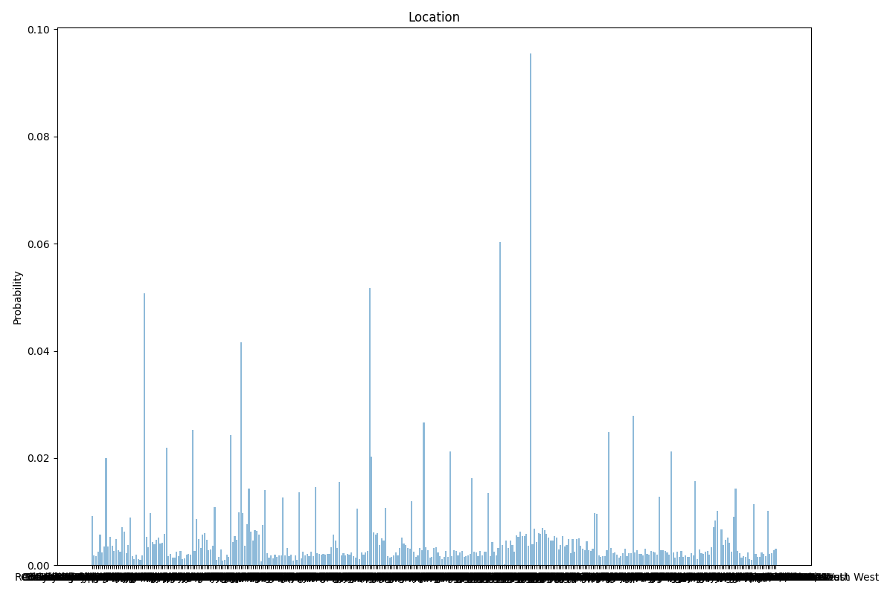

# Scotland
7 features age, sex, sexuality, ethnicity, religion, language, location.

## Age

## Sex

## Sexuality

## Ethnicity

## Religion

## Language

## Location

## Sources

https://en.wikipedia.org/wiki/Demography_of_Scotland

https://www.scotlandscensus.gov.uk/census-results/at-a-glance/population/