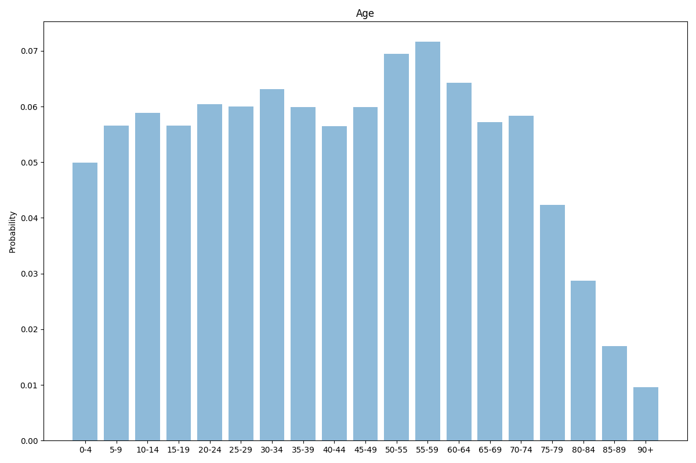
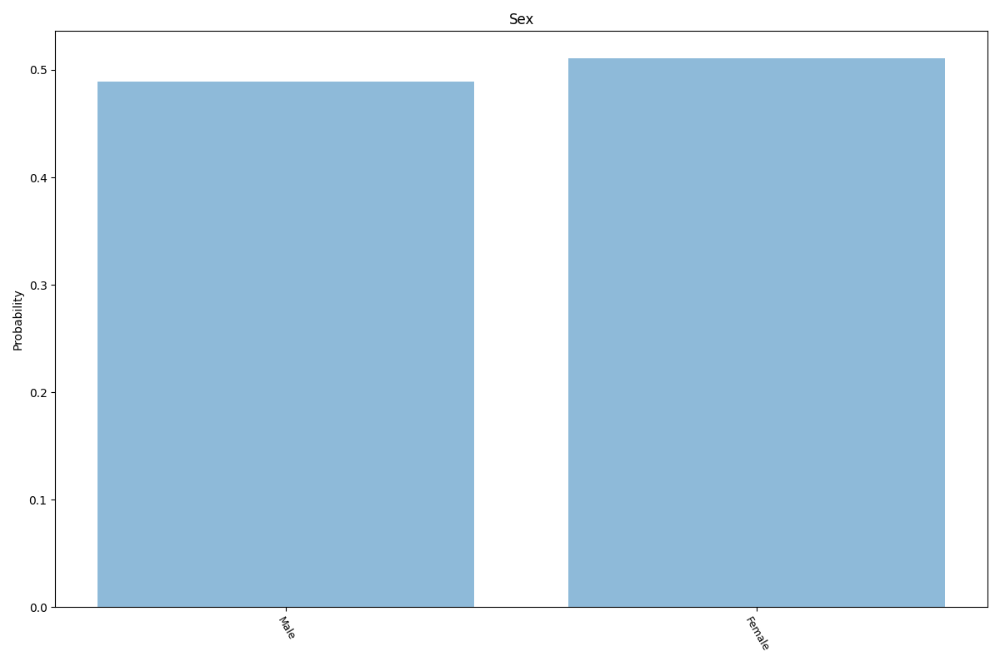
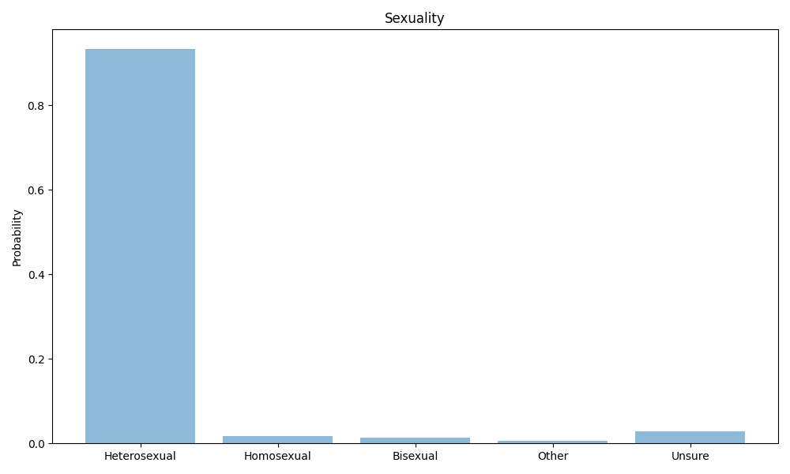
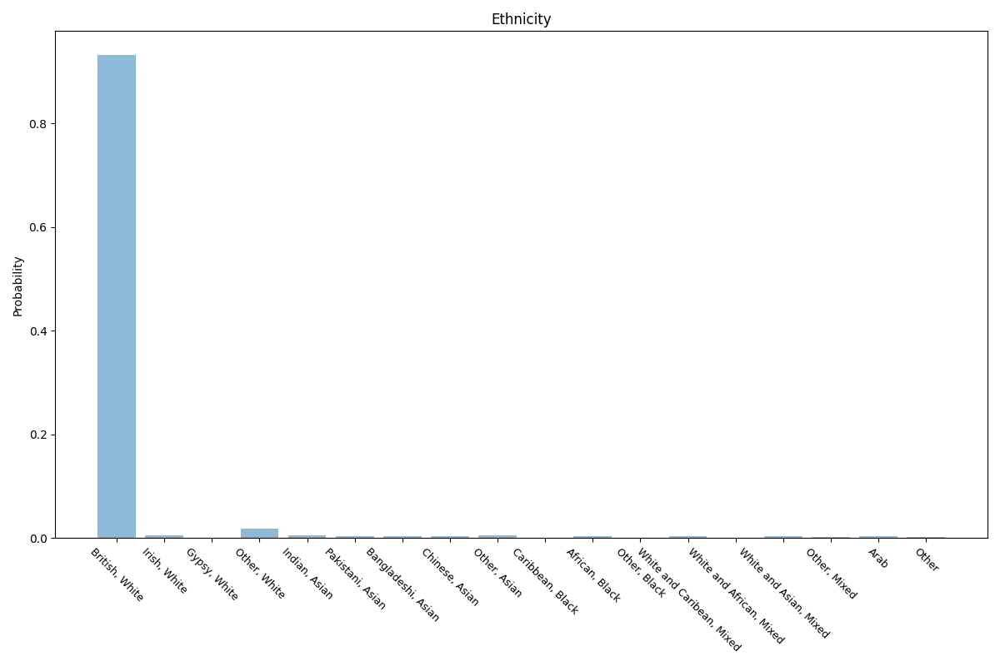
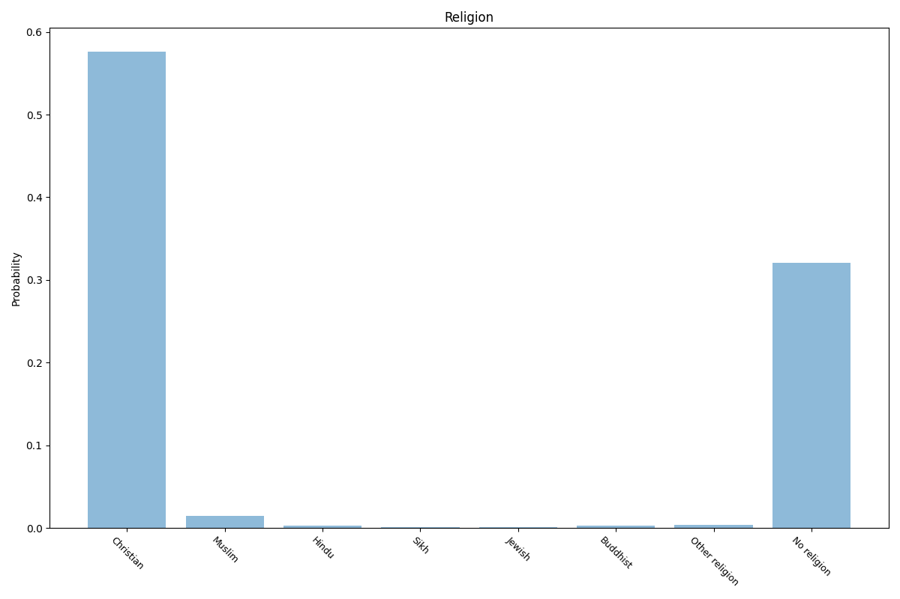
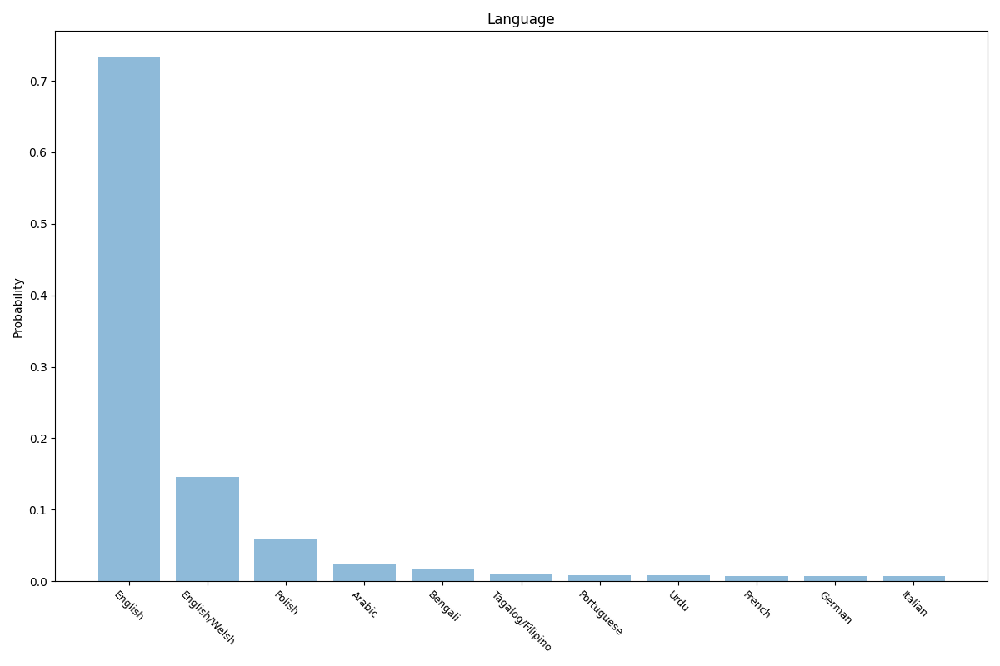
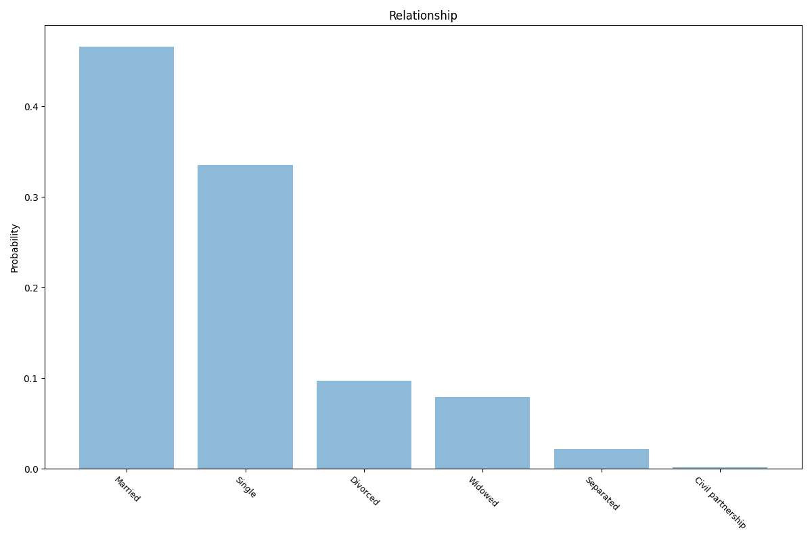
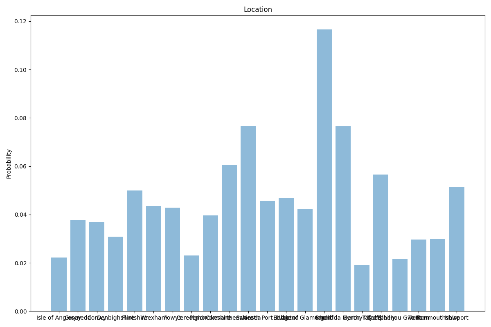

# Wales
8 features age, sex, sexuality, ethnicity, religion, language, relationship, location.

## Age

## Sex

## Sexuality

## Ethnicity

## Religion

## Language

## Relationship

## Location

## Sources

Age, sex and location taken from 2021 ONS Census data "Population and household estimates, England and Wales: Census 2021".

https://www.ons.gov.uk/peoplepopulationandcommunity/populationandmigration/populationestimates/datasets/populationandhouseholdestimatesenglandandwalescensus2021

Sexuality taken from 2020 ONS Census data "Sexual orientation, UK: 2020".

https://www.ons.gov.uk/peoplepopulationandcommunity/culturalidentity/sexuality/bulletins/sexualidentityuk/2020

Religion taken from 2011 ONS Census data "Religion in England and Wales 2011".

https://www.ons.gov.uk/peoplepopulationandcommunity/culturalidentity/religion/articles/religioninenglandandwales2011/2012-12-11

Relationship taken from 2011 ONS Census data