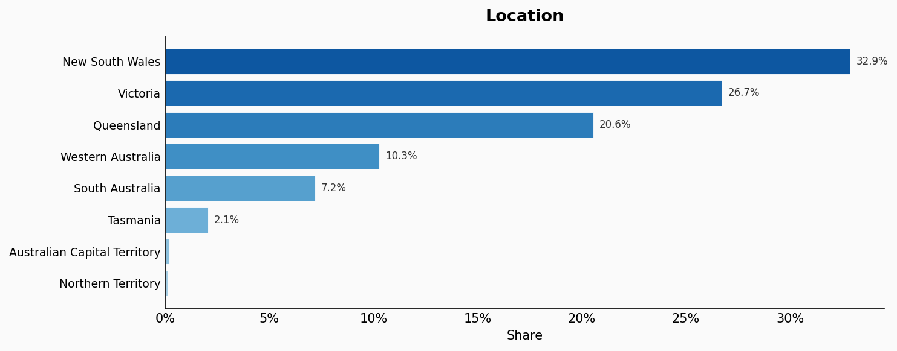
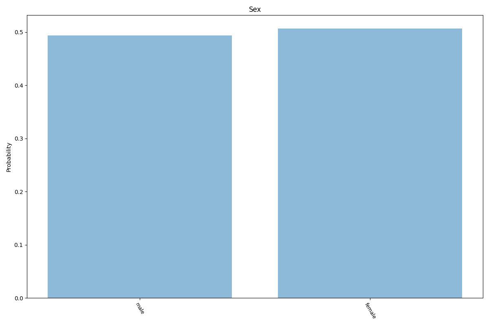
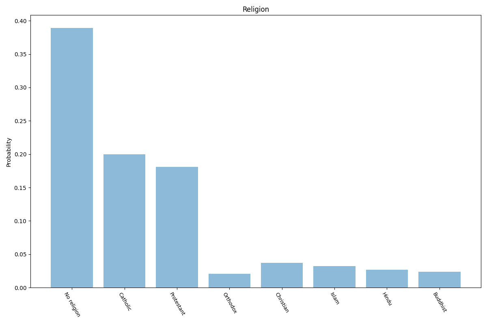
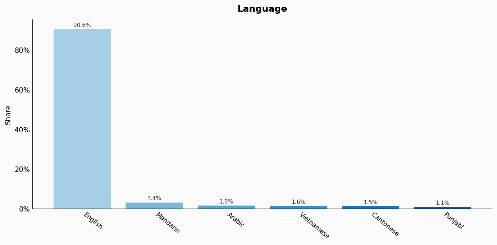
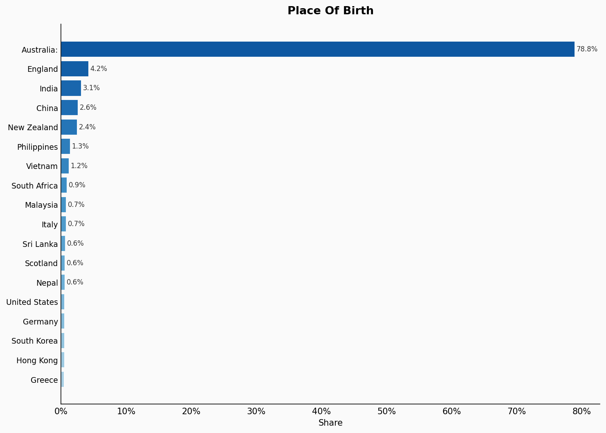

# Australia
**6 features:** location, age, sex, religion, language and place of birth.

## Location

## Age

## Sex

## Religion

## Language

## Place Of Birth

## Sources

### Location

National, state and territory population https://www.abs.gov.au/statistics/people/population/national-state-and-territory-population/sep-2020

### Place of Birth

"Table 5.1 Estimated resident population, by country of birth(a), Australia, as at 30 June, 1996 to 2021(b)(c)". Australian Bureau of Statistics. Retrieved 26 April 2022.
