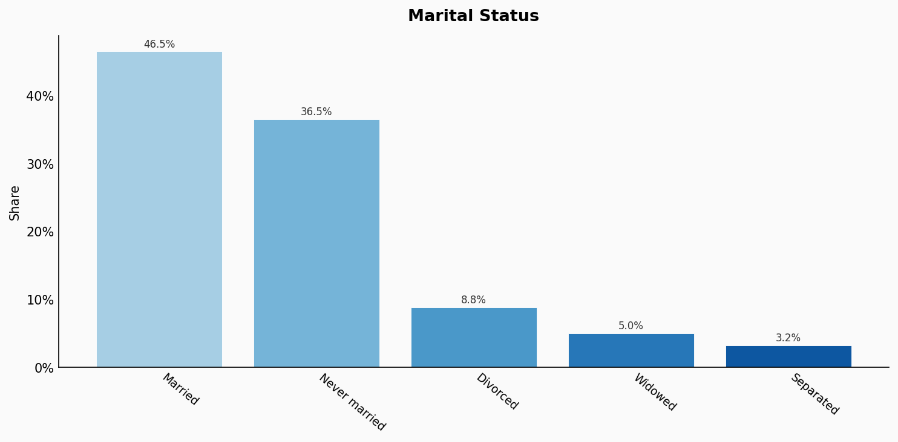
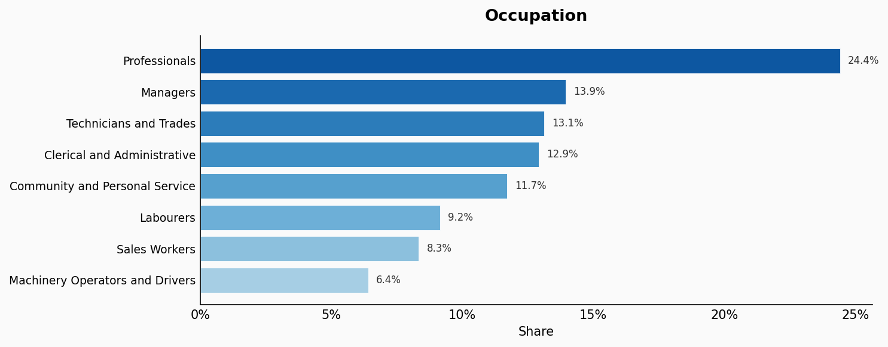
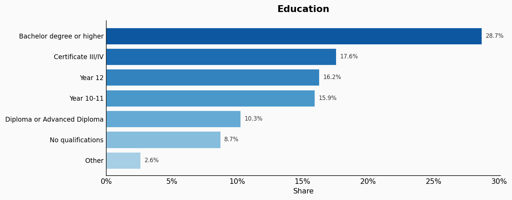
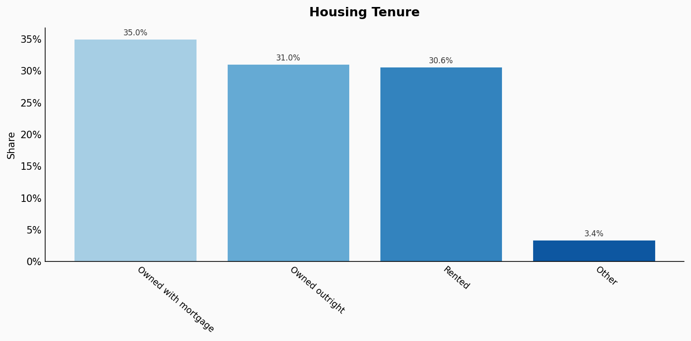
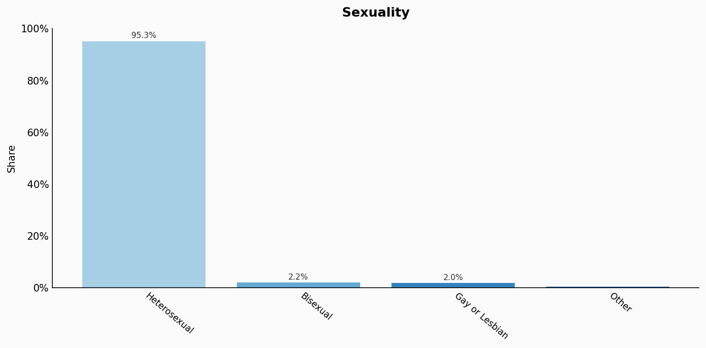

# Australia

**11 features:** location, age, sex, religion, language, marital status, occupation, education, housing tenure, place of birth, and sexuality.

## Location

| Option | Share |
|---|---:|
| New South Wales | 32.9% |
| Victoria | 26.7% |
| Queensland | 20.6% |
| Western Australia | 10.3% |
| South Australia | 7.2% |
| Tasmania | 2.1% |
| Australian Capital Territory | 0.2% |
| Northern Territory | 0.1% |

## Age

| Option | Share |
|---|---:|
| 0-4 | 5.8% |
| 5-9 | 6.2% |
| 10-14 | 6.2% |
| 15-19 | 5.7% |
| 20-24 | 6.2% |
| 25-29 | 7.0% |
| 30-34 | 7.3% |
| 35-39 | 7.2% |
| 40-44 | 6.5% |
| 45-49 | 6.4% |
| 50-54 | 6.3% |
| 55-59 | 6.1% |
| 60-64 | 5.8% |
| 65-69 | 5.1% |
| 70-74 | 4.6% |
| 75-79 | 3.2% |
| 80-84 | 2.2% |
| 85+ | 2.1% |

## Sex

| Option | Share |
|---|---:|
| female | 50.7% |
| male | 49.3% |

## Religion

| Option | Share |
|---|---:|
| No religion | 42.7% |
| Catholic | 22.0% |
| Protestant | 19.9% |
| Christian | 4.1% |
| Islam | 3.5% |
| Hindu | 3.0% |
| Buddhist | 2.6% |
| Orthodox | 2.3% |

## Language

| Option | Share |
|---|---:|
| English | 90.6% |
| Mandarin | 3.4% |
| Arabic | 1.8% |
| Vietnamese | 1.6% |
| Cantonese | 1.5% |
| Punjabi | 1.1% |

## Marital Status

| Option | Share |
|---|---:|
| Married | 46.5% |
| Never married | 36.5% |
| Divorced | 8.8% |
| Widowed | 5.0% |
| Separated | 3.2% |

## Occupation

| Option | Share |
|---|---:|
| Professionals | 24.4% |
| Managers | 13.9% |
| Technicians and Trades | 13.1% |
| Clerical and Administrative | 12.9% |
| Community and Personal Service | 11.7% |
| Labourers | 9.2% |
| Sales Workers | 8.3% |
| Machinery Operators and Drivers | 6.4% |

## Education

| Option | Share |
|---|---:|
| Bachelor degree or higher | 28.7% |
| Certificate III/IV | 17.6% |
| Year 12 | 16.2% |
| Year 10-11 | 15.9% |
| Diploma or Advanced Diploma | 10.3% |
| No qualifications | 8.7% |
| Other | 2.6% |

## Housing Tenure

| Option | Share |
|---|---:|
| Owned with mortgage | 35.0% |
| Owned outright | 31.0% |
| Rented | 30.6% |
| Other | 3.4% |

## Place Of Birth

| Option | Share |
|---|---:|
| Australia: | 78.8% |
| England | 4.2% |
| India | 3.1% |
| China | 2.6% |
| New Zealand | 2.4% |
| Philippines | 1.3% |
| Vietnam | 1.2% |
| South Africa | 0.9% |
| Malaysia | 0.7% |
| Italy | 0.7% |
| Sri Lanka | 0.6% |
| Scotland | 0.6% |
| Nepal | 0.6% |
| United States | 0.5% |
| Germany | 0.5% |
| South Korea | 0.5% |
| Hong Kong | 0.5% |
| Greece | 0.4% |

## Sexuality

| Option | Share |
|---|---:|
| Heterosexual | 95.3% |
| Bisexual | 2.2% |
| Gay or Lesbian | 2.0% |
| Other | 0.5% |

## Sources

- [2021 Census QuickStats, Australian Bureau of Statistics (2021)](https://abs.gov.au/census/find-census-data/quickstats/2021/AUS)
  *Covers: `age`, `sex`, `marital status`, `occupation`, `education`, `housing tenure`, `location`*
- [Religious affiliation in Australia, Australian Bureau of Statistics (2021)](https://www.abs.gov.au/articles/religious-affiliation-australia)
  *Covers: `religion`*
- [Cultural diversity in Australia, Australian Bureau of Statistics (2021)](https://www.abs.gov.au/statistics/people/people-and-communities/snapshot-australia/latest-release)
  *Covers: `language`*
- [Estimated resident population by country of birth, Australian Bureau of Statistics (2021)](https://www.abs.gov.au/statistics/people/population/migration-australia/2020-21)
  *Covers: `place of birth`*
- [General Social Survey 2020, Australian Bureau of Statistics (2020)](https://www.abs.gov.au/statistics/people/people-and-communities/general-social-survey-summary-results-australia/2020)
  *Covers: `sexuality`*