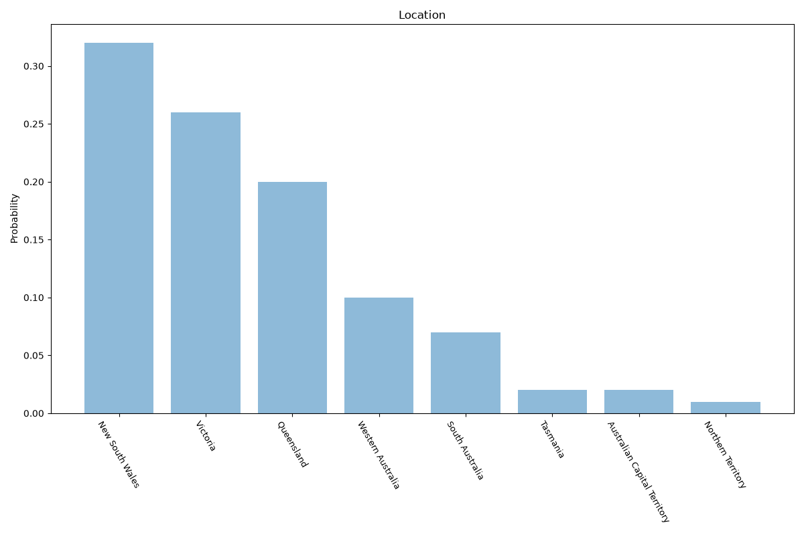
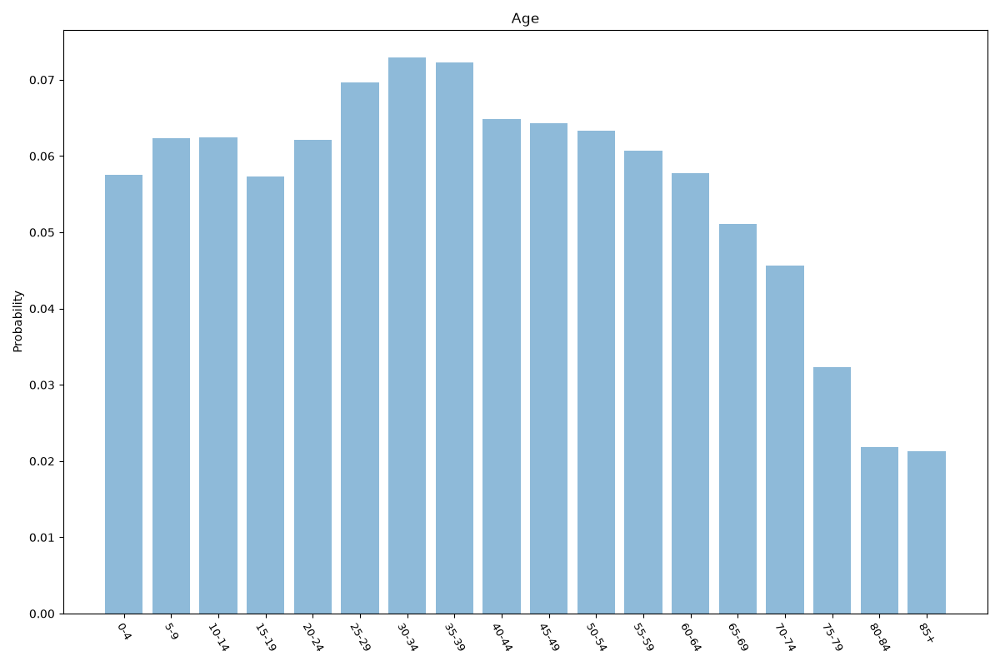
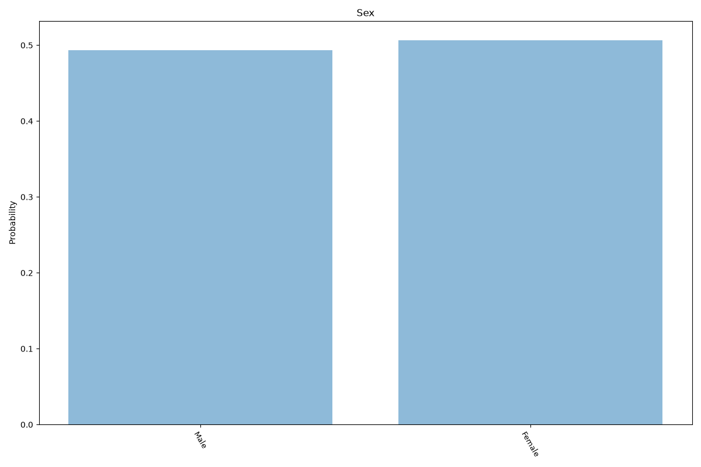
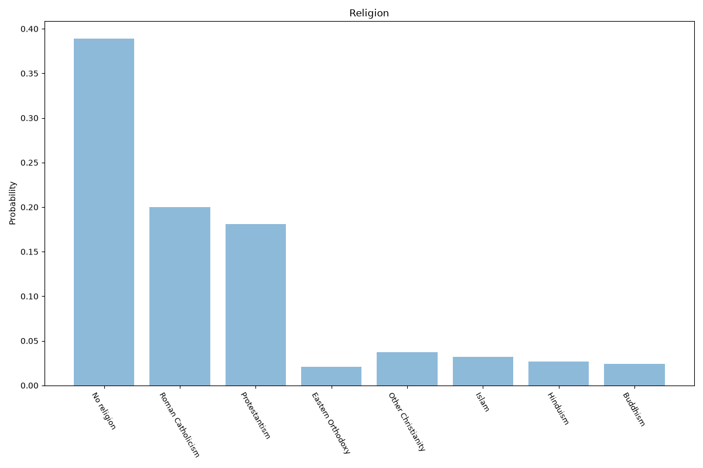
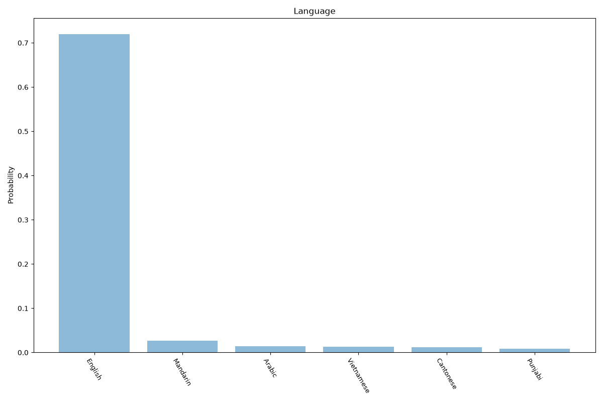
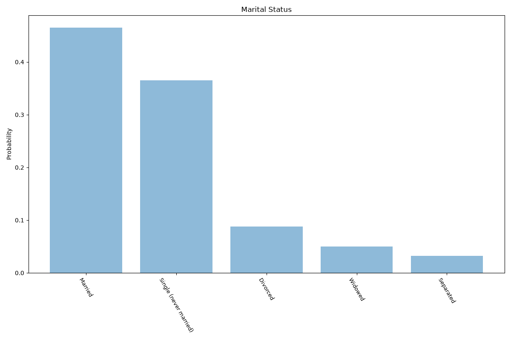
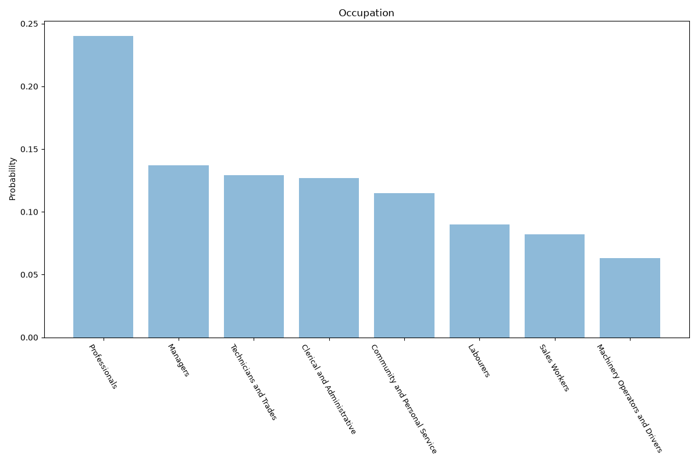
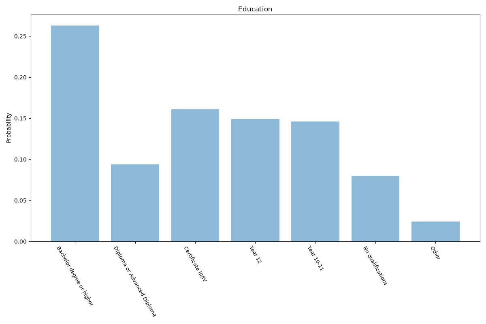
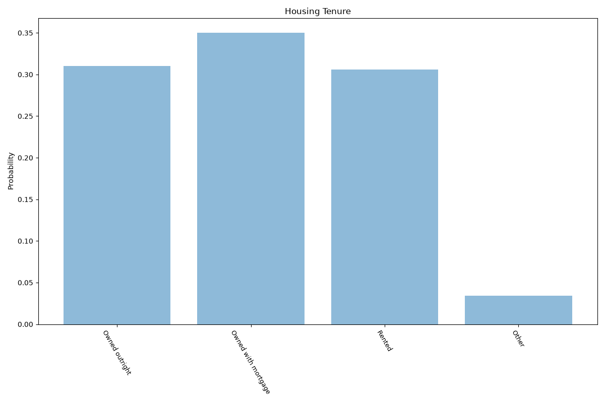
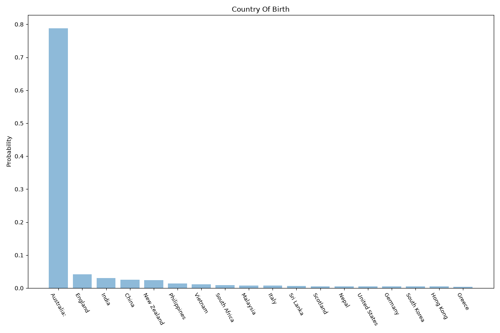

# Australia
**10 features:** location, age, sex, religion, language, marital status, occupation, education, housing tenure and country of birth.

## Location

## Age

## Sex

## Religion

## Language

## Marital Status

## Occupation

## Education

## Housing Tenure

## Country Of Birth

## Sources

- [2021 Census QuickStats, Australian Bureau of Statistics (2021)](https://www.abs.gov.au/census/find-census-data/quickstats/2021/AUS) — age, sex, marital status, occupation, education, housing tenure, location
- [Religious affiliation in Australia, Australian Bureau of Statistics (2021)](https://www.abs.gov.au/articles/religious-affiliation-australia) — religion
- [Cultural diversity in Australia, Australian Bureau of Statistics (2021)](https://www.abs.gov.au/statistics/people/people-and-communities/snapshot-australia/latest-release) — language
- [Estimated resident population by country of birth, Australian Bureau of Statistics (2021)](https://www.abs.gov.au/statistics/people/population/migration-australia/2020-21) — country of birth