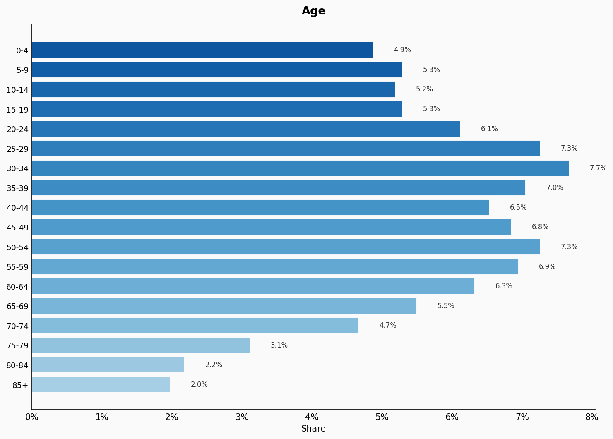
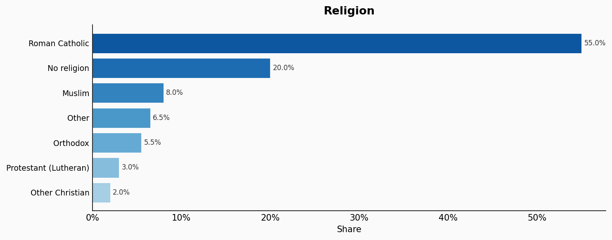
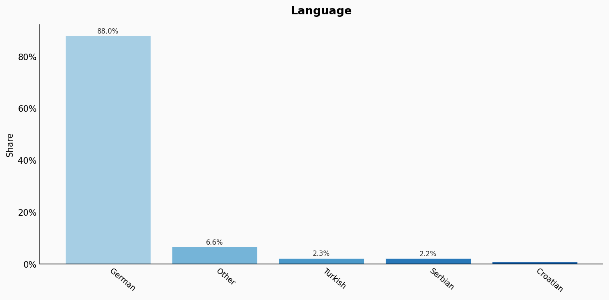
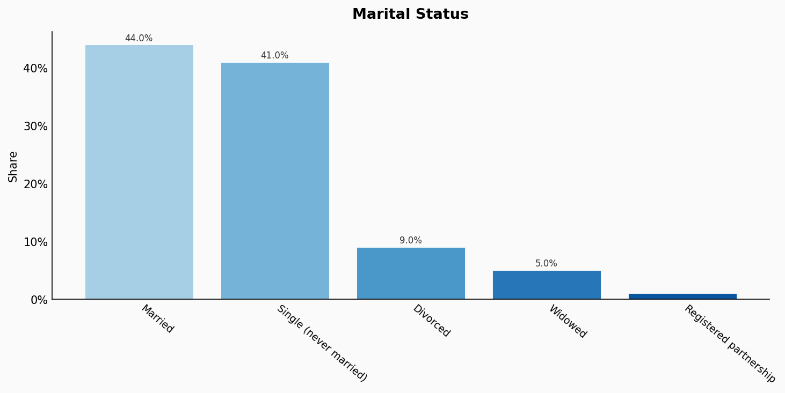
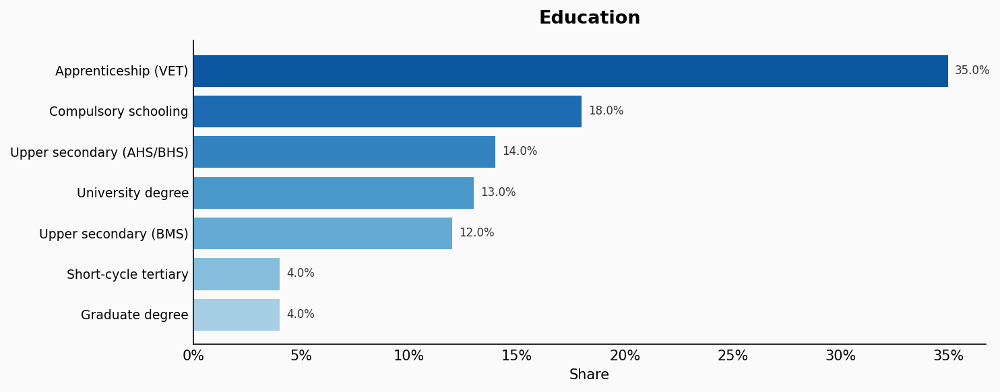
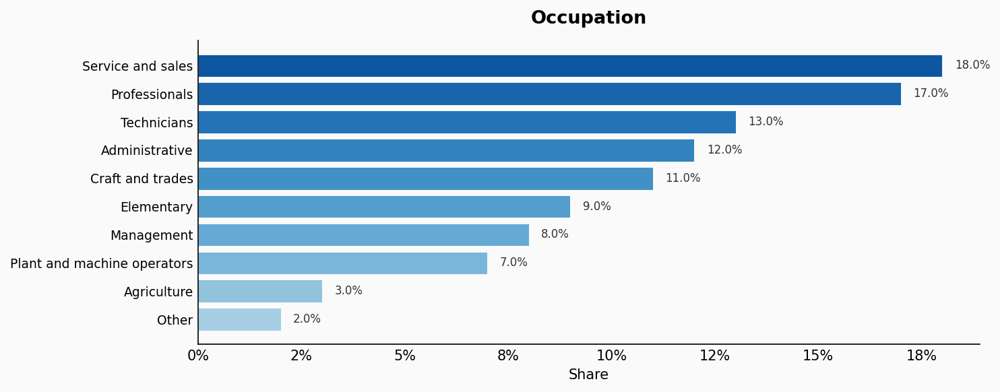
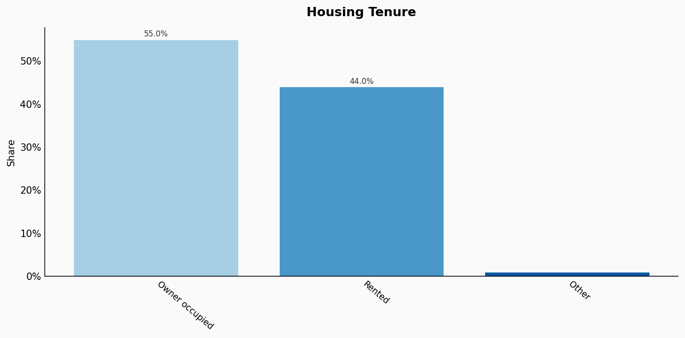
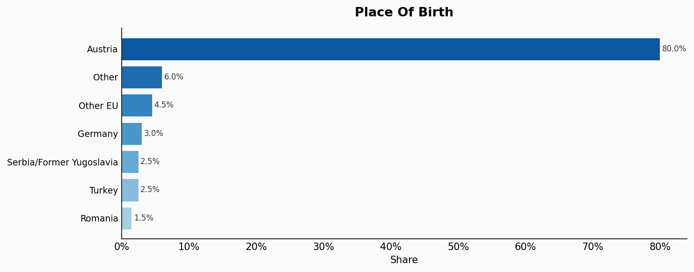

# Austria

**11 features:** age, sex, location, religion, language, marital status, education, occupation, housing tenure, place of birth, and sexuality.

## Age

| Option | Share |
|---|---:|
| 0-4 | 4.9% |
| 5-9 | 5.3% |
| 10-14 | 5.2% |
| 15-19 | 5.3% |
| 20-24 | 6.1% |
| 25-29 | 7.3% |
| 30-34 | 7.7% |
| 35-39 | 7.0% |
| 40-44 | 6.5% |
| 45-49 | 6.8% |
| 50-54 | 7.3% |
| 55-59 | 6.9% |
| 60-64 | 6.3% |
| 65-69 | 5.5% |
| 70-74 | 4.7% |
| 75-79 | 3.1% |
| 80-84 | 2.2% |
| 85+ | 2.0% |

## Sex

| Option | Share |
|---|---:|
| Female | 51.0% |
| Male | 49.0% |

## Location

| Option | Share |
|---|---:|
| Vienna | 21.2% |
| Lower Austria | 19.0% |
| Upper Austria | 16.9% |
| Styria | 14.1% |
| Tyrol | 8.4% |
| Carinthia | 6.6% |
| Salzburg | 6.2% |
| Vorarlberg | 4.4% |
| Burgenland | 3.2% |

## Religion

| Option | Share |
|---|---:|
| Roman Catholic | 55.0% |
| No religion | 20.0% |
| Muslim | 8.0% |
| Other | 6.5% |
| Orthodox | 5.5% |
| Protestant (Lutheran) | 3.0% |
| Other Christian | 2.0% |

## Language

| Option | Share |
|---|---:|
| German | 88.0% |
| Other | 6.6% |
| Turkish | 2.3% |
| Serbian | 2.2% |
| Croatian | 0.9% |

## Marital Status

| Option | Share |
|---|---:|
| Married | 44.0% |
| Single (never married) | 41.0% |
| Divorced | 9.0% |
| Widowed | 5.0% |
| Registered partnership | 1.0% |

## Education

| Option | Share |
|---|---:|
| Apprenticeship (VET) | 35.0% |
| Compulsory schooling | 18.0% |
| Upper secondary (AHS/BHS) | 14.0% |
| University degree | 13.0% |
| Upper secondary (BMS) | 12.0% |
| Short-cycle tertiary | 4.0% |
| Graduate degree | 4.0% |

## Occupation

| Option | Share |
|---|---:|
| Service and sales | 18.0% |
| Professionals | 17.0% |
| Technicians | 13.0% |
| Administrative | 12.0% |
| Craft and trades | 11.0% |
| Elementary | 9.0% |
| Management | 8.0% |
| Plant and machine operators | 7.0% |
| Agriculture | 3.0% |
| Other | 2.0% |

## Housing Tenure

| Option | Share |
|---|---:|
| Owner occupied | 55.0% |
| Rented | 44.0% |
| Other | 1.0% |

## Place Of Birth

| Option | Share |
|---|---:|
| Austria | 80.0% |
| Other | 6.0% |
| Other EU | 4.5% |
| Germany | 3.0% |
| Serbia/Former Yugoslavia | 2.5% |
| Turkey | 2.5% |
| Romania | 1.5% |

## Sexuality

| Option | Share |
|---|---:|
| Heterosexual | 93.0% |
| Bisexual | 3.5% |
| Gay or Lesbian | 2.5% |
| Other | 1.0% |

## Sources

- [Registerzählung 2021, Statistik Austria (2021)](https://www.statistik.at/statistiken/bevoelkerung-und-soziales/bevoelkerung/volkszaehlungen-registerzaehlungen-abgestimmte-erwerbsstatistik/registerzaehlung)
  *Covers: `age`, `sex`, `location`, `marital status`, `housing tenure`, `place of birth`*
- [Mikrozensus Arbeitskräfteerhebung 2022, Statistik Austria (2022)](https://www.statistik.at/statistiken/bevoelkerung-und-soziales/arbeitsmarkt/erwerbstaetige)
  *Covers: `education`, `occupation`*
- [Registerzählung - Religion 2021, Statistik Austria (2021)](https://www.statistik.at/statistiken/bevoelkerung-und-soziales/bevoelkerung/volkszaehlungen-registerzaehlungen-abgestimmte-erwerbsstatistik/registerzaehlung)
  *Covers: `religion`*
- [Mikrozensus - Umgangssprache 2021, Statistik Austria (2021)](https://www.statistik.at/statistiken/bevoelkerung-und-soziales/bevoelkerung/sprache)
  *Covers: `language`*
- [Eurobarometer Special Survey on Discrimination 2019, European Commission (2019)](https://europa.eu/eurobarometer/surveys/detail/2251)
  *Covers: `sexuality`*