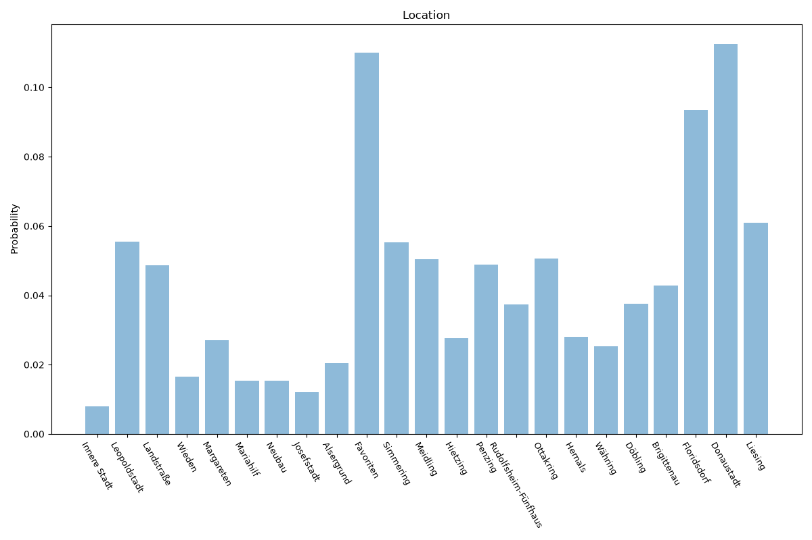

# Vienna
**2 features:** location and residence.

## Location

## Residence

## Sources

- [Population statistics, Statistics Austria (2025)](https://www.statistik.at/) — location
- [World Urbanization Prospects 2018, United Nations (2018)](https://population.un.org/wup/) — residence