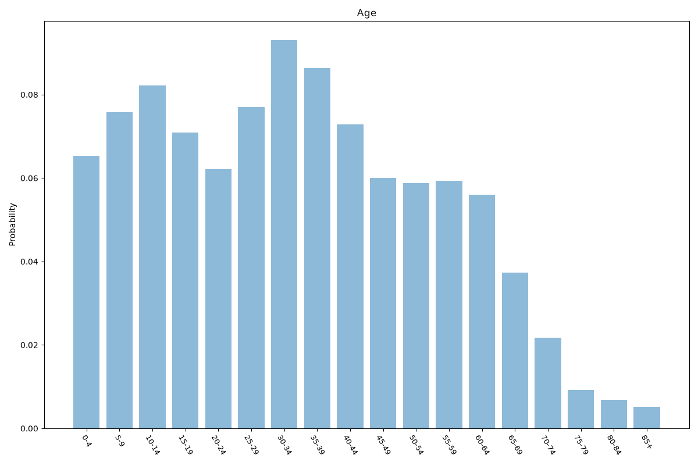
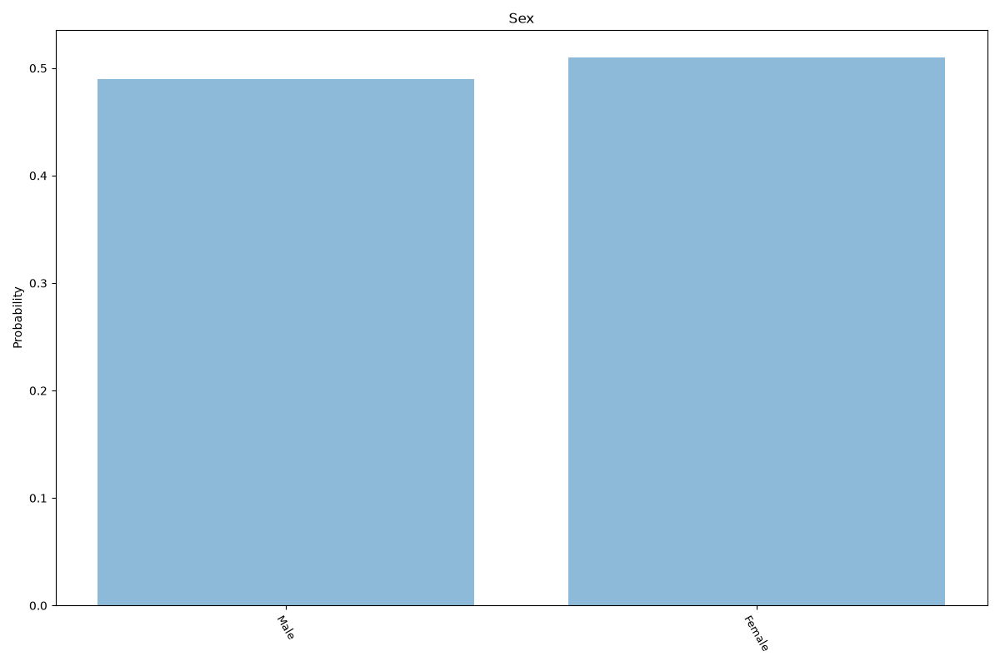
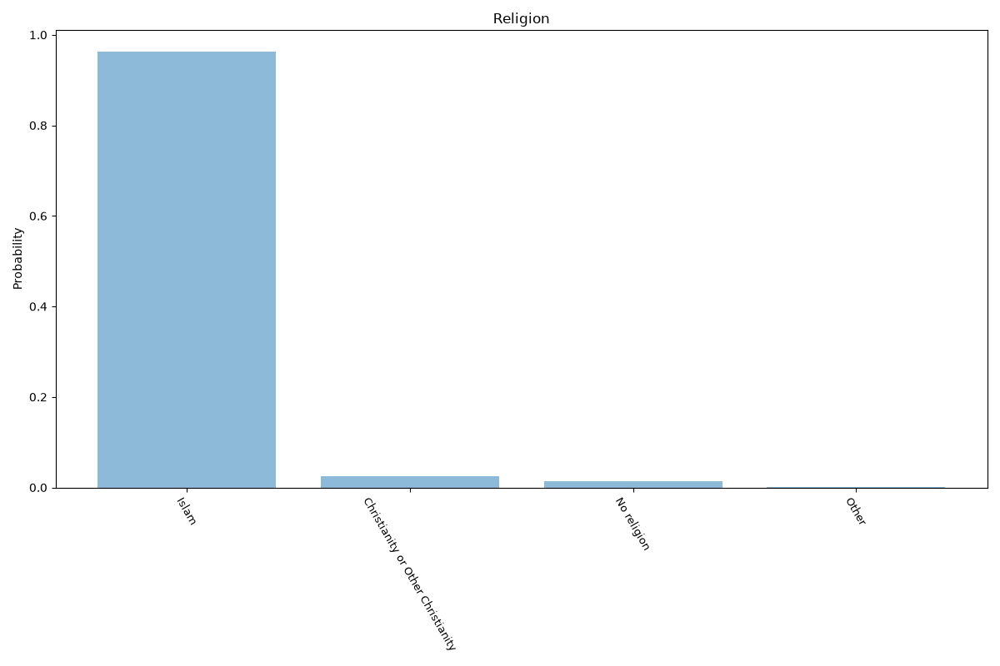
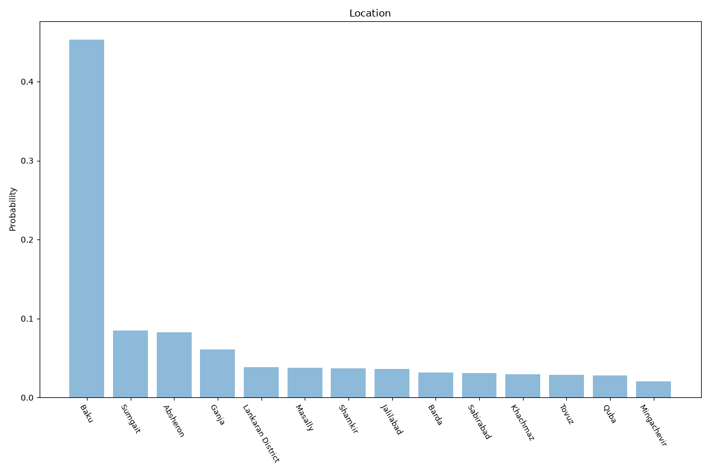

# Azerbaijan
**4 features:** age, sex, religion and location.

## Age

## Sex

## Religion

## Location

## Sources

- [World Population Prospects 2024, United Nations (2024)](https://population.un.org/wpp/) — age, sex
- [Religious composition estimate, Association of Religion Data Archives (ARDA) (2025)](https://www.thearda.com/) — religion
- [2019 Census, State Statistical Committee (Azerbaijan) (2019)](https://www.stat.gov.az/?lang=en) — location