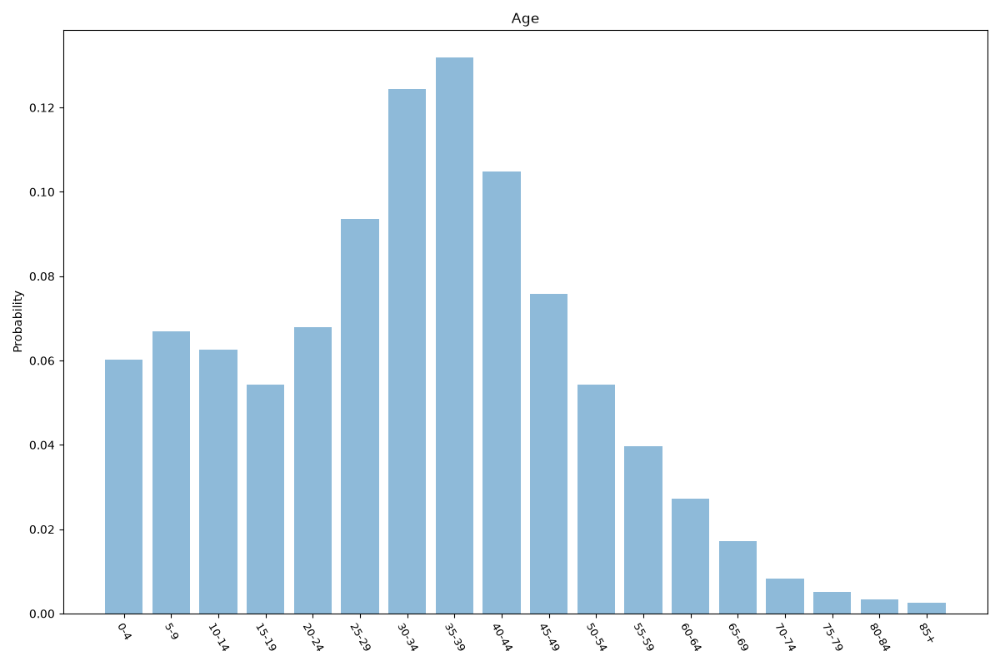
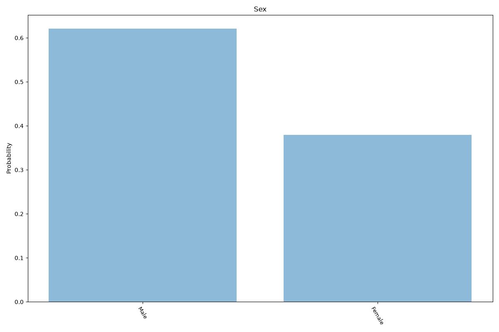
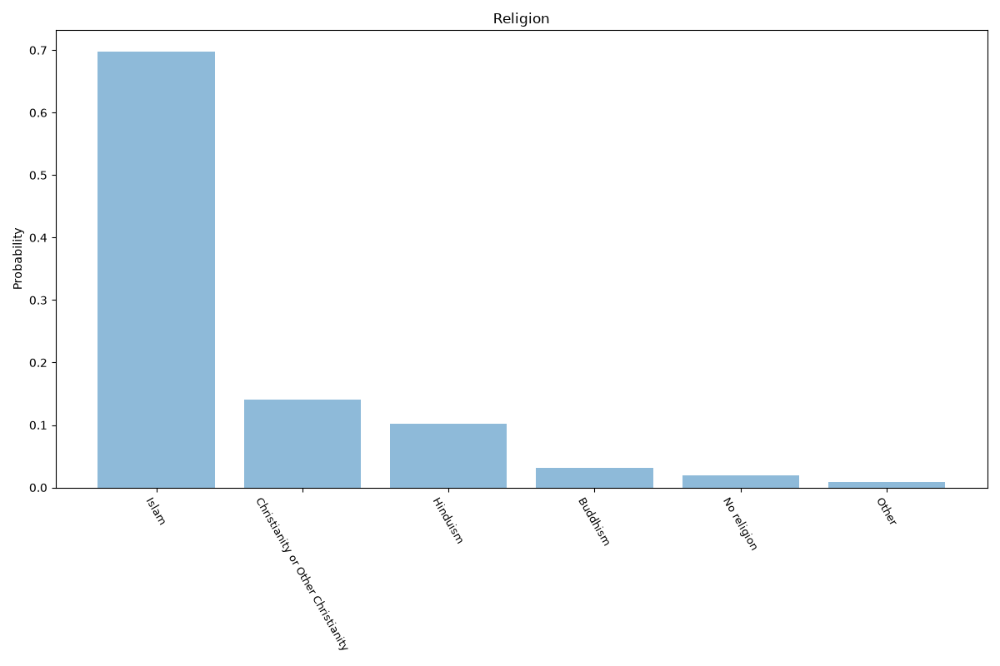
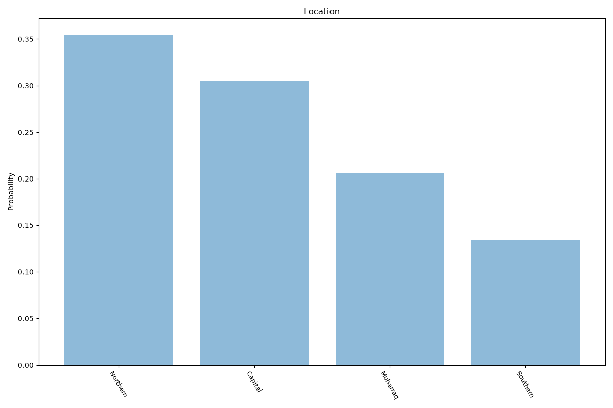

# Bahrain
**4 features:** age, sex, religion and location.

## Age

## Sex

## Religion

## Location

## Sources

- [World Population Prospects 2024, United Nations (2024)](https://population.un.org/wpp/) — age, sex
- [Religious composition estimate, Pew Research Center (2020)](https://www.pewresearch.org/religion/) — religion
- [Governorate population estimates, Information & eGovernment Authority (Bahrain) (2020)](https://www.iga.gov.bh/en) — location