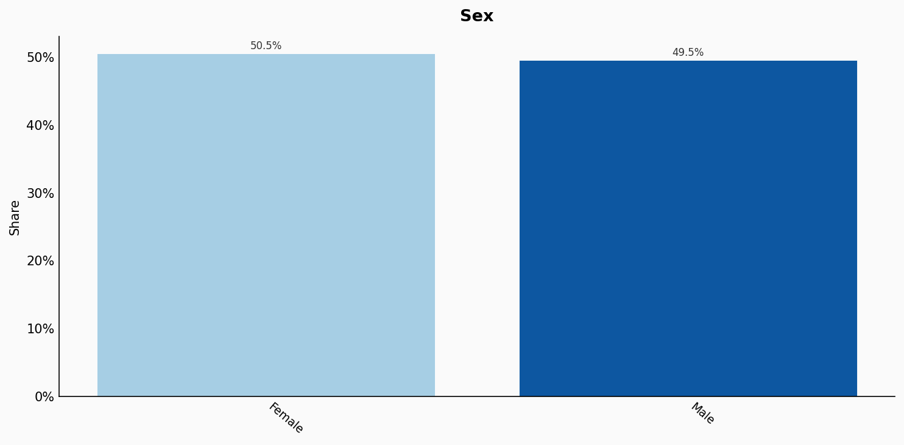
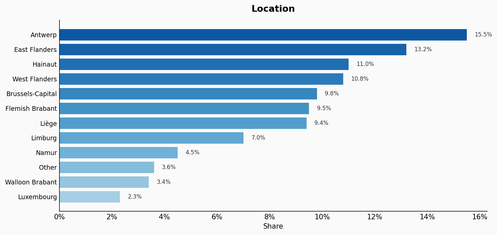
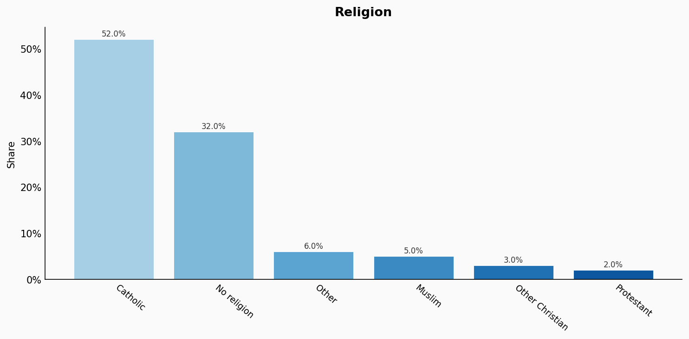
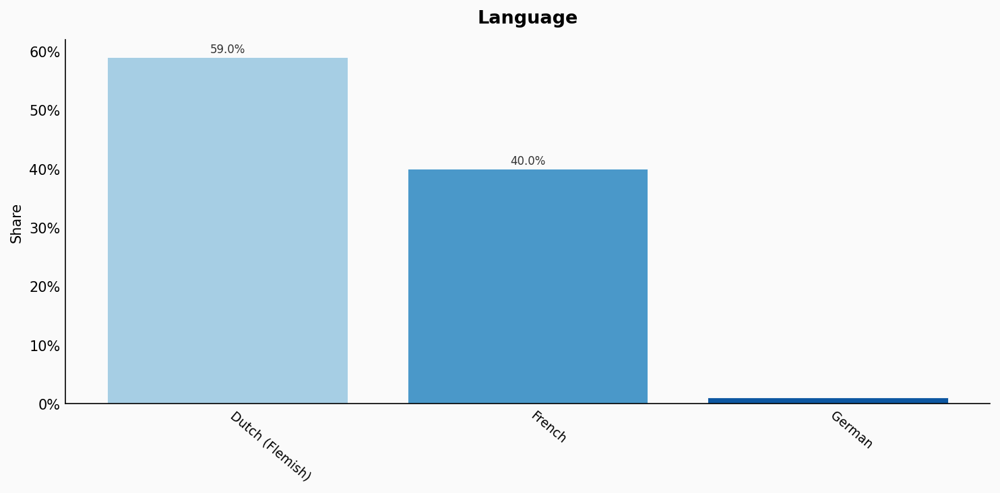
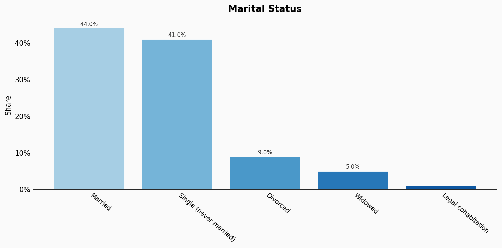
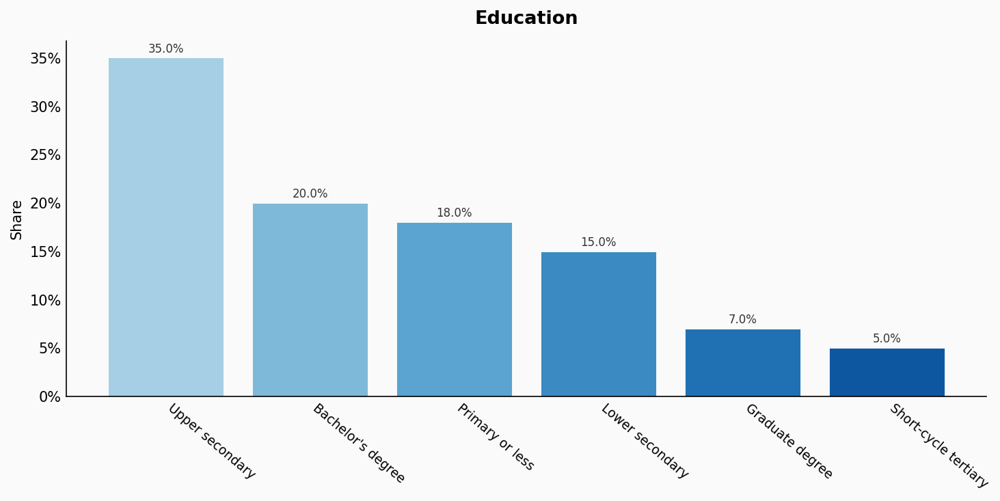
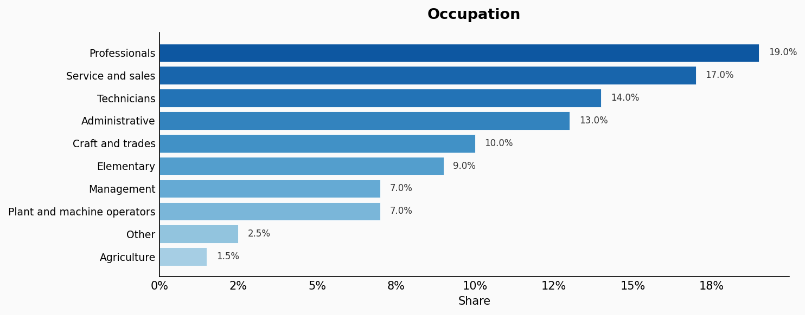
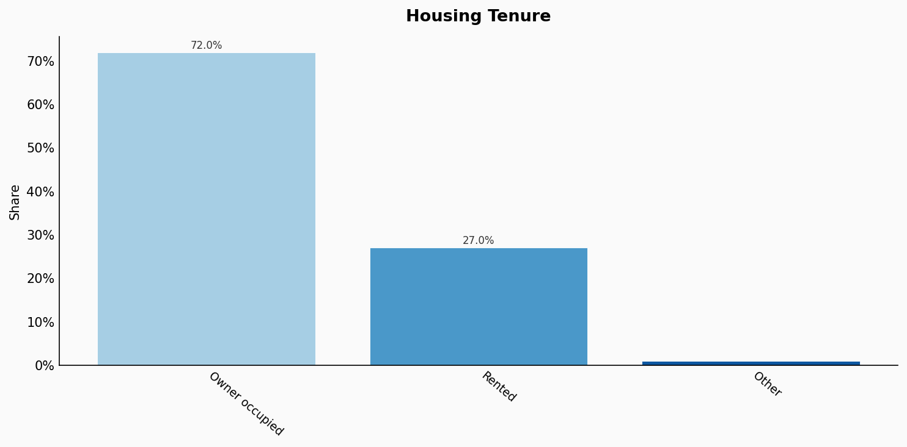
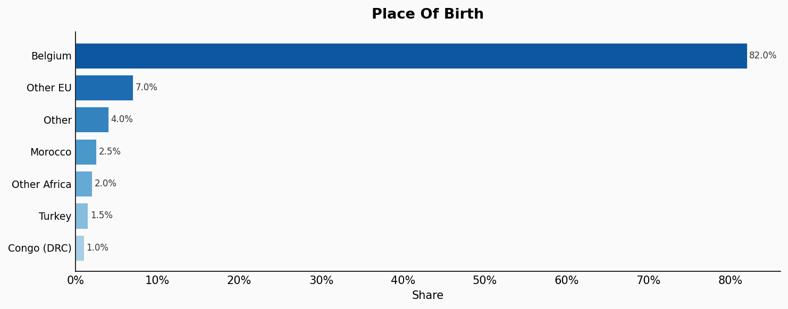
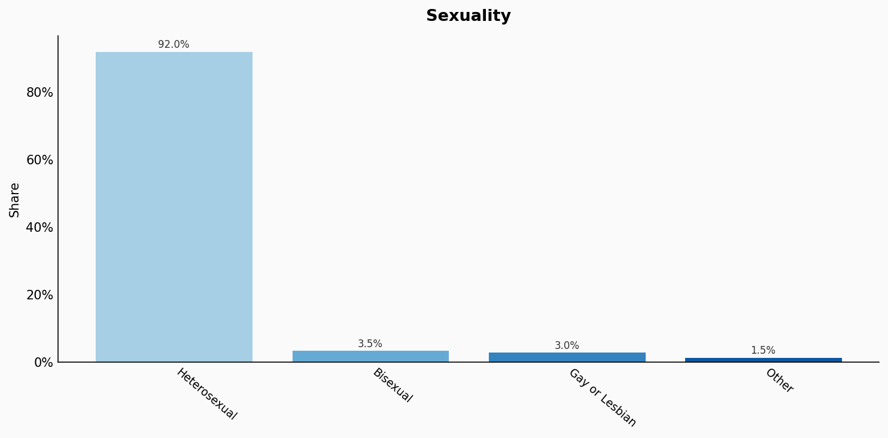

# Belgium

**11 features:** age, sex, location, religion, language, marital status, education, occupation, housing tenure, place of birth, and sexuality.

## Age

| Option | Share |
|---|---:|
| 0-4 | 5.5% |
| 5-9 | 5.9% |
| 10-14 | 5.9% |
| 15-19 | 5.9% |
| 20-24 | 6.2% |
| 25-29 | 6.7% |
| 30-34 | 7.2% |
| 35-39 | 7.1% |
| 40-44 | 6.5% |
| 45-49 | 6.7% |
| 50-54 | 7.0% |
| 55-59 | 6.7% |
| 60-64 | 6.1% |
| 65-69 | 5.3% |
| 70-74 | 4.4% |
| 75-79 | 3.0% |
| 80-84 | 2.1% |
| 85+ | 1.9% |

## Sex

| Option | Share |
|---|---:|
| Female | 50.5% |
| Male | 49.5% |

## Location

| Option | Share |
|---|---:|
| Antwerp | 15.5% |
| East Flanders | 13.2% |
| Hainaut | 11.0% |
| West Flanders | 10.8% |
| Brussels-Capital | 9.8% |
| Flemish Brabant | 9.5% |
| Liège | 9.4% |
| Limburg | 7.0% |
| Namur | 4.5% |
| Other | 3.6% |
| Walloon Brabant | 3.4% |
| Luxembourg | 2.3% |

## Religion

| Option | Share |
|---|---:|
| Catholic | 52.0% |
| No religion | 32.0% |
| Other | 6.0% |
| Muslim | 5.0% |
| Other Christian | 3.0% |
| Protestant | 2.0% |

## Language

| Option | Share |
|---|---:|
| Dutch (Flemish) | 59.0% |
| French | 40.0% |
| German | 1.0% |

## Marital Status

| Option | Share |
|---|---:|
| Married | 44.0% |
| Single (never married) | 41.0% |
| Divorced | 9.0% |
| Widowed | 5.0% |
| Legal cohabitation | 1.0% |

## Education

| Option | Share |
|---|---:|
| Upper secondary | 35.0% |
| Bachelor's degree | 20.0% |
| Primary or less | 18.0% |
| Lower secondary | 15.0% |
| Graduate degree | 7.0% |
| Short-cycle tertiary | 5.0% |

## Occupation

| Option | Share |
|---|---:|
| Professionals | 19.0% |
| Service and sales | 17.0% |
| Technicians | 14.0% |
| Administrative | 13.0% |
| Craft and trades | 10.0% |
| Elementary | 9.0% |
| Management | 7.0% |
| Plant and machine operators | 7.0% |
| Other | 2.5% |
| Agriculture | 1.5% |

## Housing Tenure

| Option | Share |
|---|---:|
| Owner occupied | 72.0% |
| Rented | 27.0% |
| Other | 1.0% |

## Place Of Birth

| Option | Share |
|---|---:|
| Belgium | 82.0% |
| Other EU | 7.0% |
| Other | 4.0% |
| Morocco | 2.5% |
| Other Africa | 2.0% |
| Turkey | 1.5% |
| Congo (DRC) | 1.0% |

## Sexuality

| Option | Share |
|---|---:|
| Heterosexual | 92.0% |
| Bisexual | 3.5% |
| Gay or Lesbian | 3.0% |
| Other | 1.5% |

## Sources

- [Statbel - Statistics Belgium 2021 (2021)](https://statbel.fgov.be/en/themes/population)
  *Covers: `age`, `sex`, `location`, `marital status`, `housing tenure`*
- [Enquête sur les Forces de Travail 2022, Statbel (2022)](https://statbel.fgov.be/en/themes/work-and-training/labour-market/employment)
  *Covers: `education`, `occupation`*
- [European Social Survey (Belgium) 2020 (2020)](https://www.europeansocialsurvey.org/)
  *Covers: `religion`*
- [Census 2011 - Language, Statbel (2011)](https://statbel.fgov.be/en/themes/population/census-2011)
  *Covers: `language`*
- [Statbel - Country of Birth Statistics 2022 (2022)](https://statbel.fgov.be/en/themes/population/foreigners)
  *Covers: `place of birth`*
- [Eurobarometer Special Survey on Discrimination 2019, European Commission (2019)](https://europa.eu/eurobarometer/surveys/detail/2251)
  *Covers: `sexuality`*