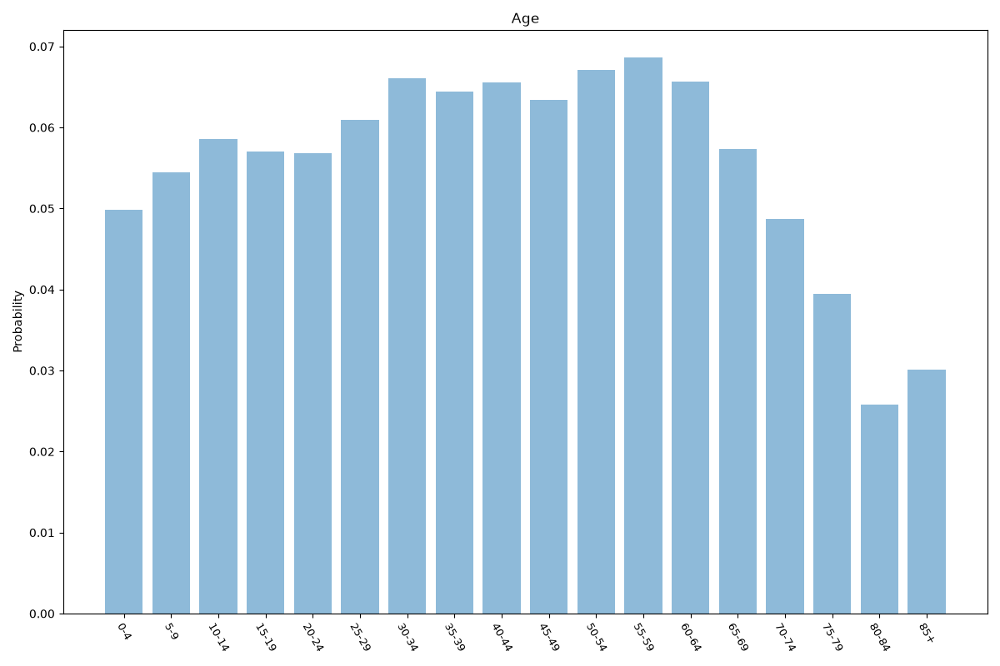
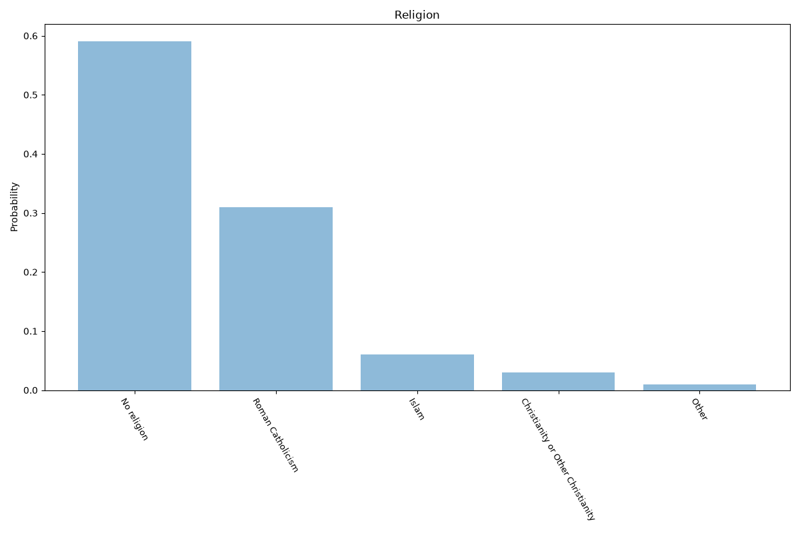
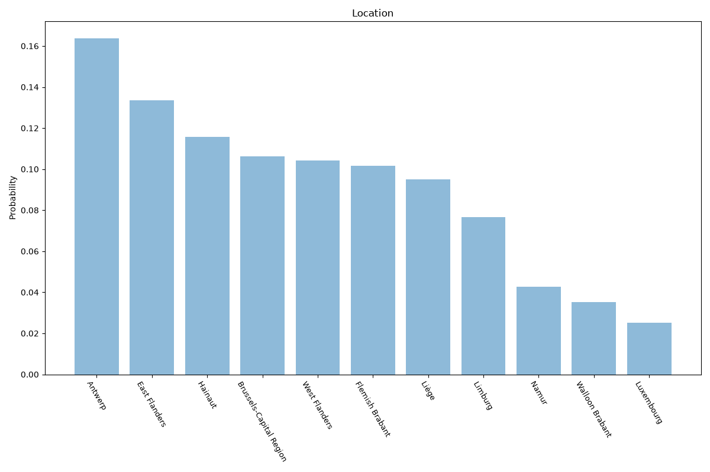

# Belgium
**4 features:** age, sex, religion and location.

## Age

## Sex

## Religion

## Location

## Sources

- [World Population Prospects 2024, United Nations (2024)](https://population.un.org/wpp/) — age, sex
- [European Social Survey (2023)](https://www.europeansocialsurvey.org/) — religion
- [Population by province, Statbel (Belgium) (2024)](https://statbel.fgov.be/en) — location