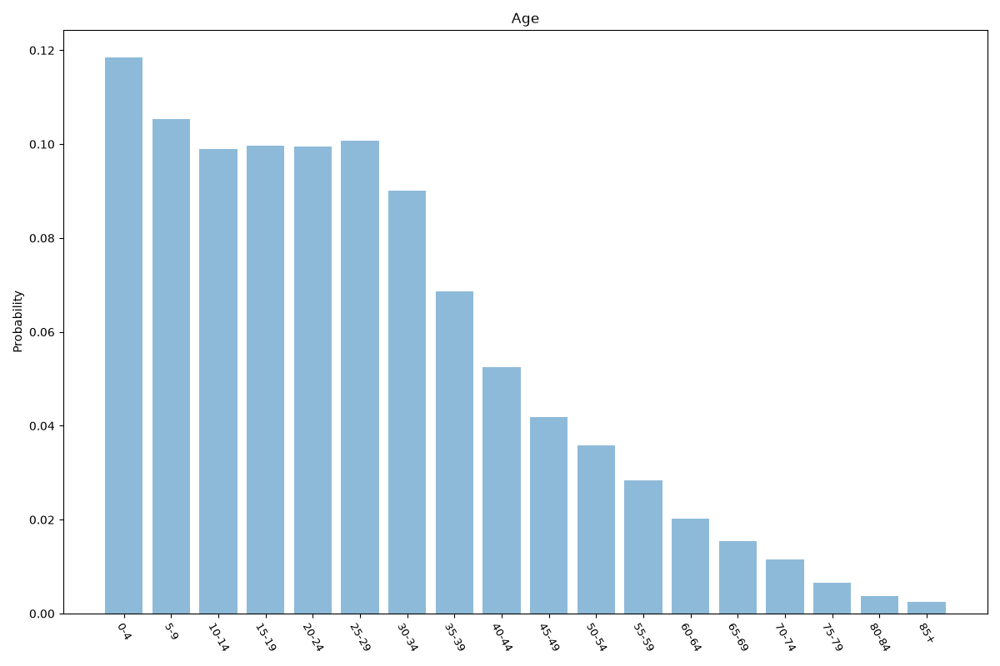
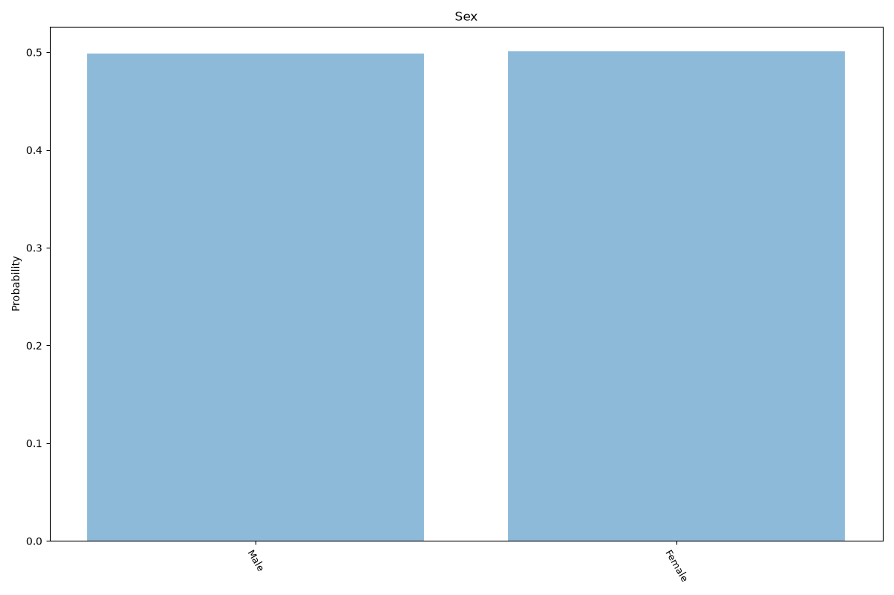
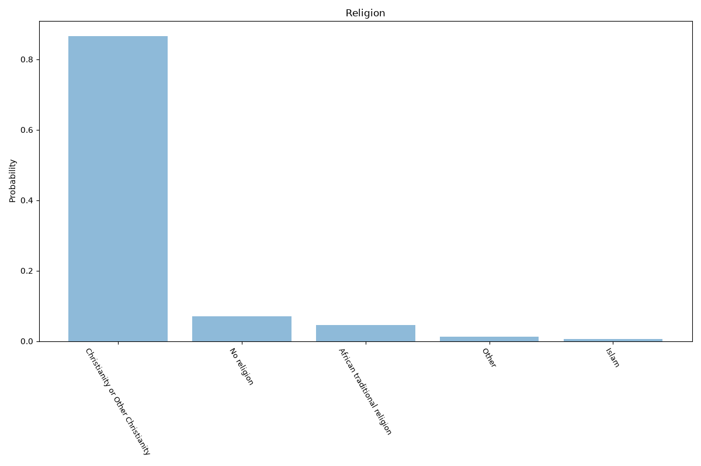
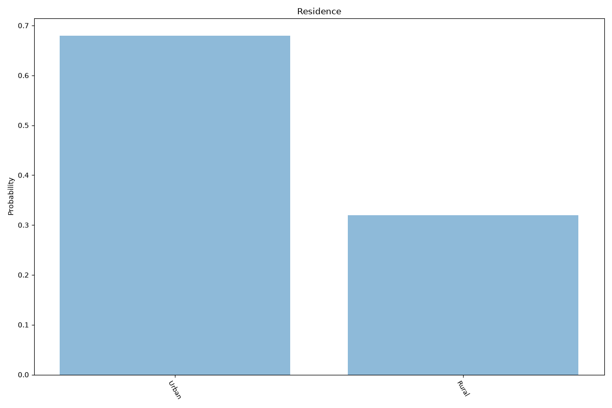
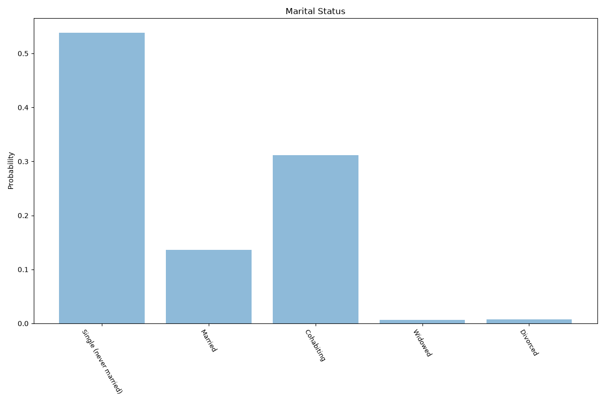
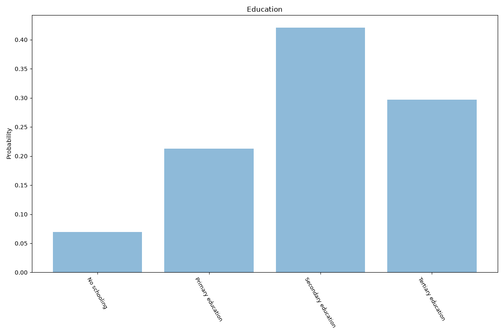
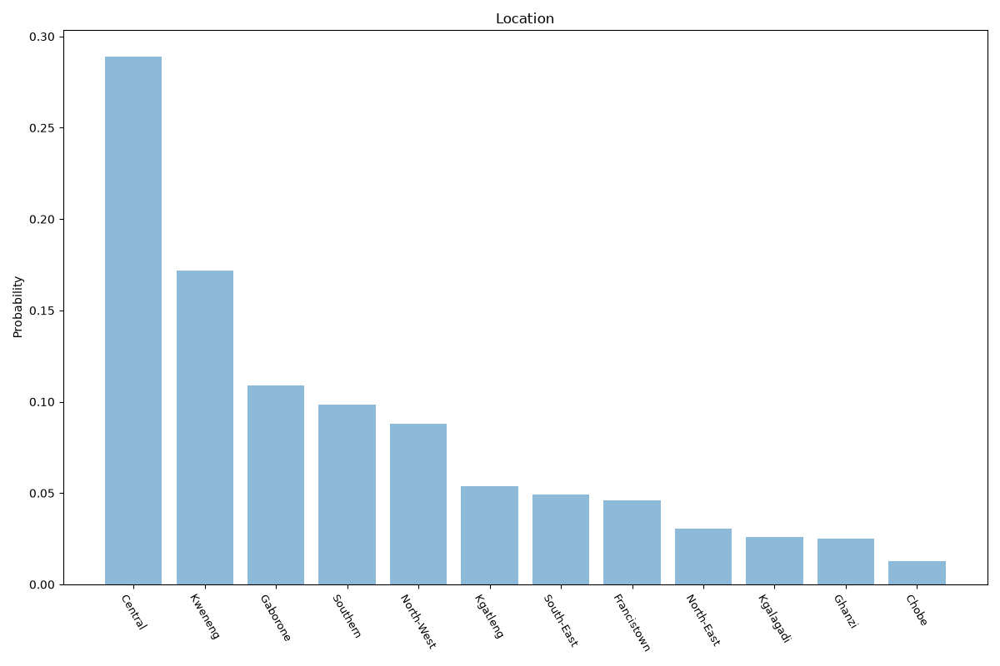

# Botswana
**7 features:** age, sex, religion, residence, marital status, education and location.

## Age

## Sex

## Religion

## Residence

## Marital Status

## Education

## Location

## Sources

- [World Population Prospects 2024, United Nations (2024)](https://population.un.org/wpp/) — age, sex
- [2022 Census (religion), Statistics Botswana (2022)](https://www.statsbots.org.bw/) — religion
- [2022 Census, Statistics Botswana (2022)](https://www.statsbots.org.bw/) — location
- [Urban population (% of total population), World Bank (2025)](https://data.worldbank.org/indicator/SP.URB.TOTL.IN.ZS) — residence
- [World Marriage Data 2019, United Nations (2017)](https://www.un.org/development/desa/pd/data/world-marriage-data) — marital status
- [Wittgenstein Centre Human Capital Data Explorer (Version 3.0, SSP2 scenario), IIASA (2020)](https://dataexplorer.wittgensteincentre.org/wcde-v3/) — education