# Brazil

**12 features:** age, sex, location, race, religion, language, marital status, education, occupation, housing tenure, place of birth, and sexuality.

## Age

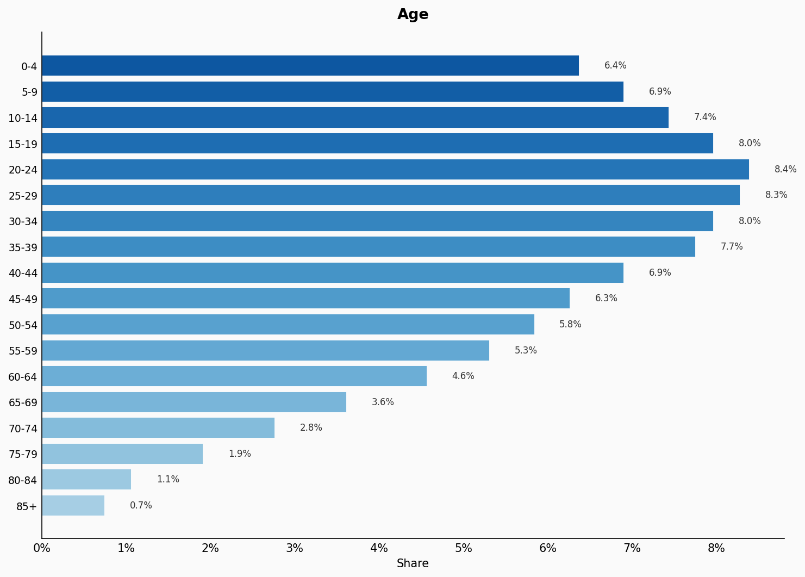

| Option | Share |
|---|---:|
| 0-4 | 6.4% |
| 5-9 | 6.9% |
| 10-14 | 7.4% |
| 15-19 | 8.0% |
| 20-24 | 8.4% |
| 25-29 | 8.3% |
| 30-34 | 8.0% |
| 35-39 | 7.7% |
| 40-44 | 6.9% |
| 45-49 | 6.3% |
| 50-54 | 5.8% |
| 55-59 | 5.3% |
| 60-64 | 4.6% |
| 65-69 | 3.6% |
| 70-74 | 2.8% |
| 75-79 | 1.9% |
| 80-84 | 1.1% |
| 85+ | 0.7% |

## Sex

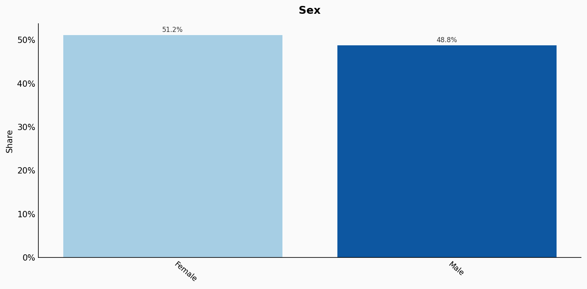

| Option | Share |
|---|---:|
| Female | 51.2% |
| Male | 48.8% |

## Location

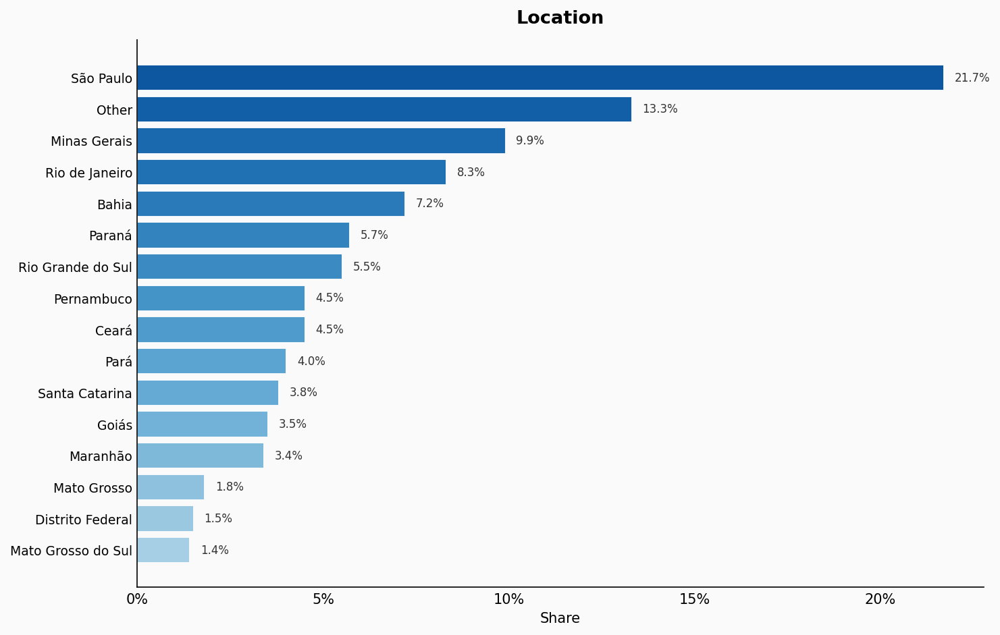

| Option | Share |
|---|---:|
| São Paulo | 21.7% |
| Other | 13.3% |
| Minas Gerais | 9.9% |
| Rio de Janeiro | 8.3% |
| Bahia | 7.2% |
| Paraná | 5.7% |
| Rio Grande do Sul | 5.5% |
| Pernambuco | 4.5% |
| Ceará | 4.5% |
| Pará | 4.0% |
| Santa Catarina | 3.8% |
| Goiás | 3.5% |
| Maranhão | 3.4% |
| Mato Grosso | 1.8% |
| Distrito Federal | 1.5% |
| Mato Grosso do Sul | 1.4% |

## Race

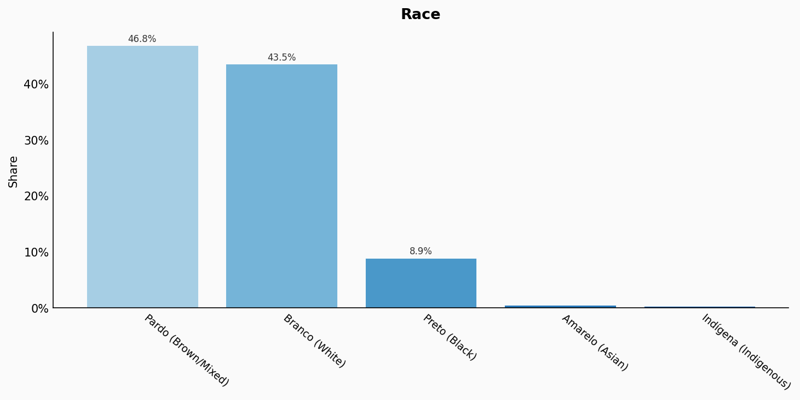

| Option | Share |
|---|---:|
| Pardo (Brown/Mixed) | 46.8% |
| Branco (White) | 43.5% |
| Preto (Black) | 8.9% |
| Amarelo (Asian) | 0.5% |
| Indígena (Indigenous) | 0.3% |

## Religion

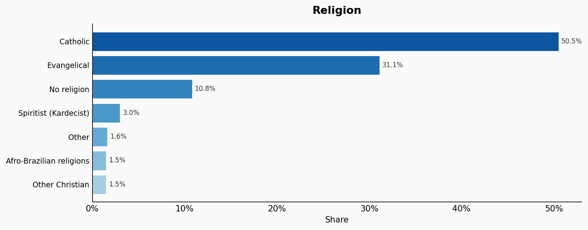

| Option | Share |
|---|---:|
| Catholic | 50.5% |
| Evangelical | 31.1% |
| No religion | 10.8% |
| Spiritist (Kardecist) | 3.0% |
| Other | 1.6% |
| Afro-Brazilian religions | 1.5% |
| Other Christian | 1.5% |

## Language

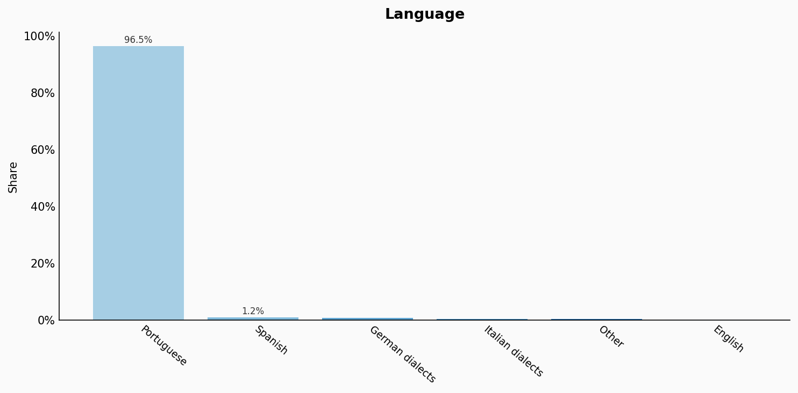

| Option | Share |
|---|---:|
| Portuguese | 96.5% |
| Spanish | 1.2% |
| German dialects | 0.9% |
| Italian dialects | 0.6% |
| Other | 0.6% |
| English | 0.2% |

## Marital Status

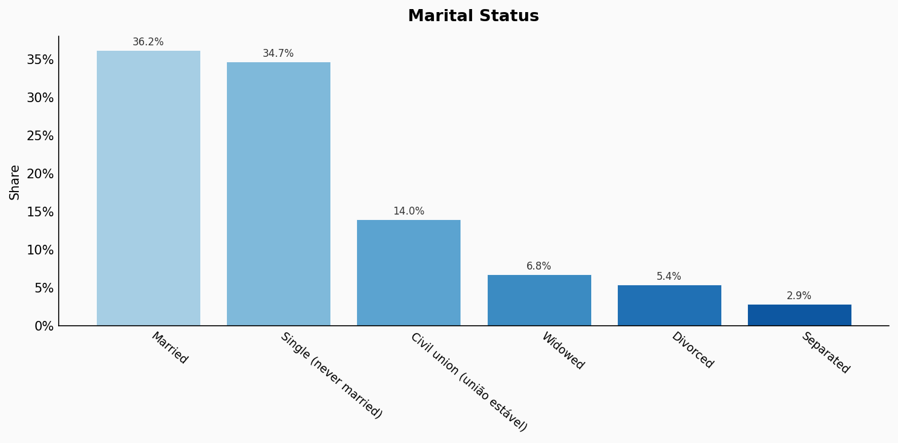

| Option | Share |
|---|---:|
| Married | 36.2% |
| Single (never married) | 34.7% |
| Civil union (união estável) | 14.0% |
| Widowed | 6.8% |
| Divorced | 5.4% |
| Separated | 2.9% |

## Education

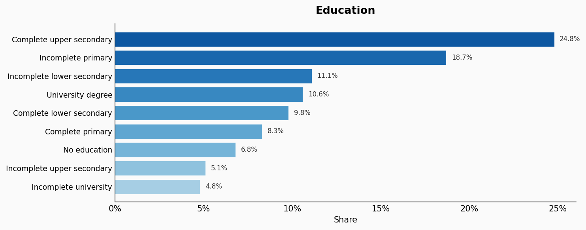

| Option | Share |
|---|---:|
| Complete upper secondary | 24.8% |
| Incomplete primary | 18.7% |
| Incomplete lower secondary | 11.1% |
| University degree | 10.6% |
| Complete lower secondary | 9.8% |
| Complete primary | 8.3% |
| No education | 6.8% |
| Incomplete upper secondary | 5.1% |
| Incomplete university | 4.8% |

## Occupation

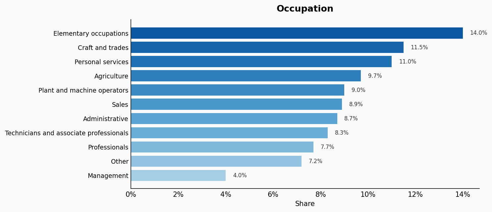

| Option | Share |
|---|---:|
| Elementary occupations | 14.0% |
| Craft and trades | 11.5% |
| Personal services | 11.0% |
| Agriculture | 9.7% |
| Plant and machine operators | 9.0% |
| Sales | 8.9% |
| Administrative | 8.7% |
| Technicians and associate professionals | 8.3% |
| Professionals | 7.7% |
| Other | 7.2% |
| Management | 4.0% |

## Housing Tenure

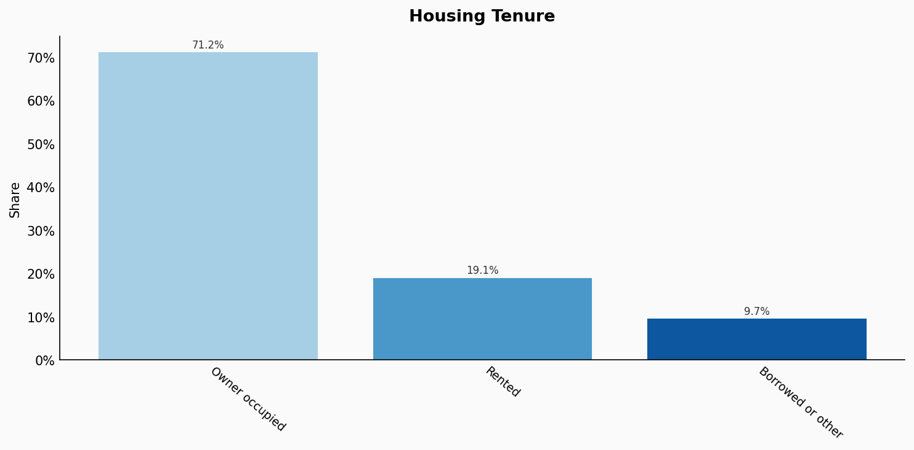

| Option | Share |
|---|---:|
| Owner occupied | 71.2% |
| Rented | 19.1% |
| Borrowed or other | 9.7% |

## Place Of Birth

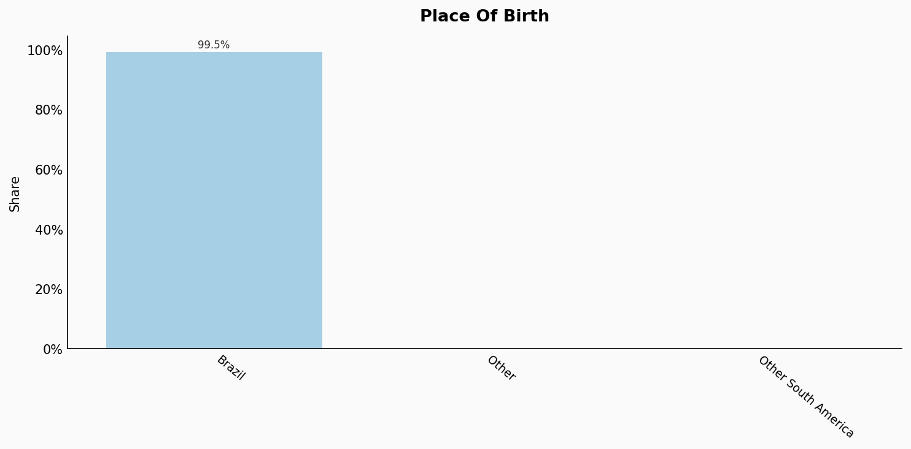

| Option | Share |
|---|---:|
| Brazil | 99.5% |
| Other | 0.3% |
| Other South America | 0.2% |

## Sexuality

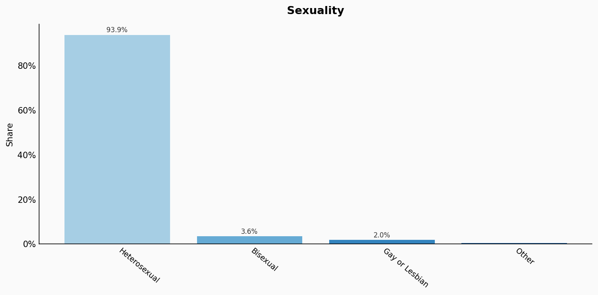

| Option | Share |
|---|---:|
| Heterosexual | 93.9% |
| Bisexual | 3.6% |
| Gay or Lesbian | 2.0% |
| Other | 0.5% |

## Sources

- [Censo Demográfico 2022, IBGE (2022)](https://censo2022.ibge.gov.br/)
  *Covers: `age`, `sex`, `marital status`, `location`, `race`, `housing tenure`*
- [Pesquisa Nacional por Amostra de Domicílios Contínua (PNADC) 2022, IBGE (2022)](https://www.ibge.gov.br/estatisticas/sociais/trabalho/9171-pesquisa-nacional-por-amostra-de-domicilios-continua-mensal.html)
  *Covers: `education`, `occupation`*
- [Censo Demográfico 2010 / Pesquisa Social Brasileira 2022, IBGE (2022)](https://www.ibge.gov.br/estatisticas/sociais/populacao/9662-censo-demografico-2010.html)
  *Covers: `religion`*
- [Pesquisa Nacional de Saúde (PNS) 2019, IBGE/MS (2019)](https://www.ibge.gov.br/estatisticas/sociais/saude/9160-pesquisa-nacional-de-saude.html)
  *Covers: `sexuality`*