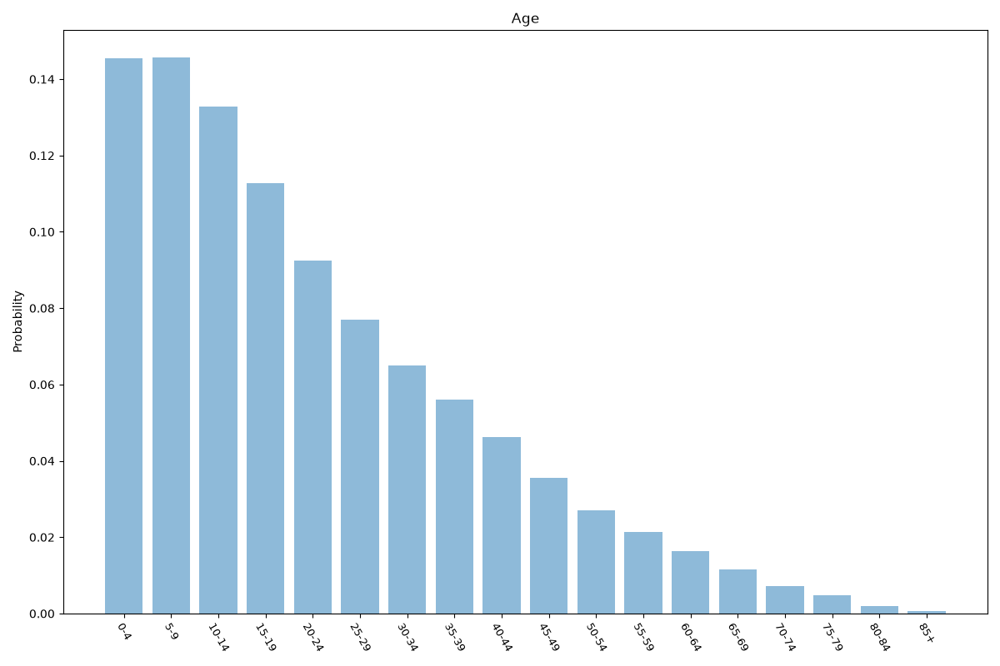
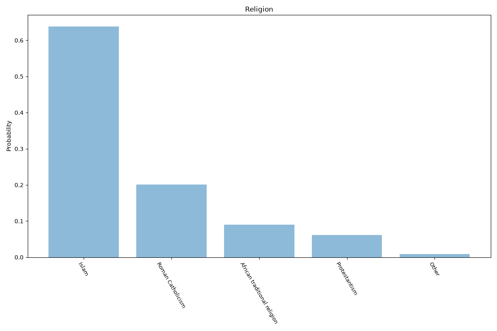
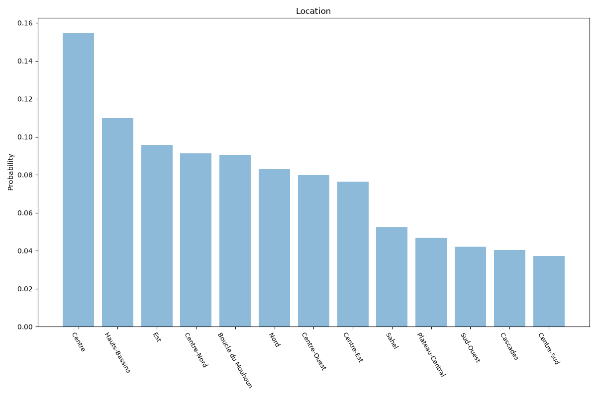

# Burkina Faso
**4 features:** age, sex, religion and location.

## Age

## Sex

## Religion

## Location

## Sources

- [World Population Prospects 2024, United Nations (2024)](https://population.un.org/wpp/) — age, sex
- [2019 General Census (religion), Institut National de la Statistique et de la Démographie (INSD) (2019)](https://www.insd.bf/) — religion
- [2019 General Census (5th RGPH), Institut National de la Statistique et de la Démographie (INSD) (2019)](https://www.insd.bf/) — location