# Canada

**12 features:** age, sex, relationship, religion, ethnicity, education, occupation, housing tenure, location, language, sexuality, and place of birth.

## Age

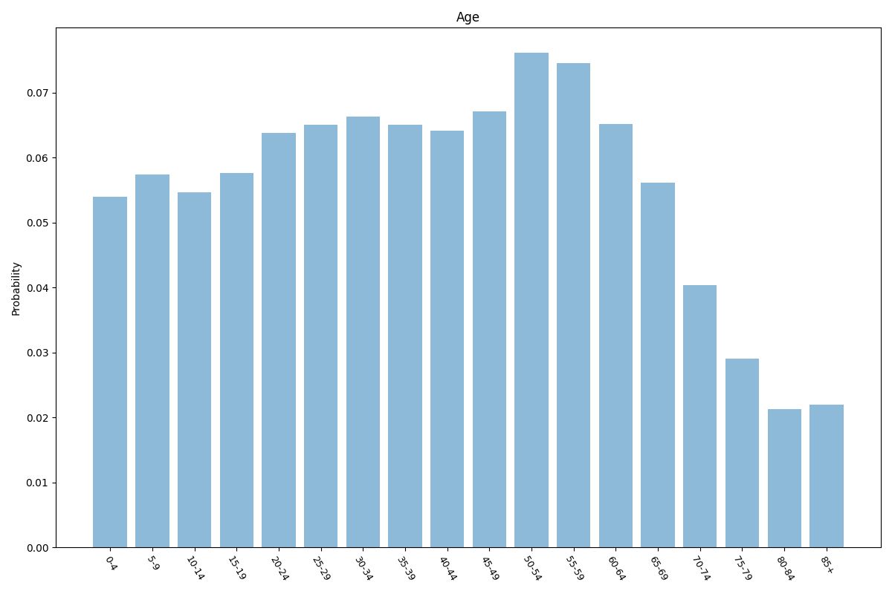

| Option | Share |
|---|---:|
| 0-4 | 5.0% |
| 5-9 | 5.5% |
| 10-14 | 5.6% |
| 15-19 | 5.8% |
| 20-24 | 6.3% |
| 25-29 | 7.0% |
| 30-34 | 7.2% |
| 35-39 | 6.9% |
| 40-44 | 6.4% |
| 45-49 | 6.6% |
| 50-54 | 7.0% |
| 55-59 | 7.1% |
| 60-64 | 6.4% |
| 65-69 | 5.5% |
| 70-74 | 4.3% |
| 75-79 | 2.9% |
| 80-84 | 2.1% |
| 85+ | 1.9% |

## Sex

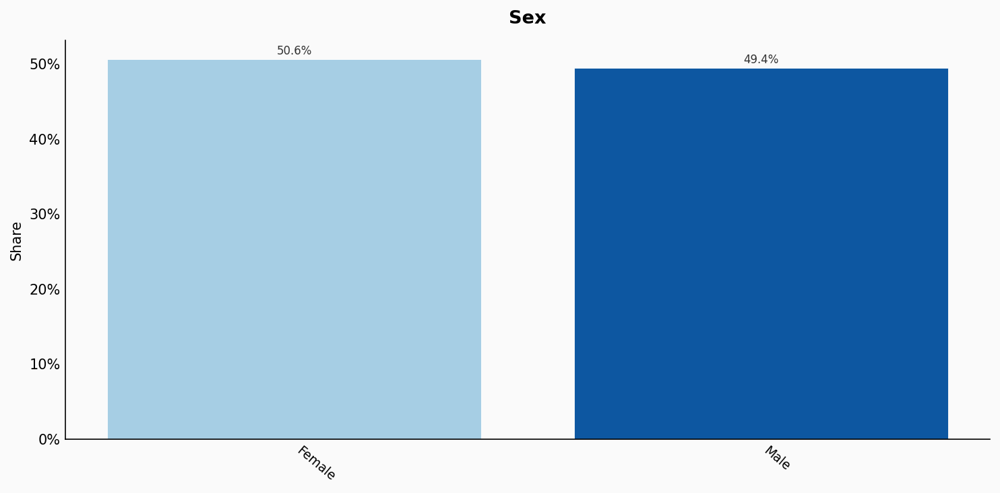

| Option | Share |
|---|---:|
| Female | 50.6% |
| Male | 49.4% |

## Relationship

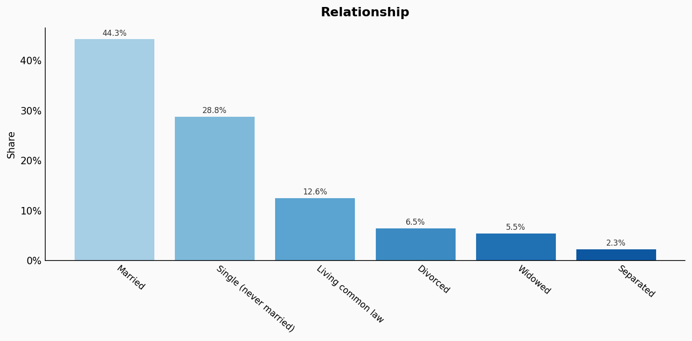

| Option | Share |
|---|---:|
| Married | 44.3% |
| Single (never married) | 28.8% |
| Living common law | 12.6% |
| Divorced | 6.5% |
| Widowed | 5.5% |
| Separated | 2.3% |

## Religion

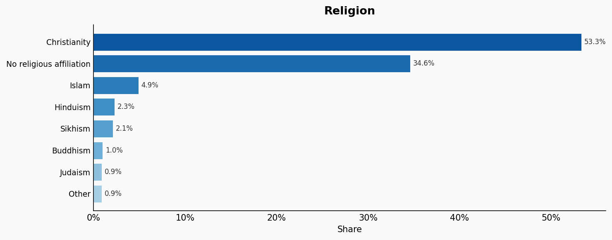

| Option | Share |
|---|---:|
| Christianity | 53.3% |
| No religious affiliation | 34.6% |
| Islam | 4.9% |
| Hinduism | 2.3% |
| Sikhism | 2.1% |
| Buddhism | 1.0% |
| Judaism | 0.9% |
| Other | 0.9% |

## Ethnicity

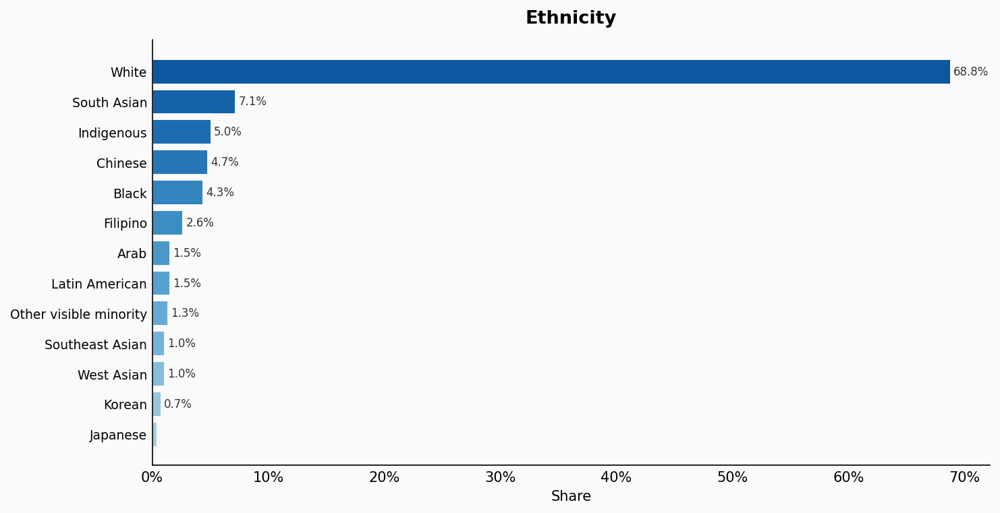

| Option | Share |
|---|---:|
| White | 68.8% |
| South Asian | 7.1% |
| Indigenous | 5.0% |
| Chinese | 4.7% |
| Black | 4.3% |
| Filipino | 2.6% |
| Arab | 1.5% |
| Latin American | 1.5% |
| Other visible minority | 1.3% |
| Southeast Asian | 1.0% |
| West Asian | 1.0% |
| Korean | 0.7% |
| Japanese | 0.4% |

## Education

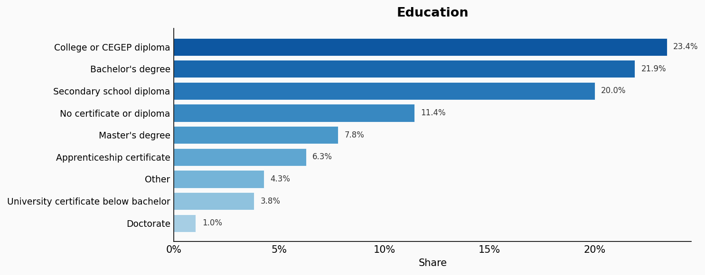

| Option | Share |
|---|---:|
| College or CEGEP diploma | 23.4% |
| Bachelor's degree | 21.9% |
| Secondary school diploma | 20.0% |
| No certificate or diploma | 11.4% |
| Master's degree | 7.8% |
| Apprenticeship certificate | 6.3% |
| Other | 4.3% |
| University certificate below bachelor | 3.8% |
| Doctorate | 1.0% |

## Occupation

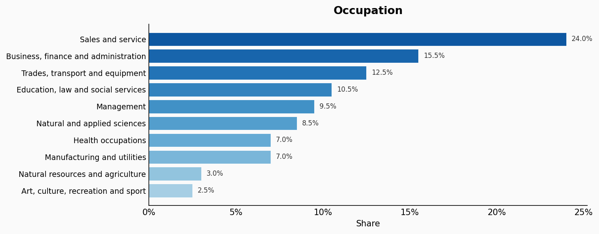

| Option | Share |
|---|---:|
| Sales and service | 24.0% |
| Business, finance and administration | 15.5% |
| Trades, transport and equipment | 12.5% |
| Education, law and social services | 10.5% |
| Management | 9.5% |
| Natural and applied sciences | 8.5% |
| Health occupations | 7.0% |
| Manufacturing and utilities | 7.0% |
| Natural resources and agriculture | 3.0% |
| Art, culture, recreation and sport | 2.5% |

## Housing Tenure

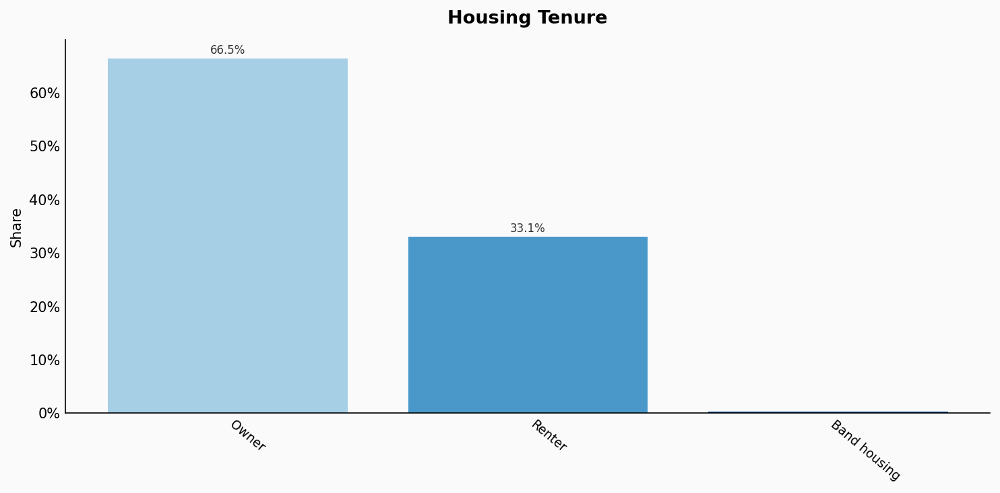

| Option | Share |
|---|---:|
| Owner | 66.5% |
| Renter | 33.1% |
| Band housing | 0.4% |

## Location

| Option | Share |
|---|---:|
| Ontario | 38.5% |
| Quebec | 23.0% |
| British Columbia | 13.5% |
| Alberta | 11.5% |
| Manitoba | 3.6% |
| Saskatchewan | 3.1% |
| Nova Scotia | 2.6% |
| New Brunswick | 2.1% |
| Newfoundland and Labrador | 1.4% |
| Prince Edward Island | 0.4% |
| Northwest Territories | 0.1% |
| Yukon | 0.1% |
| Nunavut | 0.1% |

## Language

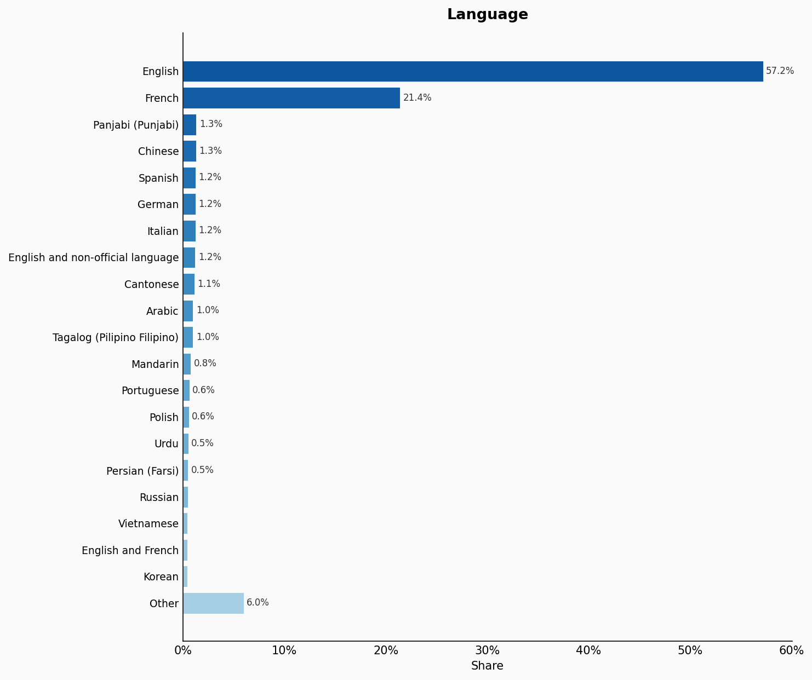

| Option | Share |
|---|---:|
| English | 57.2% |
| French | 21.4% |
| Panjabi (Punjabi) | 1.3% |
| Chinese | 1.3% |
| Spanish | 1.2% |
| German | 1.2% |
| Italian | 1.2% |
| English and non-official language | 1.2% |
| Cantonese | 1.1% |
| Arabic | 1.0% |
| Tagalog (Pilipino Filipino) | 1.0% |
| Mandarin | 0.8% |
| Portuguese | 0.6% |
| Polish | 0.6% |
| Urdu | 0.5% |
| Persian (Farsi) | 0.5% |
| Russian | 0.5% |
| Vietnamese | 0.4% |
| English and French | 0.4% |
| Korean | 0.4% |
| Other | 6.0% |

## Sexuality

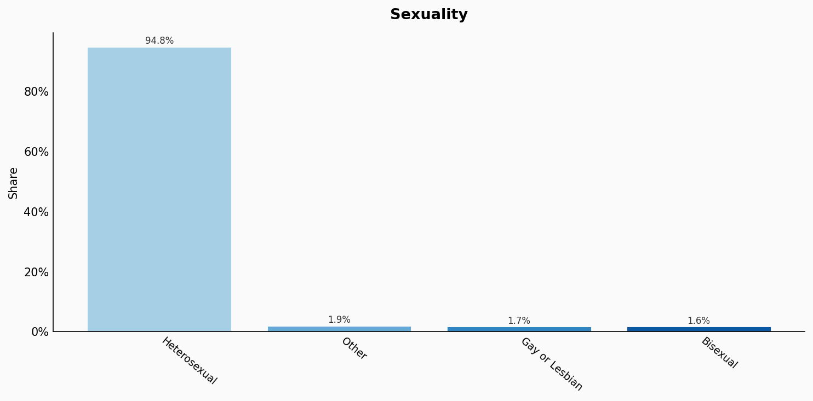

| Option | Share |
|---|---:|
| Heterosexual | 94.8% |
| Other | 1.9% |
| Gay or Lesbian | 1.7% |
| Bisexual | 1.6% |

## Place Of Birth

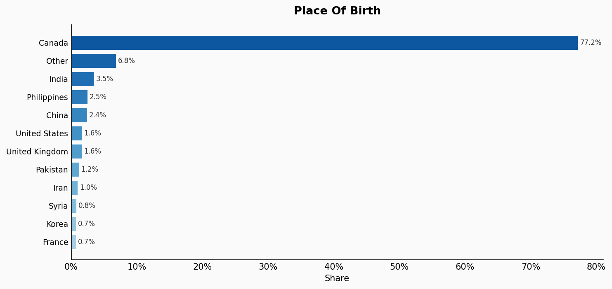

| Option | Share |
|---|---:|
| Canada | 77.2% |
| Other | 6.8% |
| India | 3.5% |
| Philippines | 2.5% |
| China | 2.4% |
| United States | 1.6% |
| United Kingdom | 1.6% |
| Pakistan | 1.2% |
| Iran | 1.0% |
| Syria | 0.8% |
| Korea | 0.7% |
| France | 0.7% |

## Sources

- [Census of Population 2021, Statistics Canada (2021)](https://www12.statcan.gc.ca/census-recensement/2021/dp-pd/prof/index.cfm?Lang=E)
  *Covers: `age`, `sex`, `relationship`, `education`, `occupation`, `housing tenure`, `location`*
- [Ethnocultural and religious diversity, Census 2021, Statistics Canada (2021)](https://www12.statcan.gc.ca/census-recensement/2021/rt-td/ethno-religion-eng.cfm)
  *Covers: `religion`*
- [Visible minority and population group, Census 2021, Statistics Canada (2021)](https://www12.statcan.gc.ca/census-recensement/2021/dp-pd/prof/details/page.cfm)
  *Covers: `ethnicity`*
- [Statistics Canada Census 2011 (2011)](https://www12.statcan.gc.ca/census-recensement/2011/dp-pd/prof/details/page.cfm?Lang=E&Geo1=PR&Code1=01&Geo2=PR&Code2=01&Data=Count&SearchText=Canada&SearchType=Begins&SearchPR=01&B1=All&Custom=&TABID=1)
  *Covers: `language`*
- [Canadian Community Health Survey, Statistics Canada (2018)](https://www150.statcan.gc.ca/n1/pub/45-28-0001/2020001/article/00016-eng.htm)
  *Covers: `sexuality`*
- [Census of Population 2021, Statistics Canada (2021)](https://www12.statcan.gc.ca/census-recensement/2021/dp-pd/prof/index.cfm?Lang=E)
  *Covers: `place of birth`*