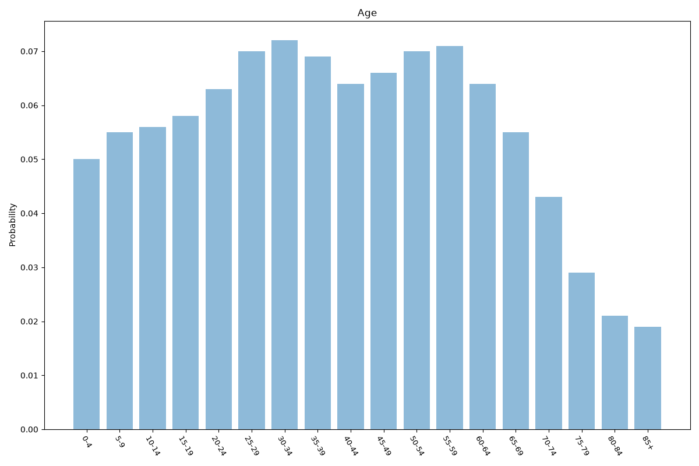
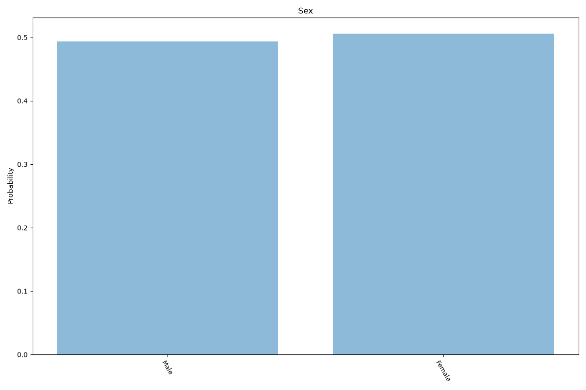
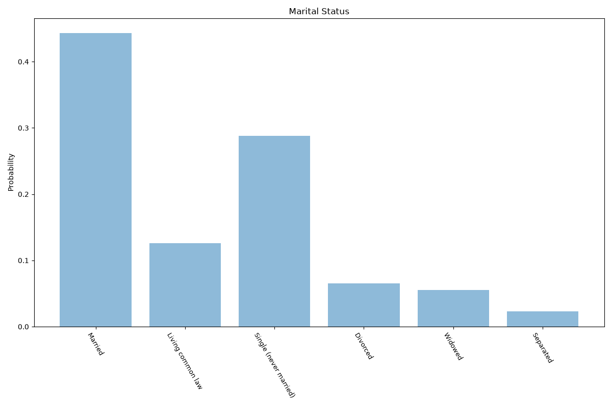
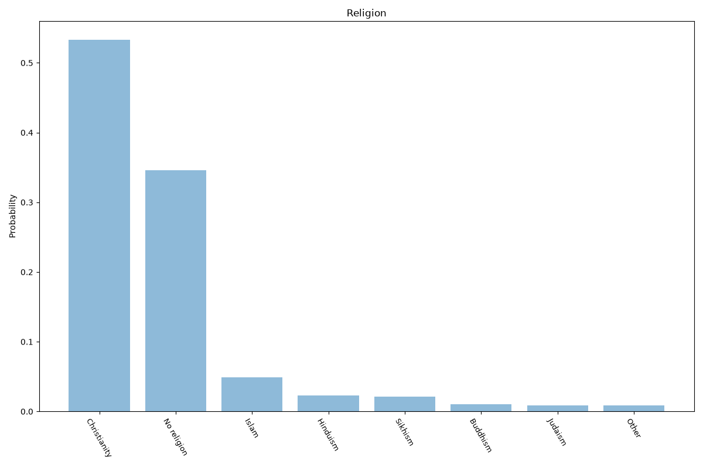
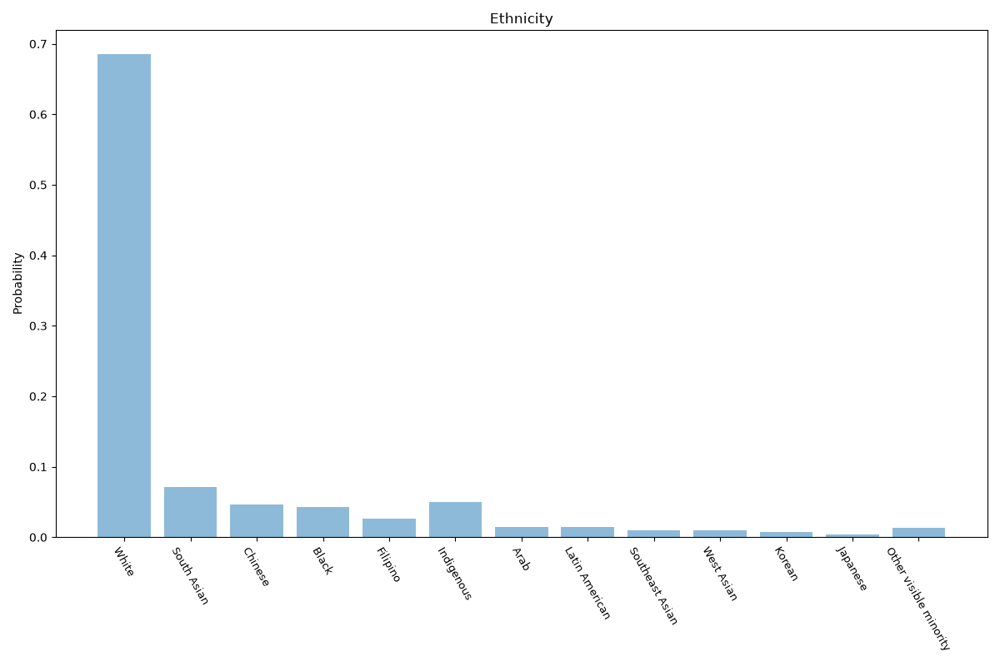
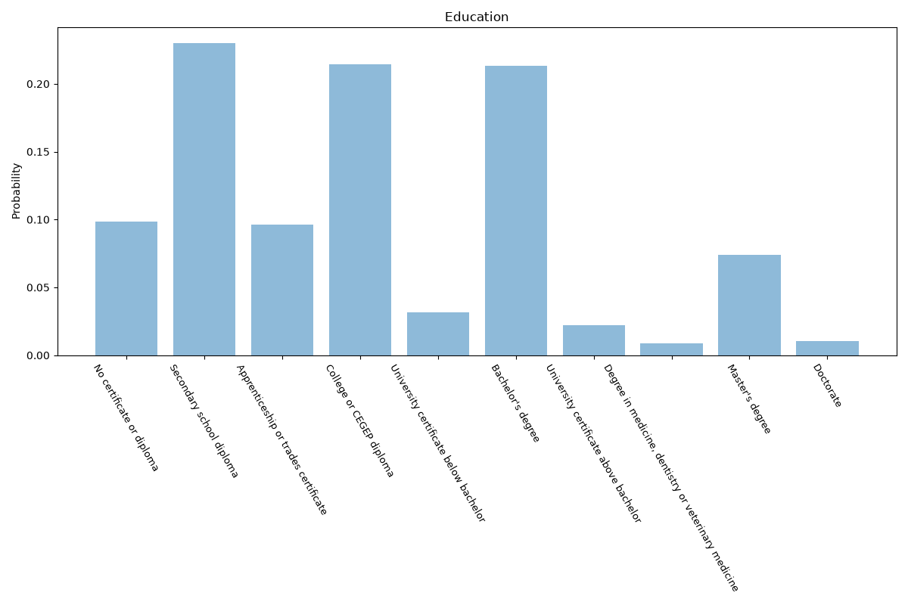
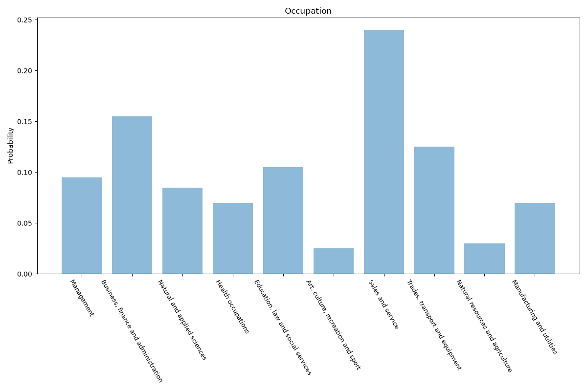
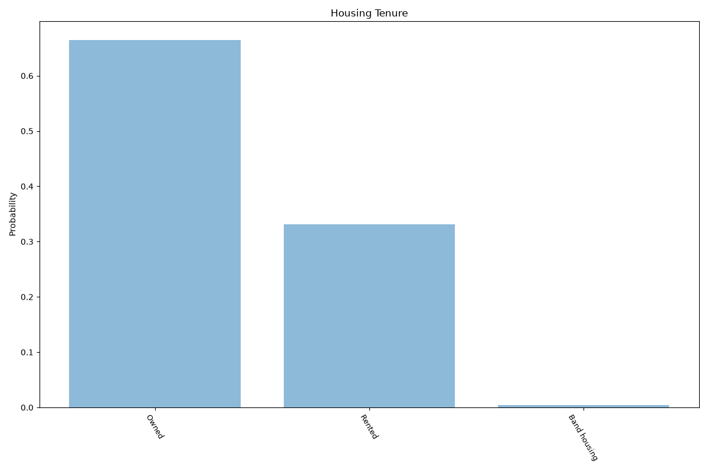
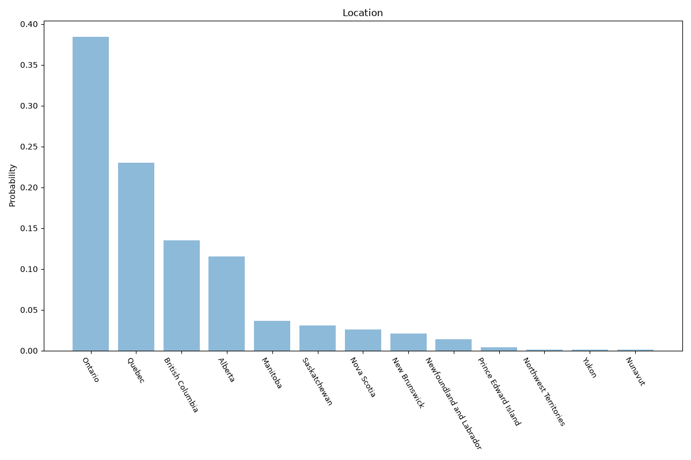
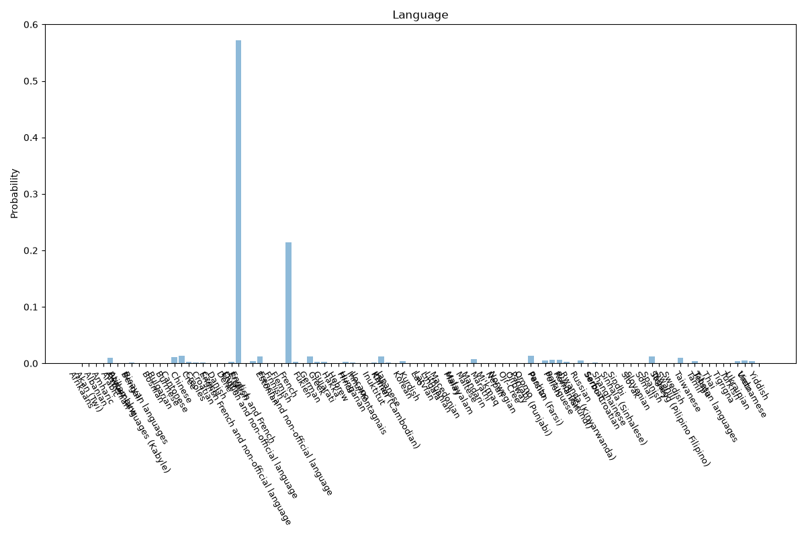

# Canada
**10 features:** age, sex, marital status, religion, ethnicity, education, occupation, housing tenure, location and language.

## Age

## Sex

## Marital Status

## Religion

## Ethnicity

## Education

## Occupation

## Housing Tenure

## Location

## Language

## Sources

- [Census of Population 2021, Statistics Canada (2021)](https://www12.statcan.gc.ca/census-recensement/2021/dp-pd/prof/index.cfm?Lang=E) — age, sex, marital status, education, occupation, housing tenure, location
- [Ethnocultural and religious diversity, Census 2021, Statistics Canada (2021)](https://www12.statcan.gc.ca/census-recensement/2021/rt-td/ethno-religion-eng.cfm) — religion
- [Visible minority and population group, Census 2021, Statistics Canada (2021)](https://www12.statcan.gc.ca/census-recensement/2021/rt-td/ethnicity-ethnicite-eng.cfm) — ethnicity
- [Language, Census of Population 2011, Statistics Canada (2011)](https://www12.statcan.gc.ca/census-recensement/2011/as-sa/98-314-x/98-314-x2011001-eng.cfm) — language