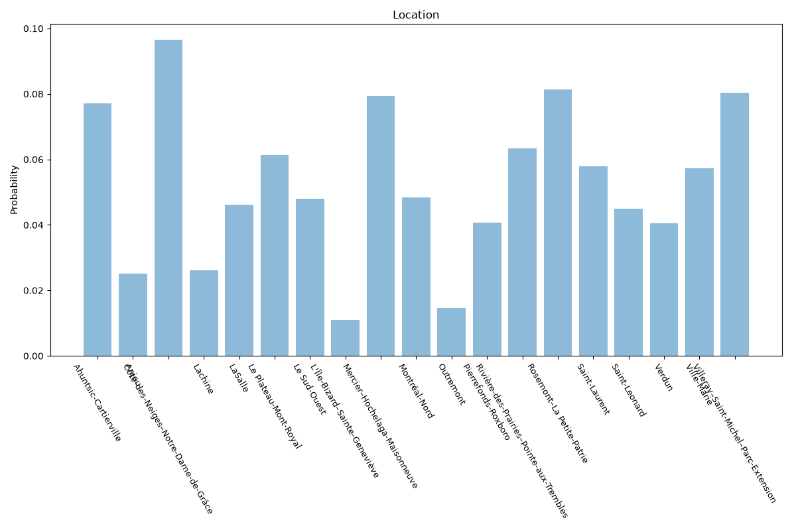

# Montreal
**2 features:** location and residence.

## Location

## Residence

## Sources

- [Census of Population 2021, Statistics Canada (2021)](https://www12.statcan.gc.ca/) — location
- [World Urbanization Prospects 2018, United Nations (2018)](https://population.un.org/wup/) — residence