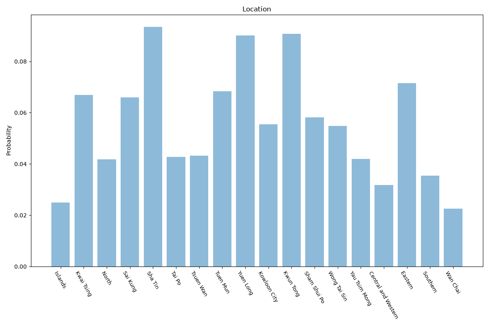

# Hong Kong
**2 features:** location and residence.

## Location

## Residence

## Sources

- [2021 Population Census, Census and Statistics Department (Hong Kong) (2021)](https://www.censtatd.gov.hk/en/) — location
- [World Urbanization Prospects 2018, United Nations (2018)](https://population.un.org/wup/) — residence