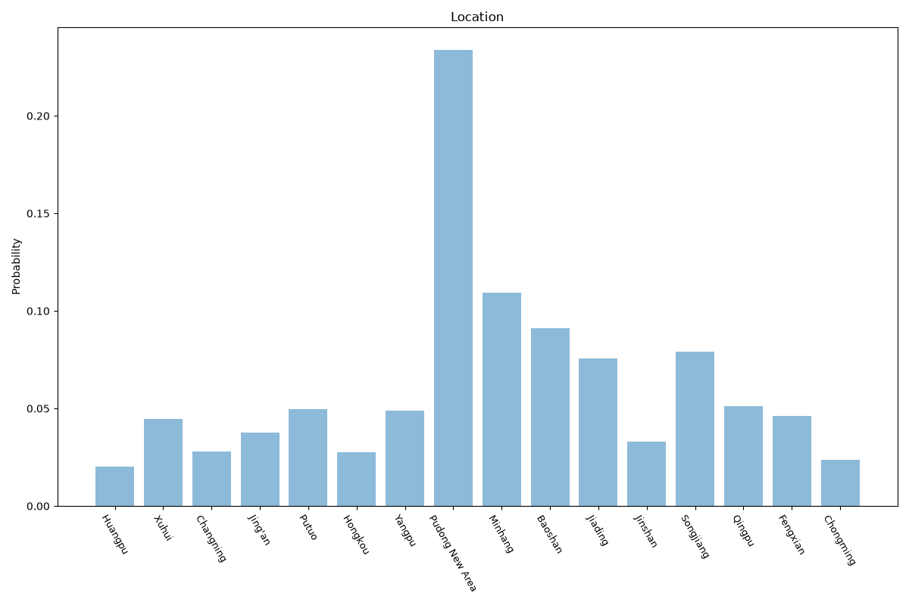

# Shanghai
**2 features:** location and residence.

## Location

## Residence

## Sources

- [Shanghai Statistical Yearbook 2024, National Bureau of Statistics of China (2023)](https://www.stats.gov.cn/english/) — location
- [World Urbanization Prospects 2018, United Nations (2018)](https://population.un.org/wup/) — residence