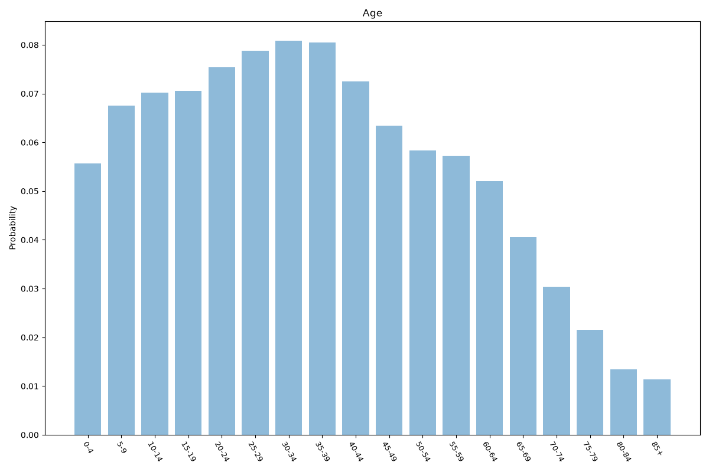
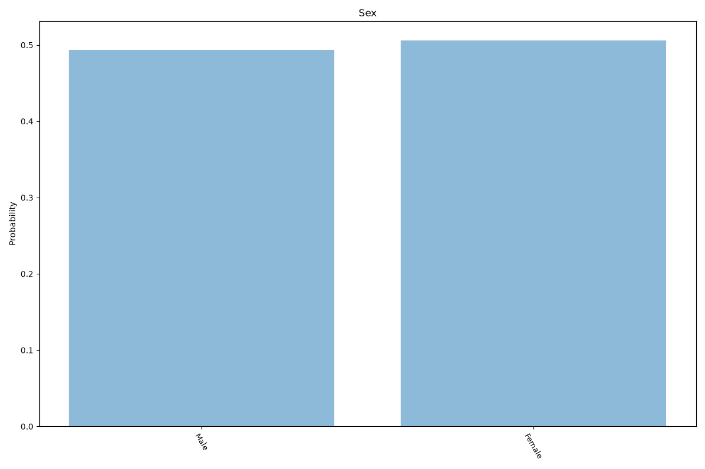
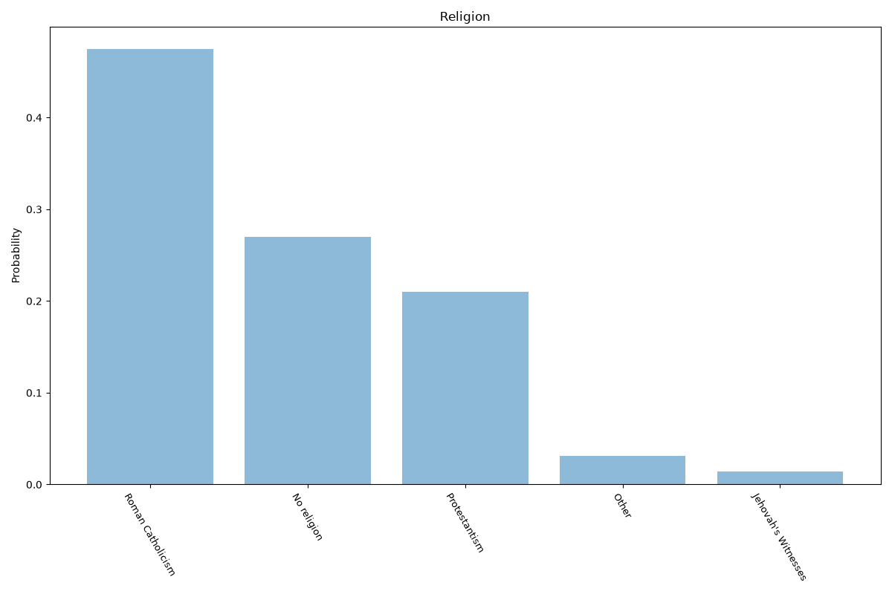
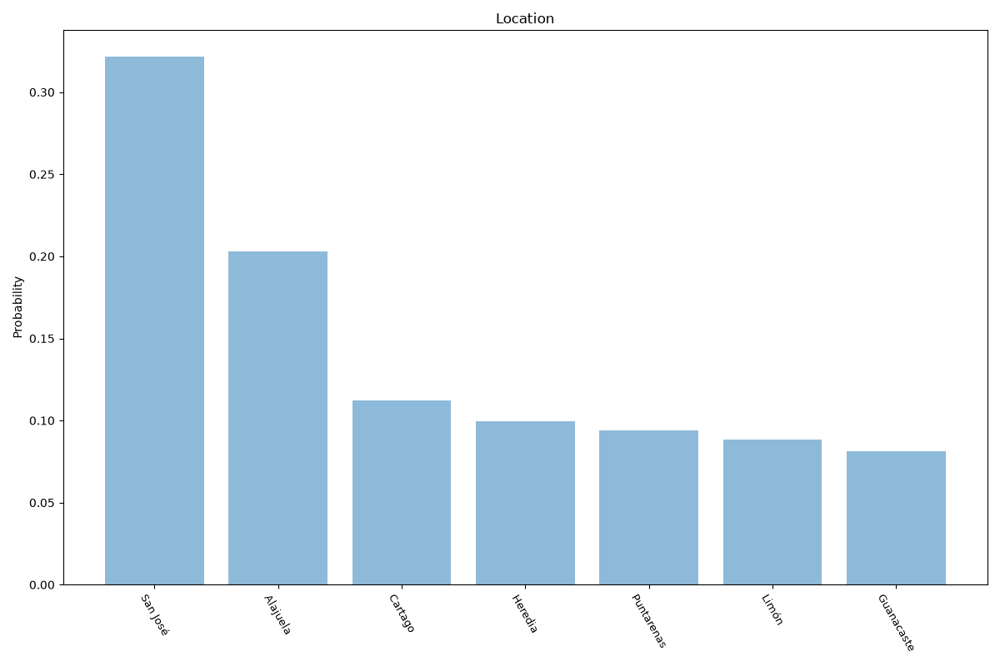

# Costa Rica
**4 features:** age, sex, religion and location.

## Age

## Sex

## Religion

## Location

## Sources

- [World Population Prospects 2024, United Nations (2024)](https://population.un.org/wpp/) — age, sex
- [The World Factbook: Costa Rica (religion), CIA (2021)](https://www.cia.gov/the-world-factbook/countries/costa-rica/) — religion
- [Population estimates, Instituto Nacional de Estadística y Censos (INEC Costa Rica) (2022)](https://www.inec.cr/) — location