# Czech Republic

**11 features:** age, sex, location, religion, language, marital status, education, occupation, housing tenure, place of birth, and sexuality.

## Age

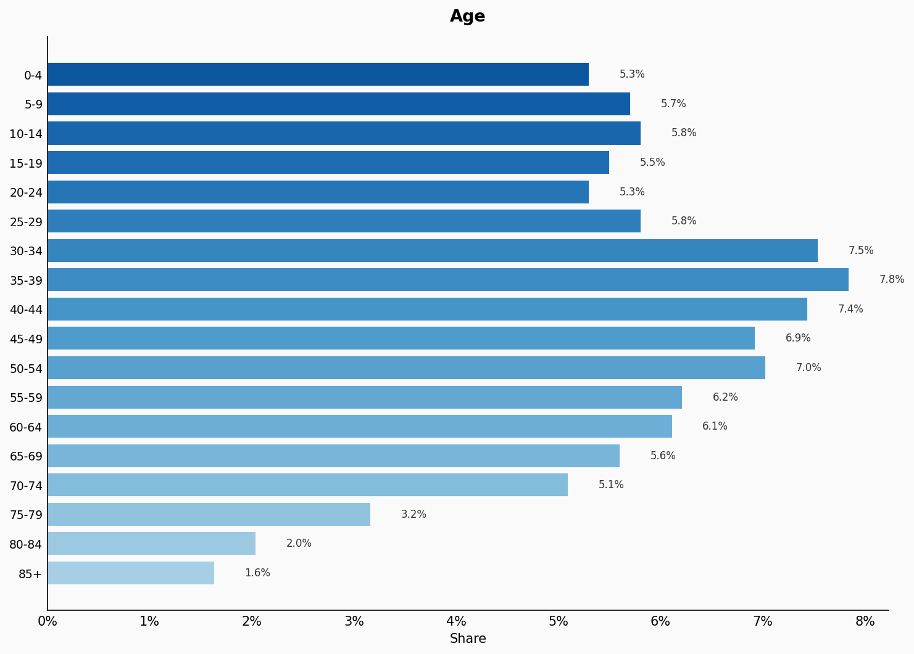

| Option | Share |
|---|---:|
| 0-4 | 5.3% |
| 5-9 | 5.7% |
| 10-14 | 5.8% |
| 15-19 | 5.5% |
| 20-24 | 5.3% |
| 25-29 | 5.8% |
| 30-34 | 7.5% |
| 35-39 | 7.8% |
| 40-44 | 7.4% |
| 45-49 | 6.9% |
| 50-54 | 7.0% |
| 55-59 | 6.2% |
| 60-64 | 6.1% |
| 65-69 | 5.6% |
| 70-74 | 5.1% |
| 75-79 | 3.2% |
| 80-84 | 2.0% |
| 85+ | 1.6% |

## Sex

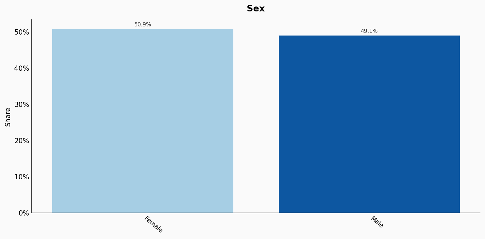

| Option | Share |
|---|---:|
| Female | 50.9% |
| Male | 49.1% |

## Location

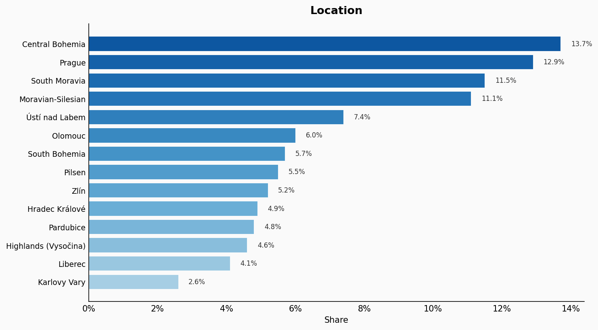

| Option | Share |
|---|---:|
| Central Bohemia | 13.7% |
| Prague | 12.9% |
| South Moravia | 11.5% |
| Moravian-Silesian | 11.1% |
| Ústí nad Labem | 7.4% |
| Olomouc | 6.0% |
| South Bohemia | 5.7% |
| Pilsen | 5.5% |
| Zlín | 5.2% |
| Hradec Králové | 4.9% |
| Pardubice | 4.8% |
| Highlands (Vysočina) | 4.6% |
| Liberec | 4.1% |
| Karlovy Vary | 2.6% |

## Religion

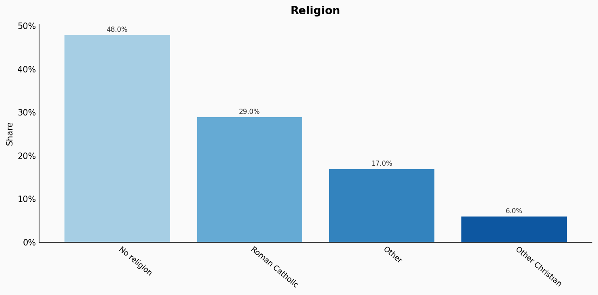

| Option | Share |
|---|---:|
| No religion | 48.0% |
| Roman Catholic | 29.0% |
| Other | 17.0% |
| Other Christian | 6.0% |

## Language

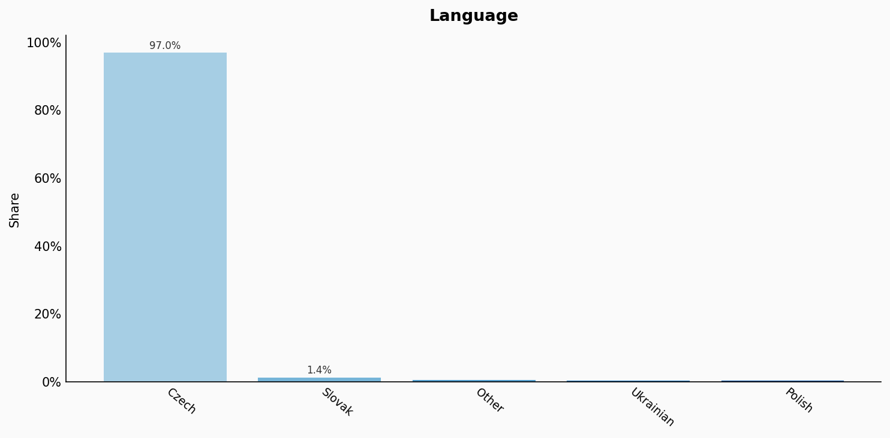

| Option | Share |
|---|---:|
| Czech | 97.0% |
| Slovak | 1.4% |
| Other | 0.7% |
| Ukrainian | 0.5% |
| Polish | 0.4% |

## Marital Status

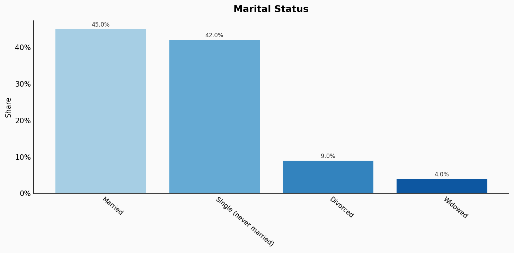

| Option | Share |
|---|---:|
| Married | 45.0% |
| Single (never married) | 42.0% |
| Divorced | 9.0% |
| Widowed | 4.0% |

## Education

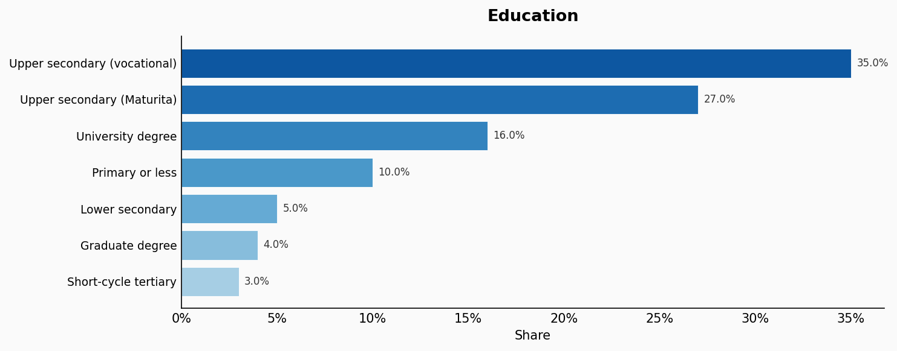

| Option | Share |
|---|---:|
| Upper secondary (vocational) | 35.0% |
| Upper secondary (Maturita) | 27.0% |
| University degree | 16.0% |
| Primary or less | 10.0% |
| Lower secondary | 5.0% |
| Graduate degree | 4.0% |
| Short-cycle tertiary | 3.0% |

## Occupation

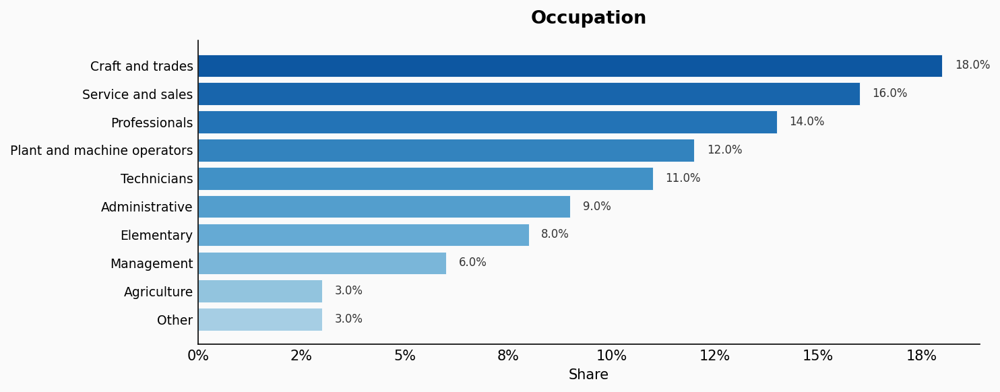

| Option | Share |
|---|---:|
| Craft and trades | 18.0% |
| Service and sales | 16.0% |
| Professionals | 14.0% |
| Plant and machine operators | 12.0% |
| Technicians | 11.0% |
| Administrative | 9.0% |
| Elementary | 8.0% |
| Management | 6.0% |
| Agriculture | 3.0% |
| Other | 3.0% |

## Housing Tenure

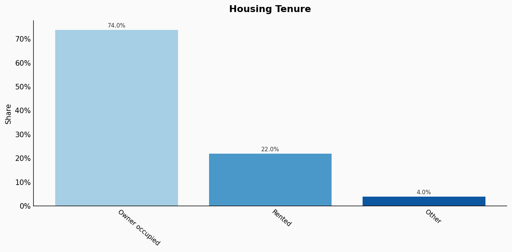

| Option | Share |
|---|---:|
| Owner occupied | 74.0% |
| Rented | 22.0% |
| Other | 4.0% |

## Place Of Birth

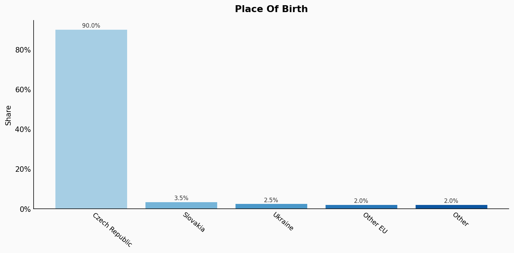

| Option | Share |
|---|---:|
| Czech Republic | 90.0% |
| Slovakia | 3.5% |
| Ukraine | 2.5% |
| Other EU | 2.0% |
| Other | 2.0% |

## Sexuality

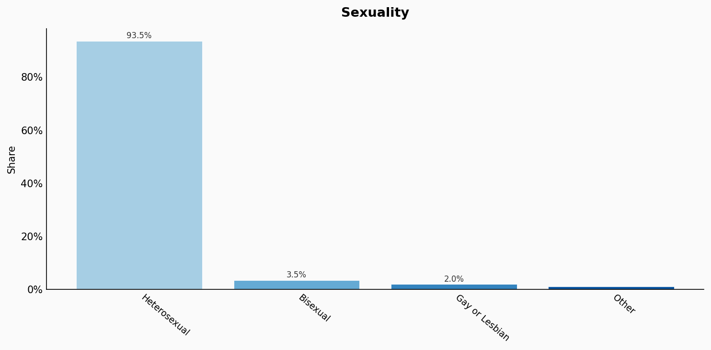

| Option | Share |
|---|---:|
| Heterosexual | 93.5% |
| Bisexual | 3.5% |
| Gay or Lesbian | 2.0% |
| Other | 1.0% |

## Sources

- [Sčítání lidu, domů a bytů 2021, Český statistický úřad (CZSO) (2021)](https://www.czso.cz/csu/czso/census-2021)
  *Covers: `age`, `sex`, `location`, `marital status`, `housing tenure`, `place of birth`*
- [Výběrové šetření pracovních sil 2022, CZSO (2022)](https://www.czso.cz/csu/czso/labour-force-survey)
  *Covers: `education`, `occupation`*
- [Sčítání lidu - Náboženská víra 2021, CZSO (2021)](https://www.czso.cz/csu/czso/census-2021)
  *Covers: `religion`*
- [Sčítání lidu - Mateřský jazyk 2021, CZSO (2021)](https://www.czso.cz/csu/czso/census-2021)
  *Covers: `language`*
- [Eurobarometer Special Survey on Discrimination 2019, European Commission (2019)](https://europa.eu/eurobarometer/surveys/detail/2251)
  *Covers: `sexuality`*