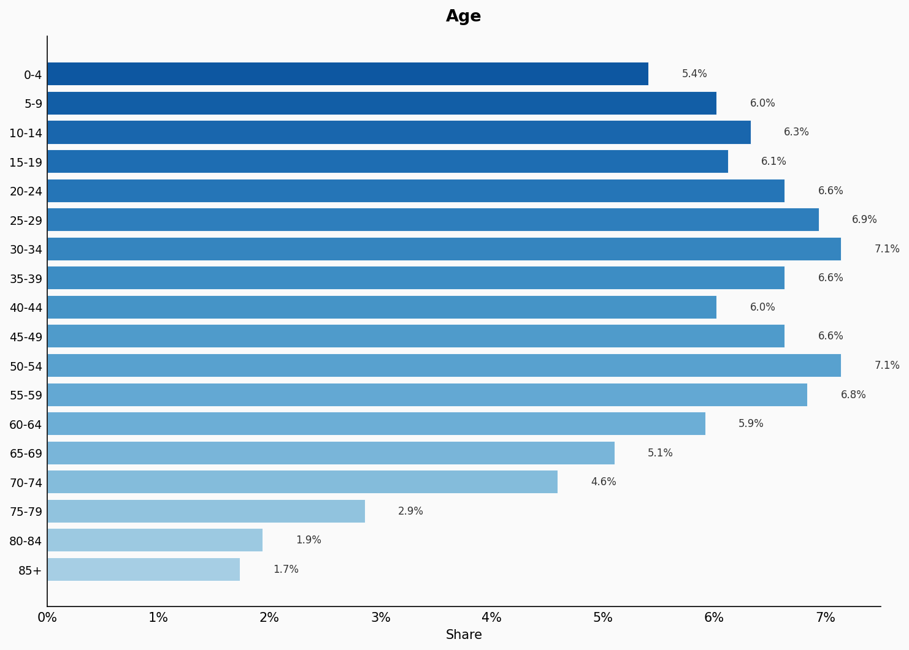
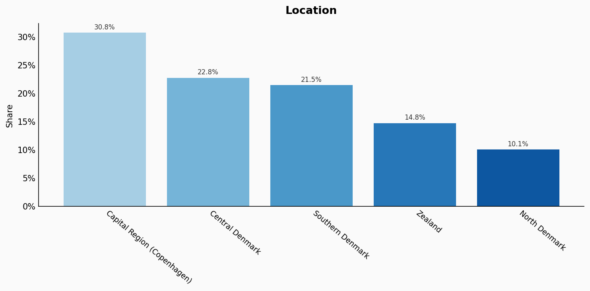
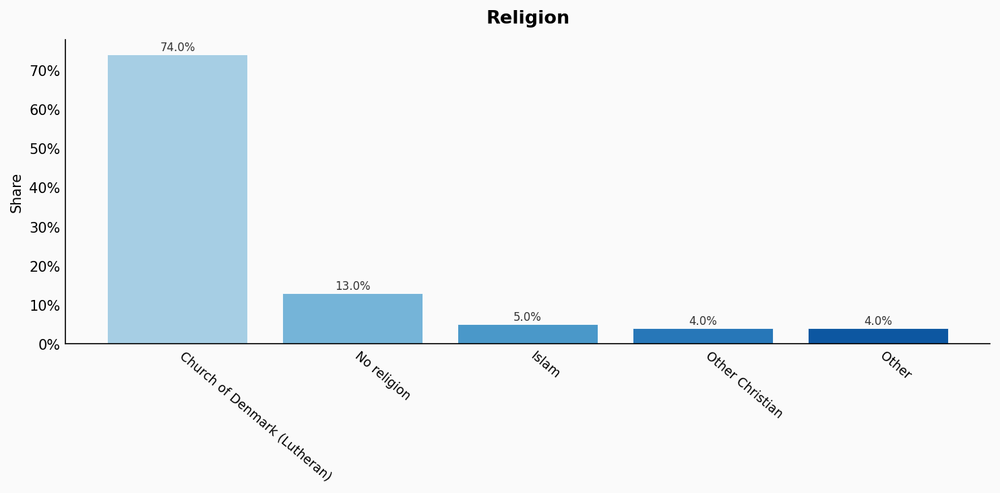
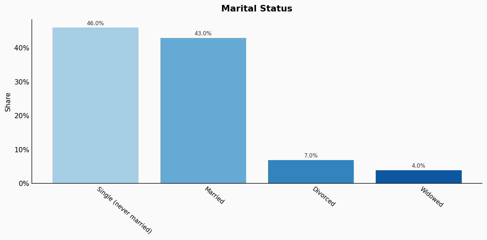
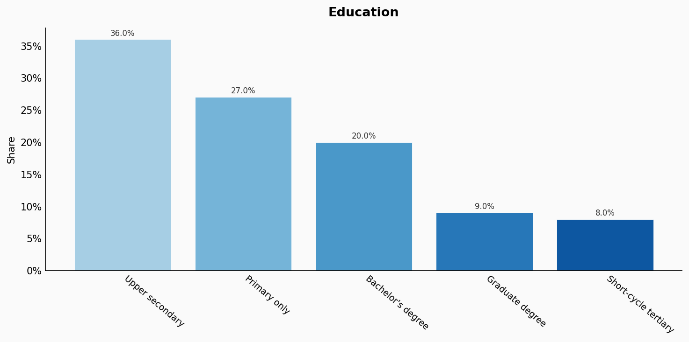
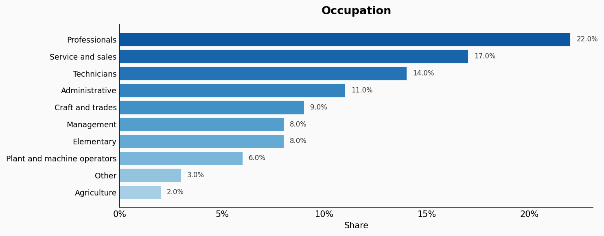
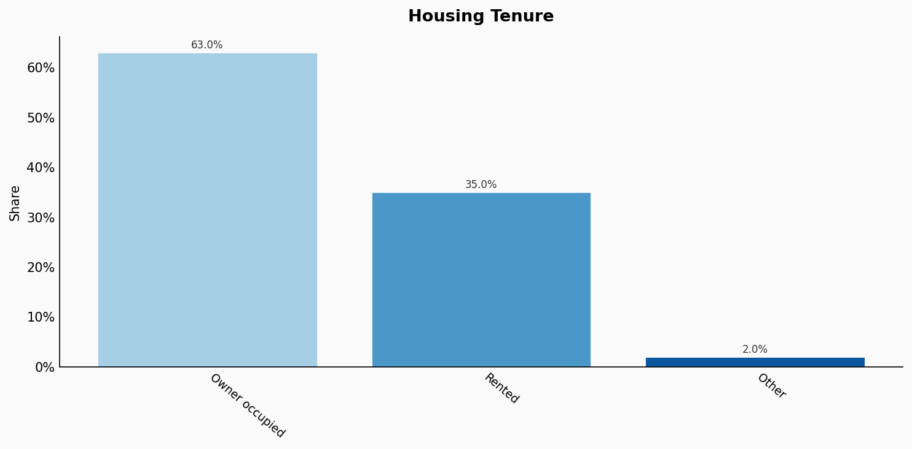
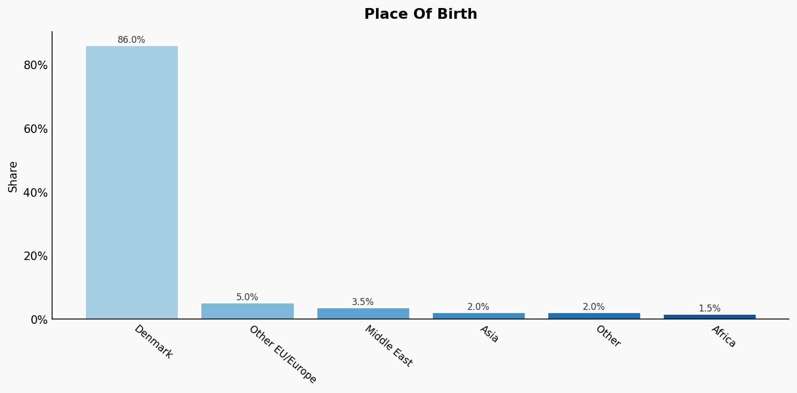

# Denmark

**11 features:** age, sex, location, religion, language, marital status, education, occupation, housing tenure, place of birth, and sexuality.

## Age

| Option | Share |
|---|---:|
| 0-4 | 5.4% |
| 5-9 | 6.0% |
| 10-14 | 6.3% |
| 15-19 | 6.1% |
| 20-24 | 6.6% |
| 25-29 | 6.9% |
| 30-34 | 7.1% |
| 35-39 | 6.6% |
| 40-44 | 6.0% |
| 45-49 | 6.6% |
| 50-54 | 7.1% |
| 55-59 | 6.8% |
| 60-64 | 5.9% |
| 65-69 | 5.1% |
| 70-74 | 4.6% |
| 75-79 | 2.9% |
| 80-84 | 1.9% |
| 85+ | 1.7% |

## Sex

| Option | Share |
|---|---:|
| Female | 50.0% |
| Male | 50.0% |

## Location

| Option | Share |
|---|---:|
| Capital Region (Copenhagen) | 30.8% |
| Central Denmark | 22.8% |
| Southern Denmark | 21.5% |
| Zealand | 14.8% |
| North Denmark | 10.1% |

## Religion

| Option | Share |
|---|---:|
| Church of Denmark (Lutheran) | 74.0% |
| No religion | 13.0% |
| Islam | 5.0% |
| Other Christian | 4.0% |
| Other | 4.0% |

## Language

| Option | Share |
|---|---:|
| Danish | 94.0% |
| Other | 2.2% |
| Other Scandinavian | 1.5% |
| English | 1.5% |
| Arabic | 0.8% |

## Marital Status

| Option | Share |
|---|---:|
| Single (never married) | 46.0% |
| Married | 43.0% |
| Divorced | 7.0% |
| Widowed | 4.0% |

## Education

| Option | Share |
|---|---:|
| Upper secondary | 36.0% |
| Primary only | 27.0% |
| Bachelor's degree | 20.0% |
| Graduate degree | 9.0% |
| Short-cycle tertiary | 8.0% |

## Occupation

| Option | Share |
|---|---:|
| Professionals | 22.0% |
| Service and sales | 17.0% |
| Technicians | 14.0% |
| Administrative | 11.0% |
| Craft and trades | 9.0% |
| Management | 8.0% |
| Elementary | 8.0% |
| Plant and machine operators | 6.0% |
| Other | 3.0% |
| Agriculture | 2.0% |

## Housing Tenure

| Option | Share |
|---|---:|
| Owner occupied | 63.0% |
| Rented | 35.0% |
| Other | 2.0% |

## Place Of Birth

| Option | Share |
|---|---:|
| Denmark | 86.0% |
| Other EU/Europe | 5.0% |
| Middle East | 3.5% |
| Asia | 2.0% |
| Other | 2.0% |
| Africa | 1.5% |

## Sexuality

| Option | Share |
|---|---:|
| Heterosexual | 93.0% |
| Bisexual | 3.5% |
| Gay or Lesbian | 2.5% |
| Other | 1.0% |

## Sources

- [Danmarks Statistik - Befolkningsstatistik 2021 (2021)](https://www.dst.dk/en/Statistik/emner/befolkning-og-valg/befolkning-og-befolkningsfremskrivning)
  *Covers: `age`, `sex`, `location`, `marital status`, `housing tenure`, `place of birth`*
- [Arbejdskraftundersøgelsen 2022, Danmarks Statistik (2022)](https://www.dst.dk/en/Statistik/emner/arbejde-og-indkomst/arbejdskraft)
  *Covers: `education`, `occupation`*
- [Kirkestatistik 2021, Danmarks Statistik (2021)](https://www.dst.dk/en/Statistik/emner/kultur-og-kirke/kirker-og-trossamfund)
  *Covers: `religion`*
- [Indvandrere i Danmark 2022, Danmarks Statistik (2022)](https://www.dst.dk/en/Statistik/emner/befolkning-og-valg/indvandrere-og-efterkommere)
  *Covers: `language`*
- [Eurobarometer Special Survey on Discrimination 2019, European Commission (2019)](https://europa.eu/eurobarometer/surveys/detail/2251)
  *Covers: `sexuality`*