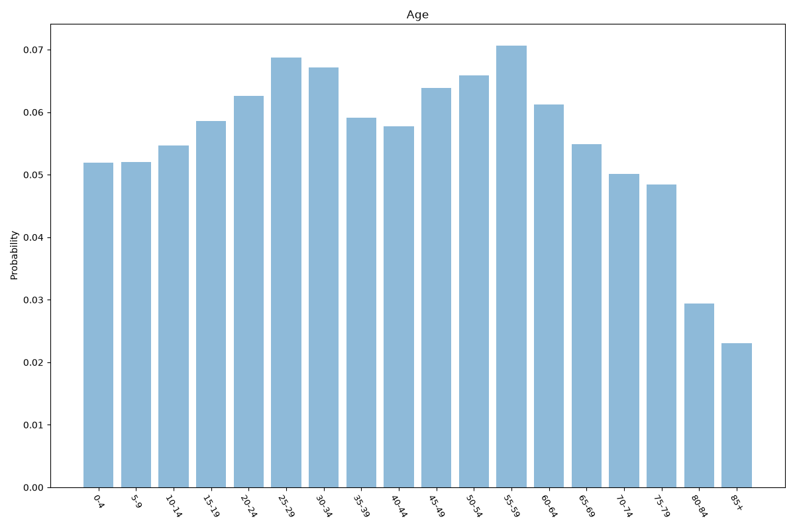
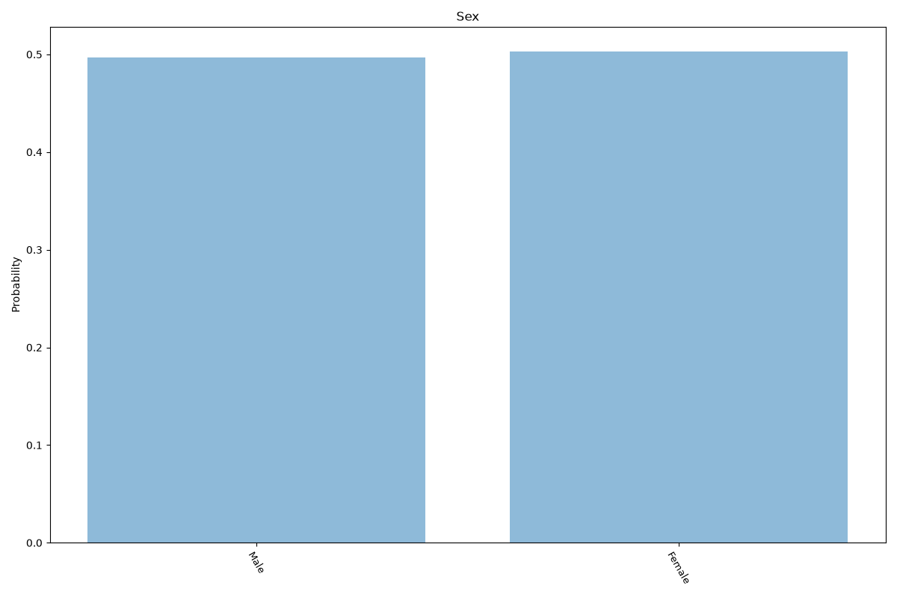
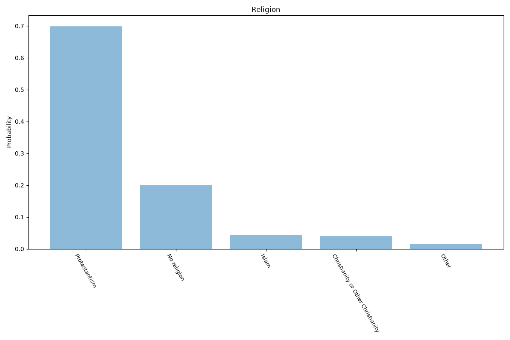
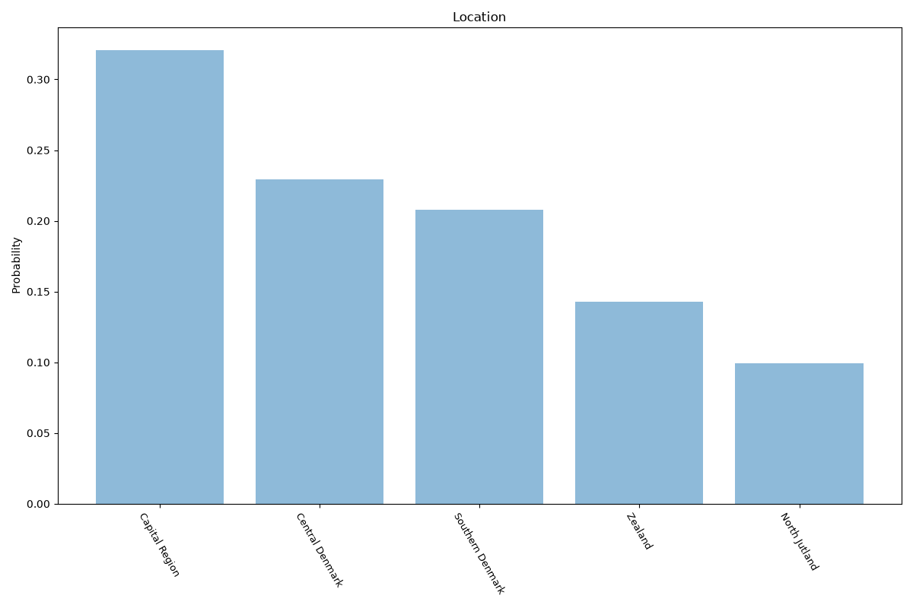

# Denmark
**4 features:** age, sex, religion and location.

## Age

## Sex

## Religion

## Location

## Sources

- [World Population Prospects 2024, United Nations (2024)](https://population.un.org/wpp/) — age, sex
- [Religious affiliation, Statistics Denmark and CIA World Factbook (2024)](https://www.dst.dk/en) — religion
- [Population by region, Statistics Denmark (2024)](https://www.dst.dk/en) — location