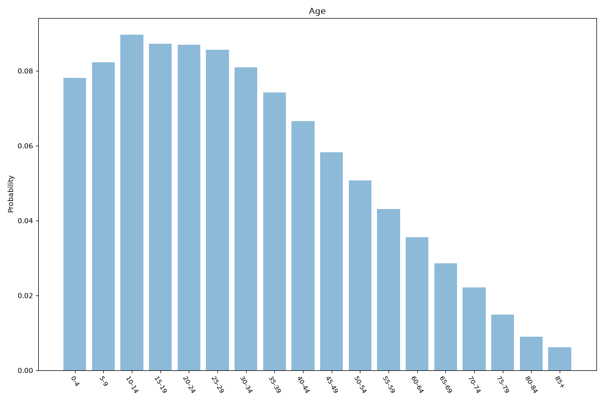
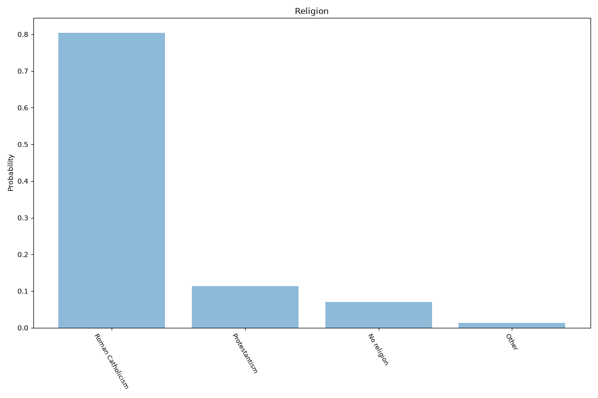
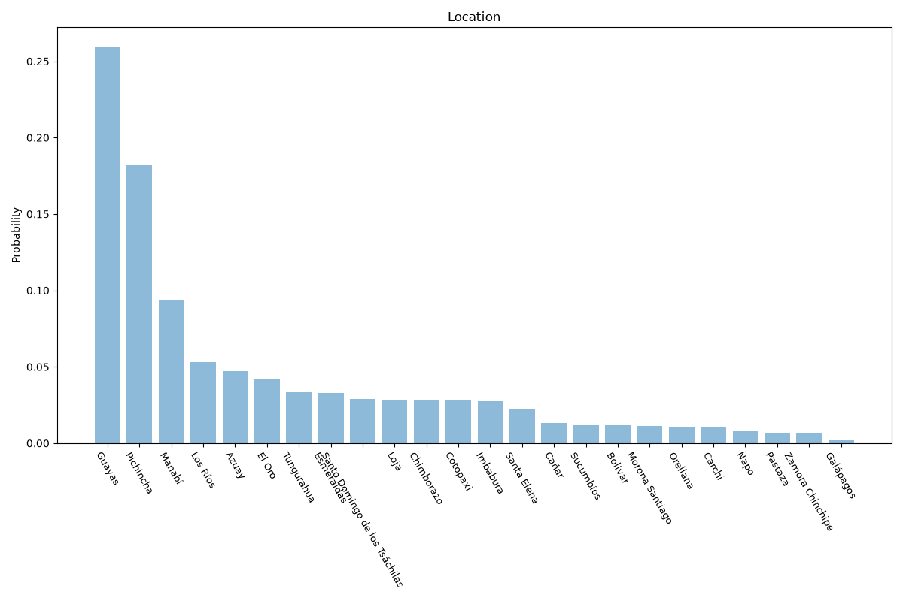

# Ecuador
**4 features:** age, sex, religion and location.

## Age

## Sex

## Religion

## Location

## Sources

- [World Population Prospects 2024, United Nations (2024)](https://population.un.org/wpp/) — age, sex
- [2012 Census (religion), Instituto Nacional de Estadística y Censos (INEC) (2012)](https://www.ecuadorencifras.gob.ec/) — religion
- [2022 Census, Instituto Nacional de Estadística y Censos (INEC) (2022)](https://www.ecuadorencifras.gob.ec/) — location