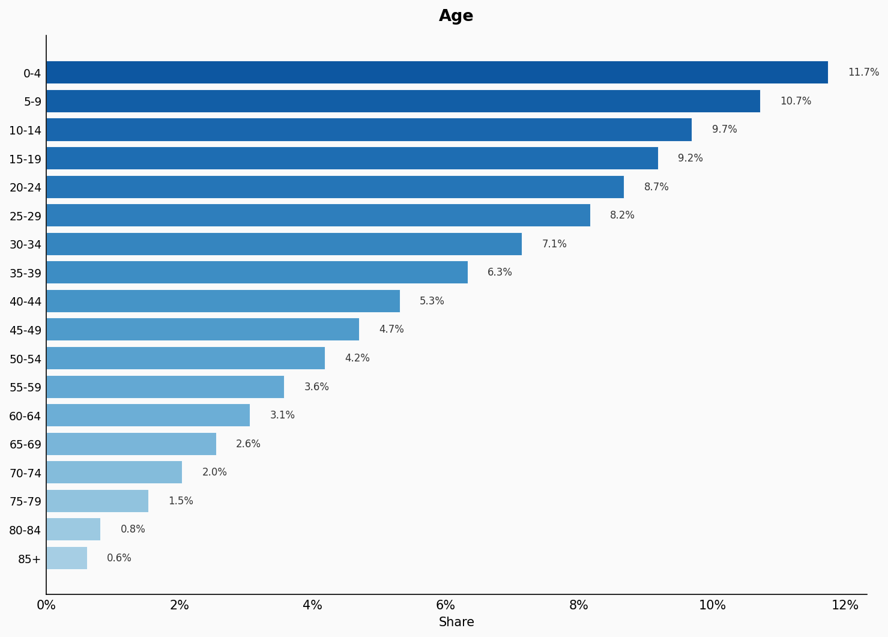
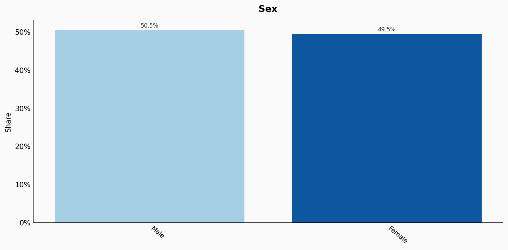
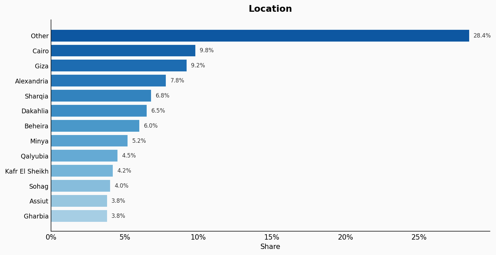
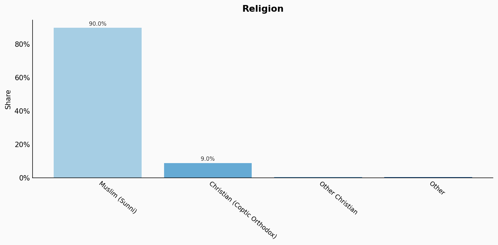
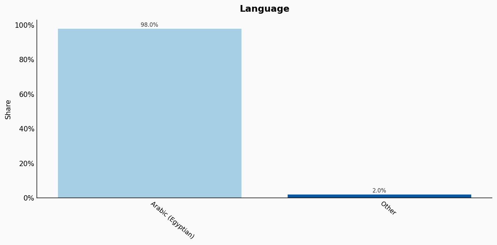
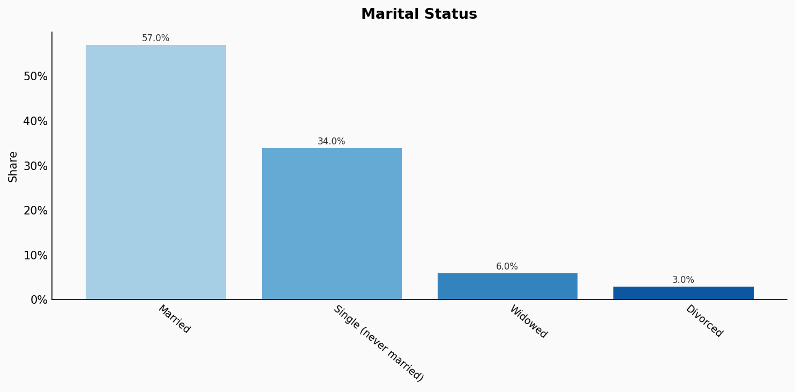
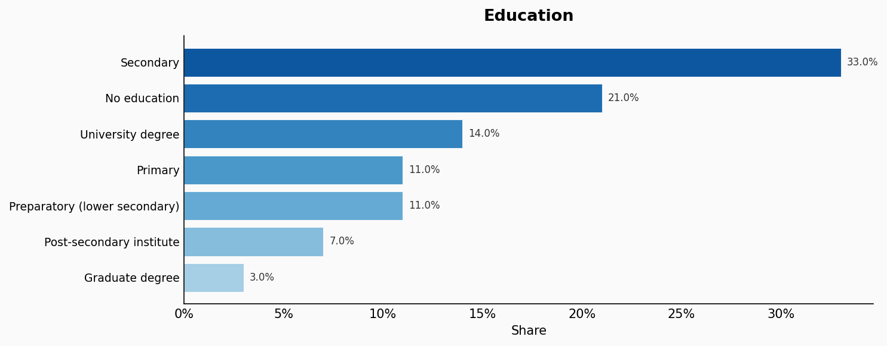
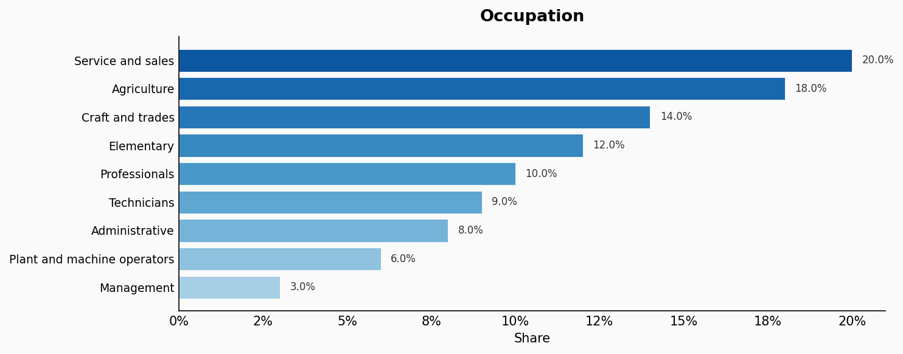
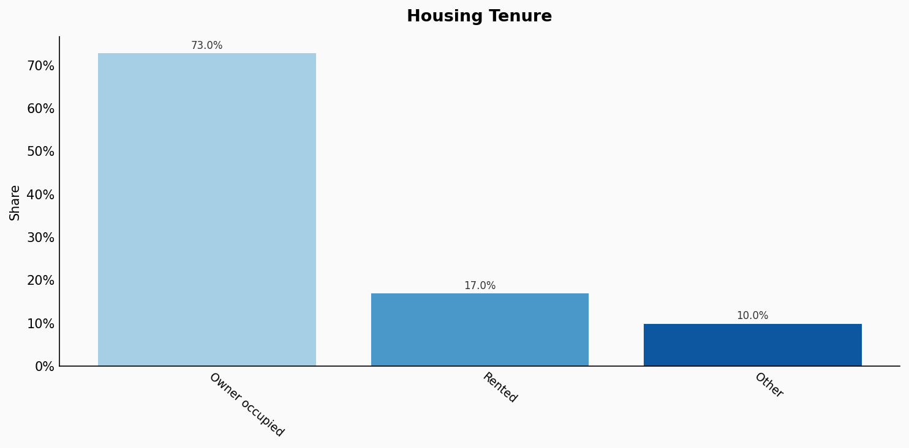
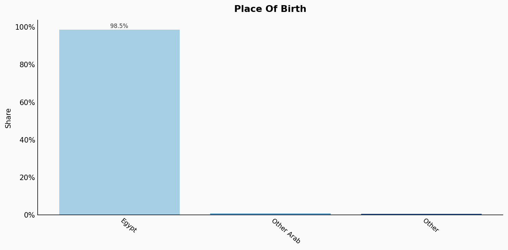

# Egypt

**11 features:** age, sex, location, religion, language, marital status, education, occupation, housing tenure, place of birth, and sexuality.

## Age

| Option | Share |
|---|---:|
| 0-4 | 11.7% |
| 5-9 | 10.7% |
| 10-14 | 9.7% |
| 15-19 | 9.2% |
| 20-24 | 8.7% |
| 25-29 | 8.2% |
| 30-34 | 7.1% |
| 35-39 | 6.3% |
| 40-44 | 5.3% |
| 45-49 | 4.7% |
| 50-54 | 4.2% |
| 55-59 | 3.6% |
| 60-64 | 3.1% |
| 65-69 | 2.6% |
| 70-74 | 2.0% |
| 75-79 | 1.5% |
| 80-84 | 0.8% |
| 85+ | 0.6% |

## Sex

| Option | Share |
|---|---:|
| Male | 50.5% |
| Female | 49.5% |

## Location

| Option | Share |
|---|---:|
| Other | 28.4% |
| Cairo | 9.8% |
| Giza | 9.2% |
| Alexandria | 7.8% |
| Sharqia | 6.8% |
| Dakahlia | 6.5% |
| Beheira | 6.0% |
| Minya | 5.2% |
| Qalyubia | 4.5% |
| Kafr El Sheikh | 4.2% |
| Sohag | 4.0% |
| Assiut | 3.8% |
| Gharbia | 3.8% |

## Religion

| Option | Share |
|---|---:|
| Muslim (Sunni) | 90.0% |
| Christian (Coptic Orthodox) | 9.0% |
| Other Christian | 0.5% |
| Other | 0.5% |

## Language

| Option | Share |
|---|---:|
| Arabic (Egyptian) | 98.0% |
| Other | 2.0% |

## Marital Status

| Option | Share |
|---|---:|
| Married | 57.0% |
| Single (never married) | 34.0% |
| Widowed | 6.0% |
| Divorced | 3.0% |

## Education

| Option | Share |
|---|---:|
| Secondary | 33.0% |
| No education | 21.0% |
| University degree | 14.0% |
| Primary | 11.0% |
| Preparatory (lower secondary) | 11.0% |
| Post-secondary institute | 7.0% |
| Graduate degree | 3.0% |

## Occupation

| Option | Share |
|---|---:|
| Service and sales | 20.0% |
| Agriculture | 18.0% |
| Craft and trades | 14.0% |
| Elementary | 12.0% |
| Professionals | 10.0% |
| Technicians | 9.0% |
| Administrative | 8.0% |
| Plant and machine operators | 6.0% |
| Management | 3.0% |

## Housing Tenure

| Option | Share |
|---|---:|
| Owner occupied | 73.0% |
| Rented | 17.0% |
| Other | 10.0% |

## Place Of Birth

| Option | Share |
|---|---:|
| Egypt | 98.5% |
| Other Arab | 0.8% |
| Other | 0.7% |

## Sexuality

| Option | Share |
|---|---:|
| Heterosexual | 97.0% |
| Bisexual | 1.5% |
| Gay or Lesbian | 1.0% |
| Other | 0.5% |

## Sources

- [Census 2017, Central Agency for Public Mobilization and Statistics (CAPMAS) (2017)](https://www.capmas.gov.eg/Pages/StaticPages.aspx?page_id=5035)
  *Covers: `age`, `sex`, `location`, `marital status`, `housing tenure`, `place of birth`*
- [Labour Force Survey 2022, CAPMAS (2022)](https://www.capmas.gov.eg/Pages/DynamicPage.aspx?pageid=7108)
  *Covers: `education`, `occupation`*
- [Census 2017 - Religion, CAPMAS (2017)](https://www.capmas.gov.eg/Pages/StaticPages.aspx?page_id=5035)
  *Covers: `religion`*
- [Ethnologue: Languages of Egypt (2023) (2023)](https://www.ethnologue.com/country/EG/)
  *Covers: `language`*
- [Arab Barometer Wave VI - Egypt 2021 (2021)](https://www.arabbarometer.org/)
  *Covers: `sexuality`*