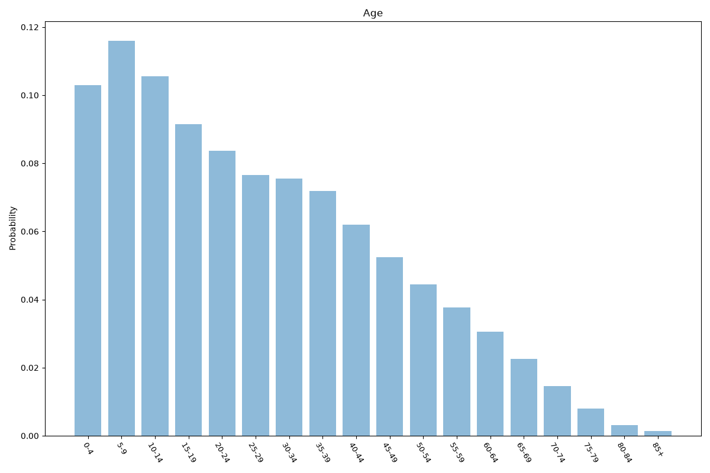
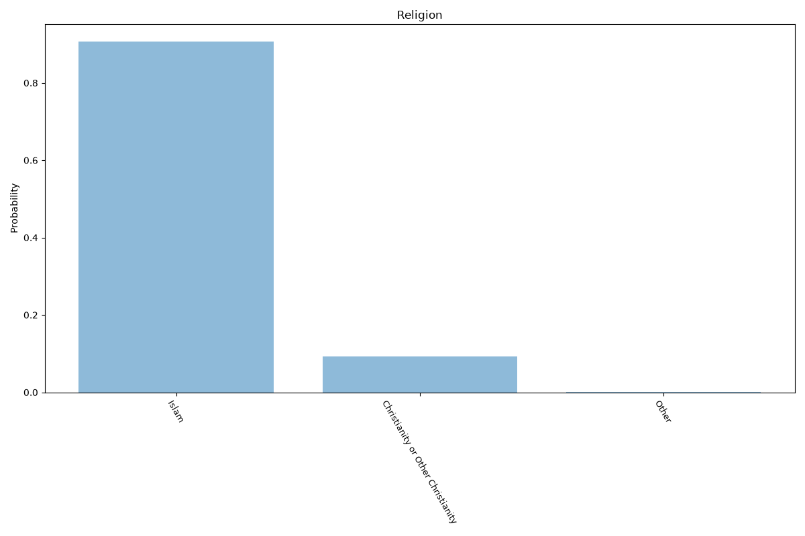
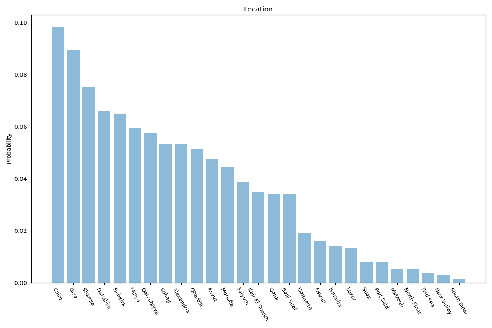

# Egypt
**4 features:** age, sex, religion and location.

## Age

## Sex

## Religion

## Location

## Sources

- [World Population Prospects 2024, United Nations (2024)](https://population.un.org/wpp/) — age, sex
- [2020 International Religious Freedom Report: Egypt, US Department of State (2020)](https://www.state.gov/reports/2020-report-on-international-religious-freedom/egypt/) — religion
- [Population estimates, Central Agency for Public Mobilization and Statistics (CAPMAS) (2023)](https://www.capmas.gov.eg/) — location