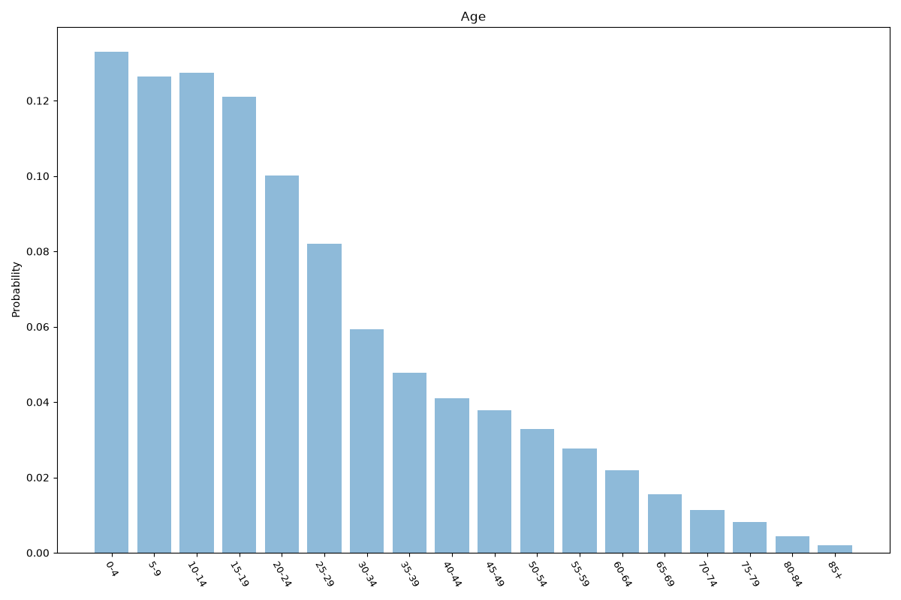
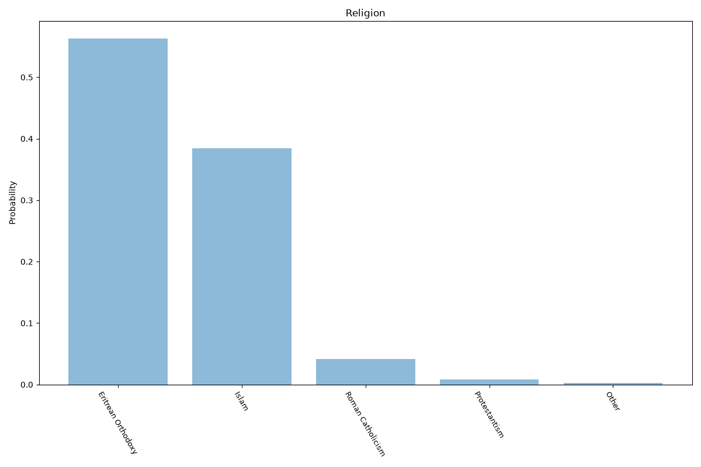
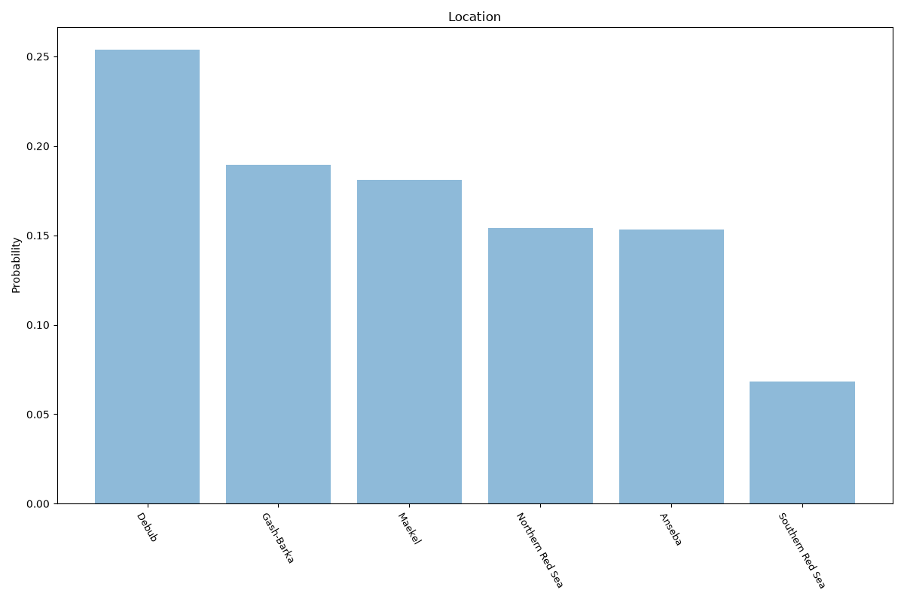

# Eritrea
**4 features:** age, sex, religion and location.

## Age

## Sex

## Religion

## Location

## Sources

- [World Population Prospects 2024, United Nations (2024)](https://population.un.org/wpp/) — age, sex
- [2010 Eritrea Population and Health Survey, National Statistics Office (Eritrea) (2010)](https://dhsprogram.com/) — religion
- [Regional population estimates, National Statistics Office (Eritrea) (2010)](https://dhsprogram.com/) — location