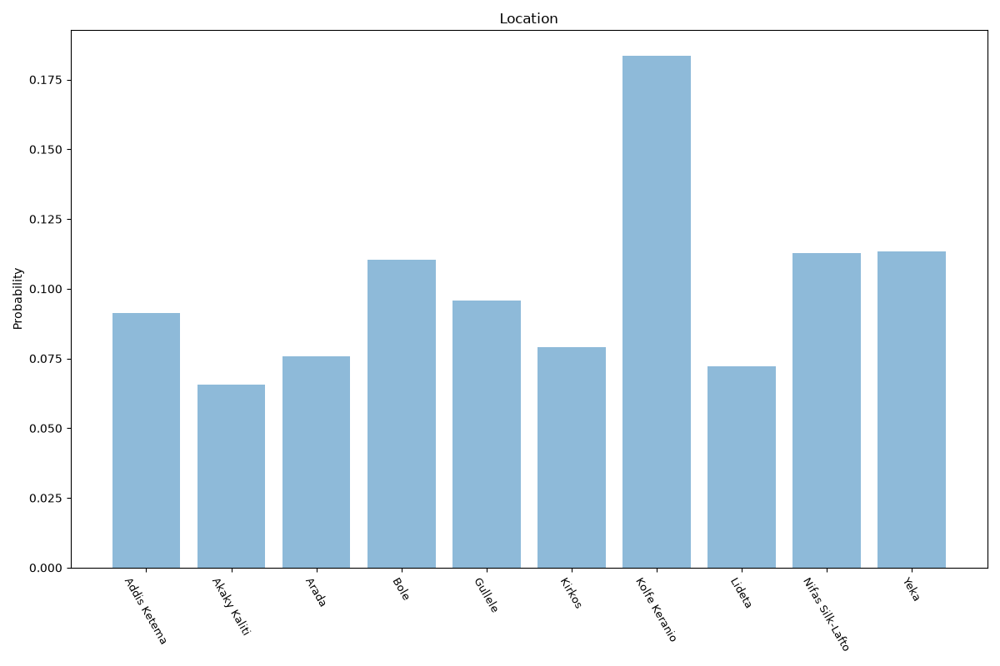

# Addis Ababa
**2 features:** location and residence.

## Location

## Residence

## Sources

- [Population projection by sub-city, Ethiopian Statistics Service (2022)](https://www.statsethiopia.gov.et/) — location
- [World Urbanization Prospects 2018, United Nations (2018)](https://population.un.org/wup/) — residence