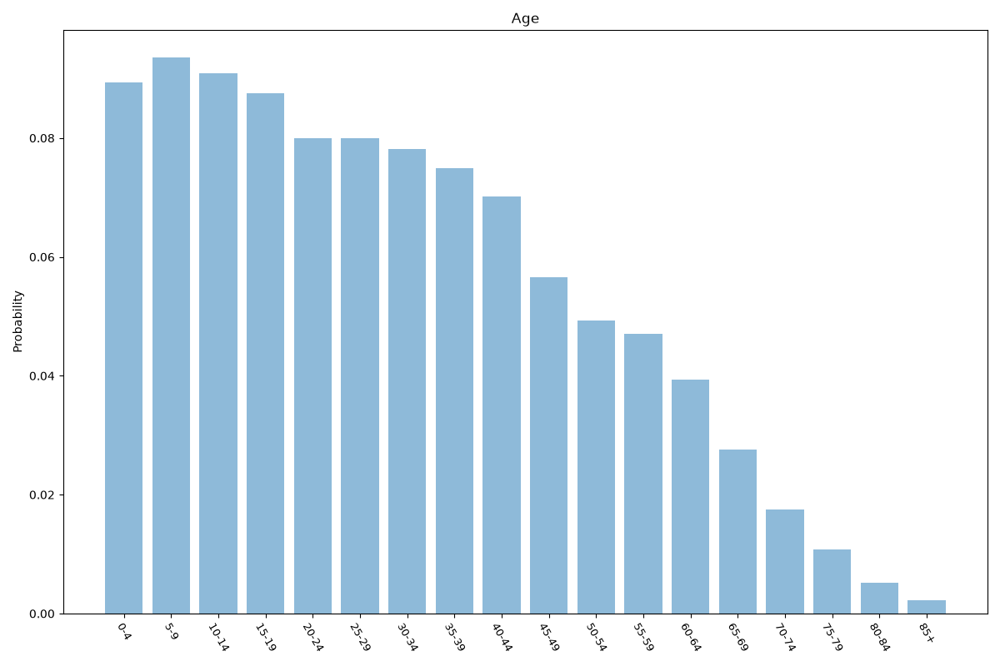
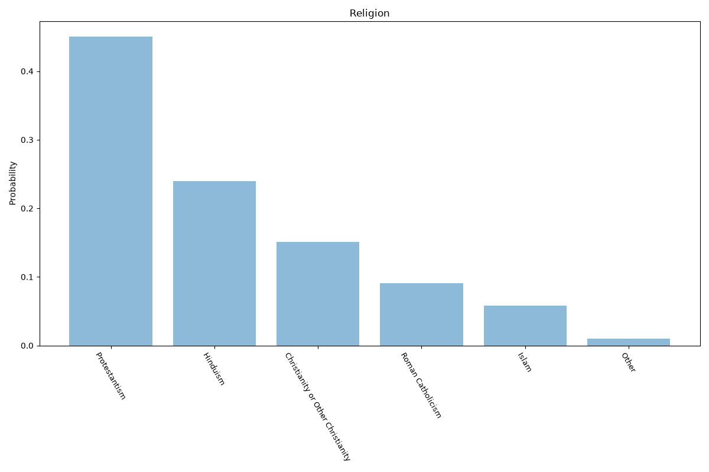
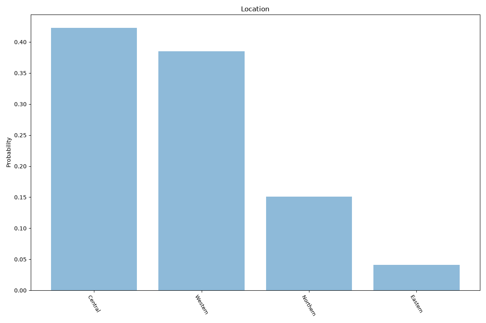

# Fiji
**4 features:** age, sex, religion and location.

## Age

## Sex

## Religion

## Location

## Sources

- [World Population Prospects 2024, United Nations (2024)](https://population.un.org/wpp/) — age, sex
- [2017 Census (religion), Fiji Bureau of Statistics (2017)](https://www.statsfiji.gov.fj/) — religion
- [2017 Census, Fiji Bureau of Statistics (2017)](https://www.statsfiji.gov.fj/) — location