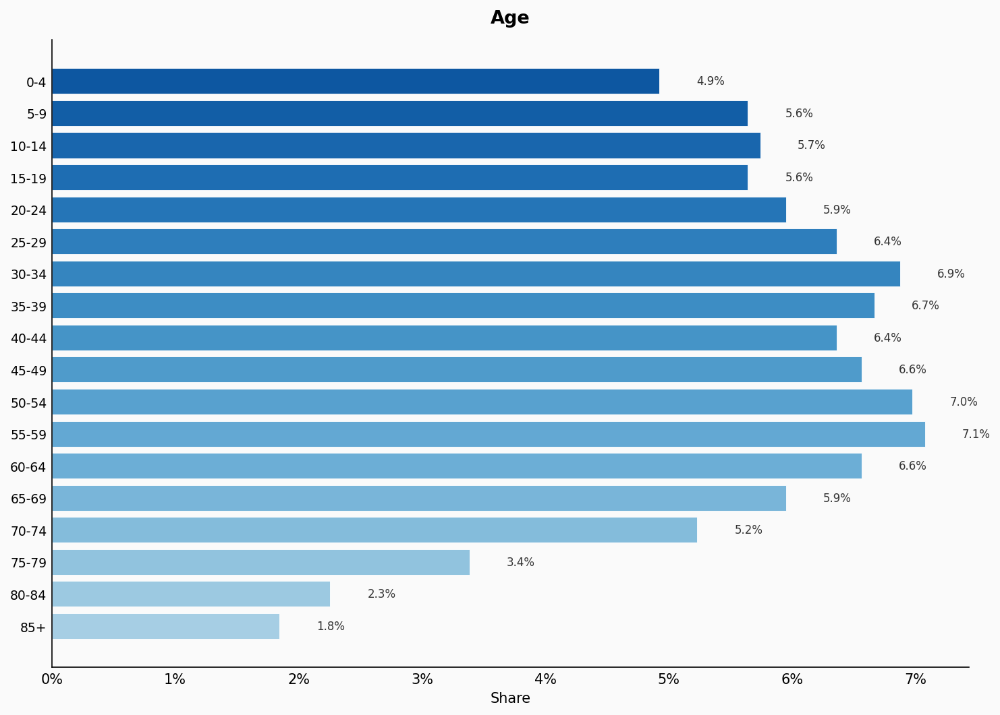
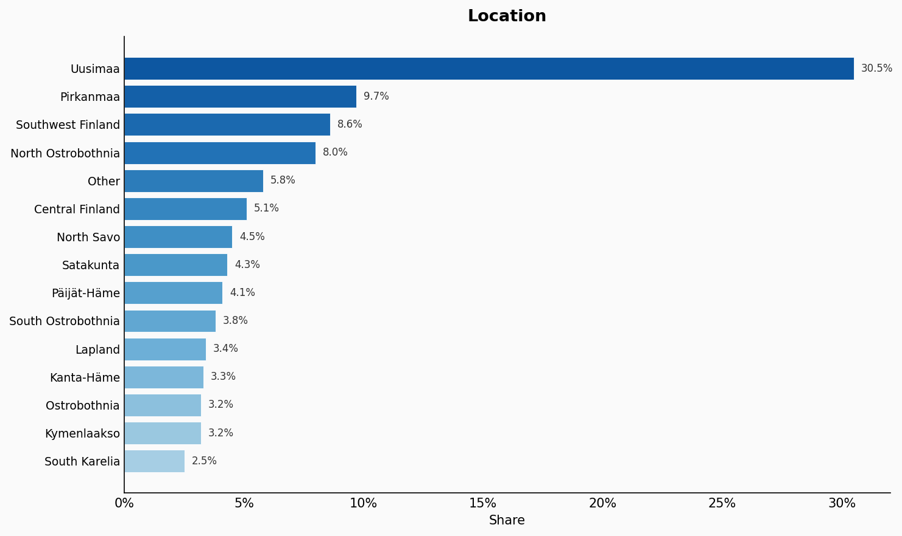
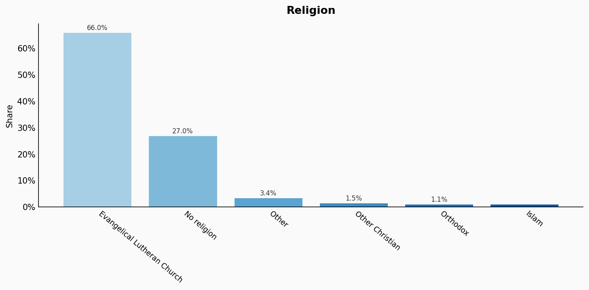
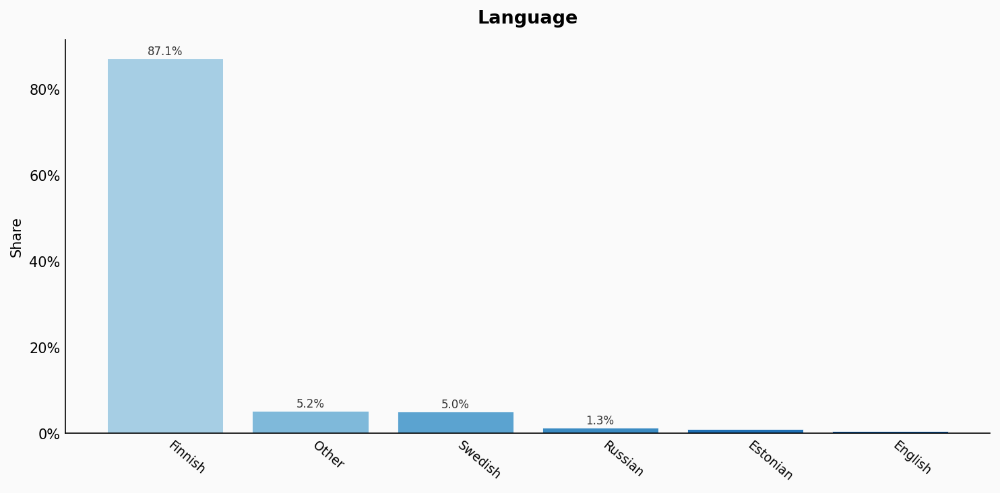
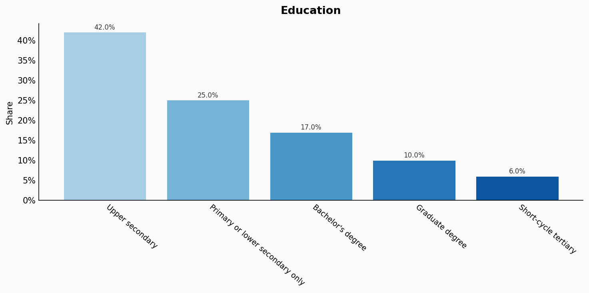
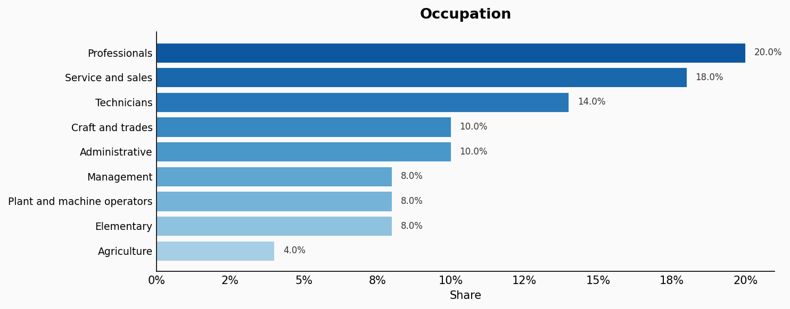
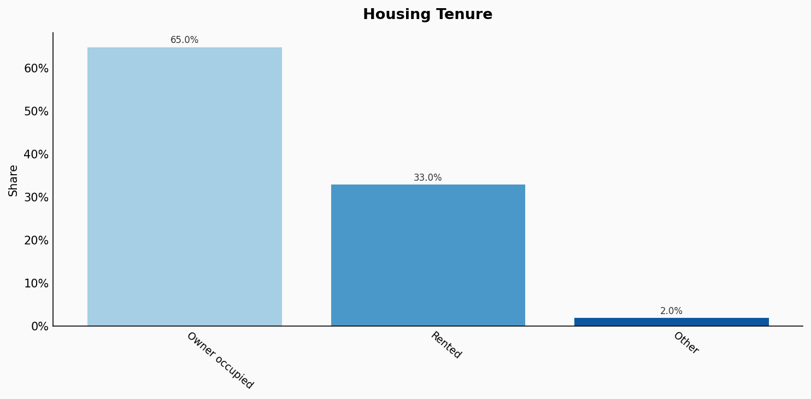
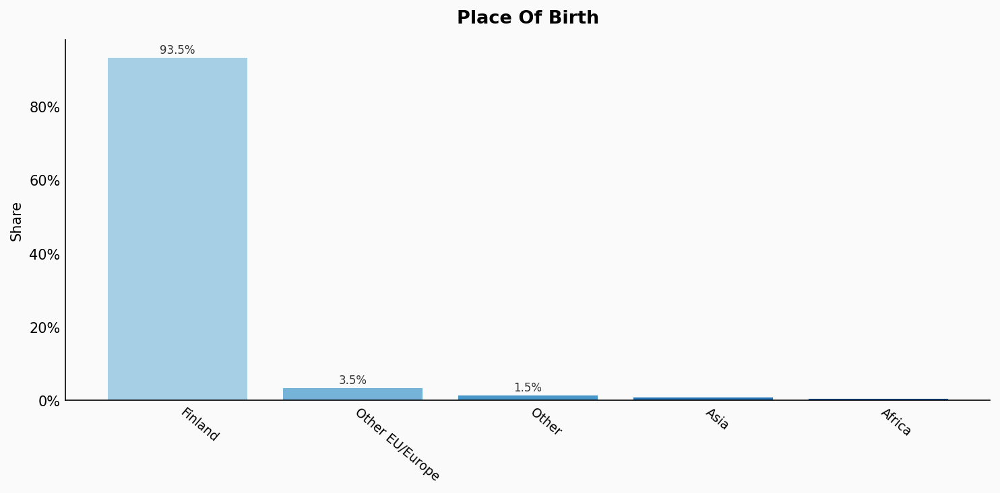
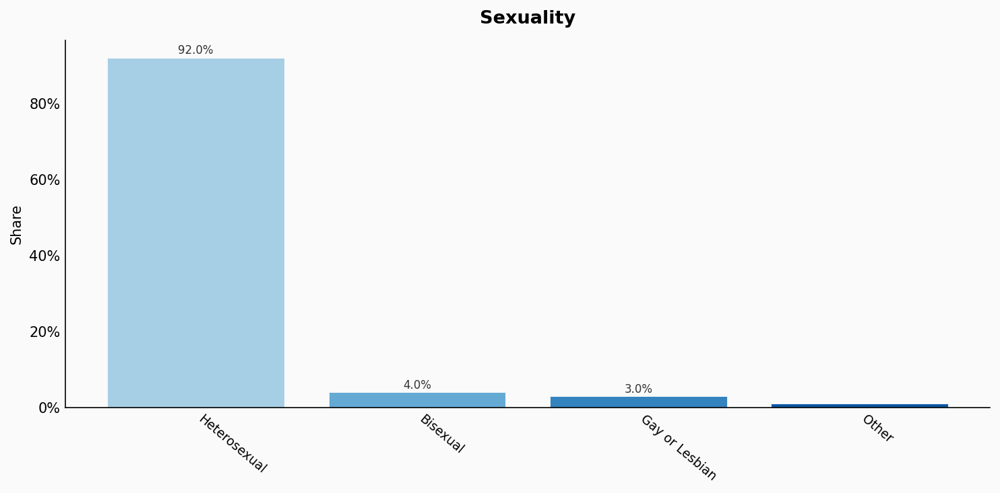

# Finland

**11 features:** age, sex, location, religion, language, marital status, education, occupation, housing tenure, place of birth, and sexuality.

## Age

| Option | Share |
|---|---:|
| 0-4 | 4.9% |
| 5-9 | 5.6% |
| 10-14 | 5.7% |
| 15-19 | 5.6% |
| 20-24 | 5.9% |
| 25-29 | 6.4% |
| 30-34 | 6.9% |
| 35-39 | 6.7% |
| 40-44 | 6.4% |
| 45-49 | 6.6% |
| 50-54 | 7.0% |
| 55-59 | 7.1% |
| 60-64 | 6.6% |
| 65-69 | 5.9% |
| 70-74 | 5.2% |
| 75-79 | 3.4% |
| 80-84 | 2.3% |
| 85+ | 1.8% |

## Sex

| Option | Share |
|---|---:|
| Female | 50.8% |
| Male | 49.2% |

## Location

| Option | Share |
|---|---:|
| Uusimaa | 30.5% |
| Pirkanmaa | 9.7% |
| Southwest Finland | 8.6% |
| North Ostrobothnia | 8.0% |
| Other | 5.8% |
| Central Finland | 5.1% |
| North Savo | 4.5% |
| Satakunta | 4.3% |
| Päijät-Häme | 4.1% |
| South Ostrobothnia | 3.8% |
| Lapland | 3.4% |
| Kanta-Häme | 3.3% |
| Ostrobothnia | 3.2% |
| Kymenlaakso | 3.2% |
| South Karelia | 2.5% |

## Religion

| Option | Share |
|---|---:|
| Evangelical Lutheran Church | 66.0% |
| No religion | 27.0% |
| Other | 3.4% |
| Other Christian | 1.5% |
| Orthodox | 1.1% |
| Islam | 1.0% |

## Language

| Option | Share |
|---|---:|
| Finnish | 87.1% |
| Other | 5.2% |
| Swedish | 5.0% |
| Russian | 1.3% |
| Estonian | 0.9% |
| English | 0.5% |

## Marital Status

| Option | Share |
|---|---:|
| Single (never married) | 45.0% |
| Married | 42.0% |
| Divorced | 9.0% |
| Widowed | 4.0% |

## Education

| Option | Share |
|---|---:|
| Upper secondary | 42.0% |
| Primary or lower secondary only | 25.0% |
| Bachelor's degree | 17.0% |
| Graduate degree | 10.0% |
| Short-cycle tertiary | 6.0% |

## Occupation

| Option | Share |
|---|---:|
| Professionals | 20.0% |
| Service and sales | 18.0% |
| Technicians | 14.0% |
| Craft and trades | 10.0% |
| Administrative | 10.0% |
| Management | 8.0% |
| Plant and machine operators | 8.0% |
| Elementary | 8.0% |
| Agriculture | 4.0% |

## Housing Tenure

| Option | Share |
|---|---:|
| Owner occupied | 65.0% |
| Rented | 33.0% |
| Other | 2.0% |

## Place Of Birth

| Option | Share |
|---|---:|
| Finland | 93.5% |
| Other EU/Europe | 3.5% |
| Other | 1.5% |
| Asia | 1.0% |
| Africa | 0.5% |

## Sexuality

| Option | Share |
|---|---:|
| Heterosexual | 92.0% |
| Bisexual | 4.0% |
| Gay or Lesbian | 3.0% |
| Other | 1.0% |

## Sources

- [Väestötilastot 2021, Tilastokeskus (Statistics Finland) (2021)](https://www.stat.fi/en/statistics/vaerak)
  *Covers: `age`, `sex`, `location`, `marital status`, `housing tenure`, `place of birth`*
- [Työvoimatutkimus 2022, Tilastokeskus (2022)](https://www.stat.fi/en/statistics/tyti)
  *Covers: `education`, `occupation`*
- [Uskonnolliset yhdyskunnat 2021, Tilastokeskus (2021)](https://www.stat.fi/en/statistics/uskyo)
  *Covers: `religion`*
- [Väestön kielitilasto 2021, Tilastokeskus (2021)](https://www.stat.fi/en/statistics/vaerak)
  *Covers: `language`*
- [Eurobarometer Special Survey on Discrimination 2019, European Commission (2019)](https://europa.eu/eurobarometer/surveys/detail/2251)
  *Covers: `sexuality`*