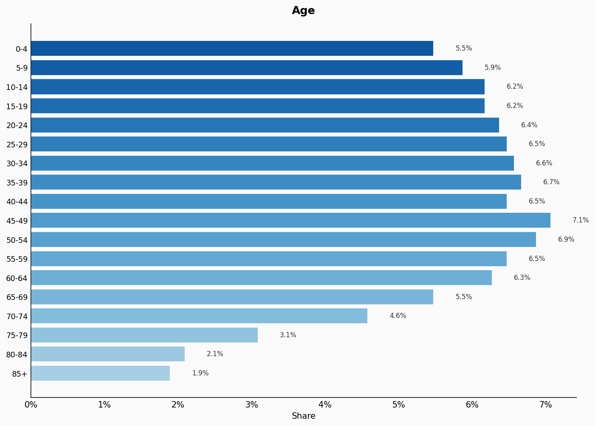
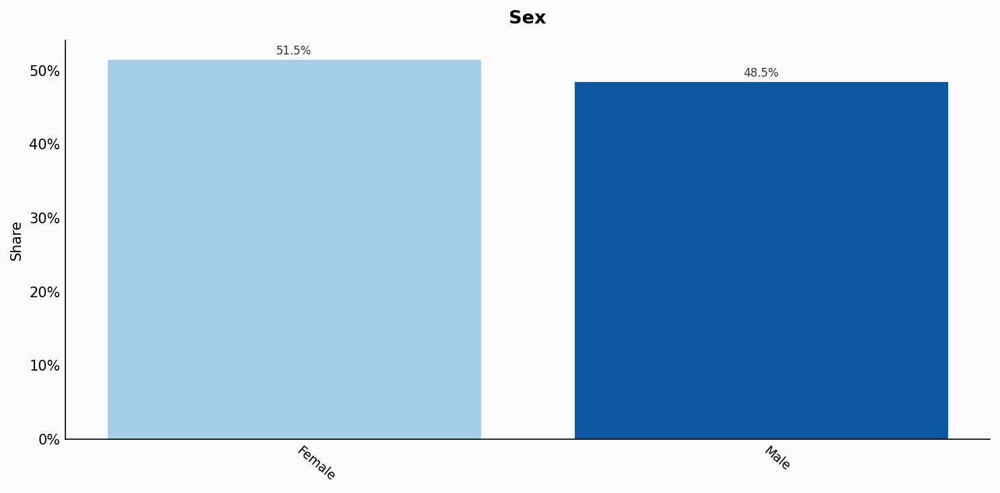
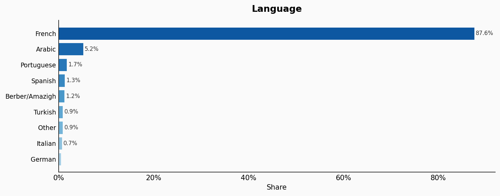
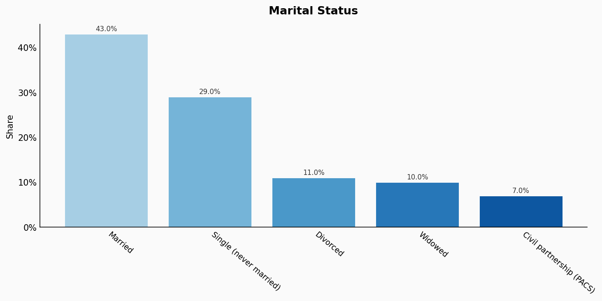
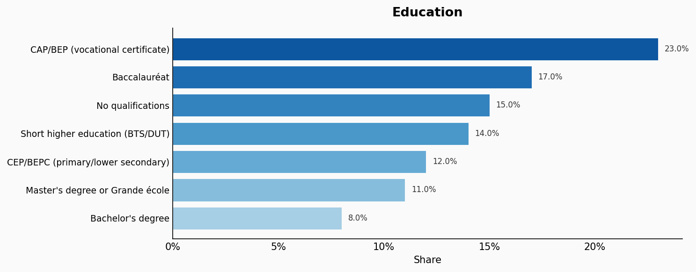
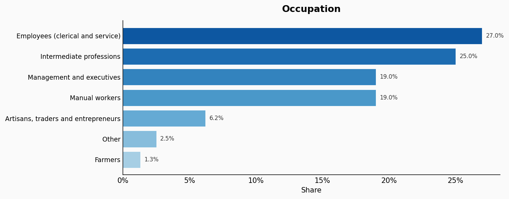
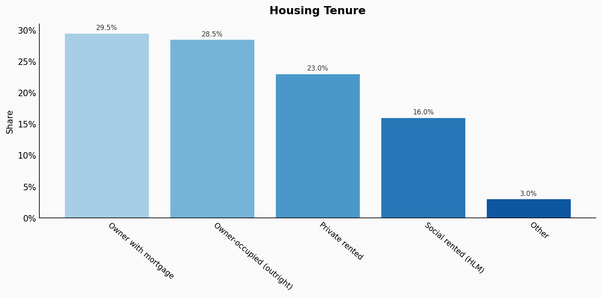
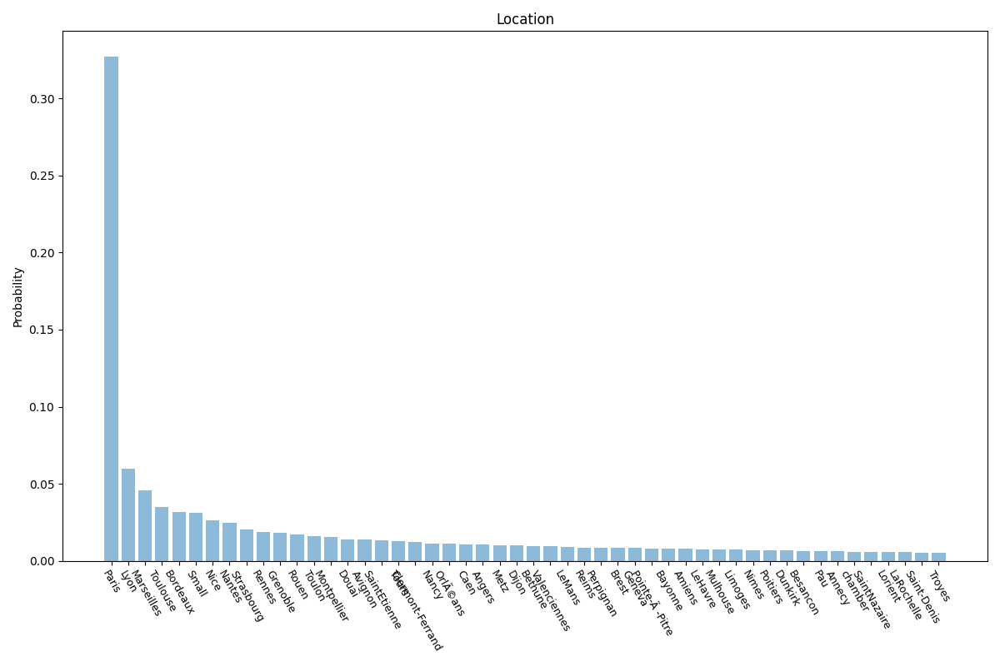
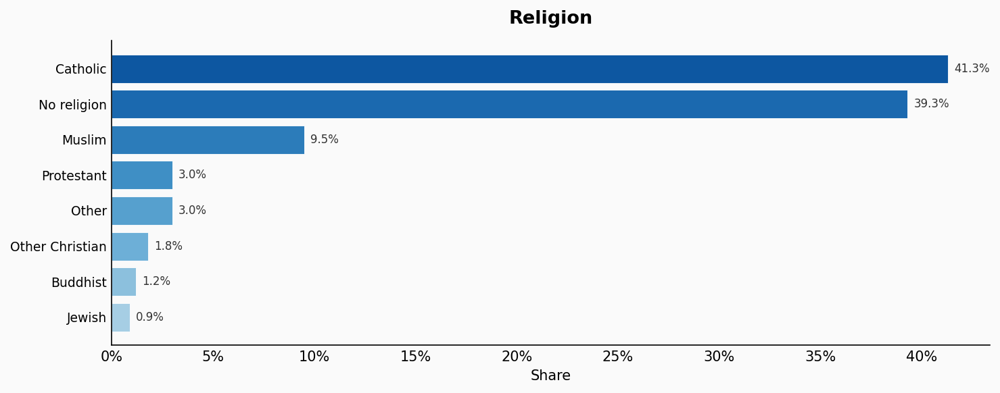
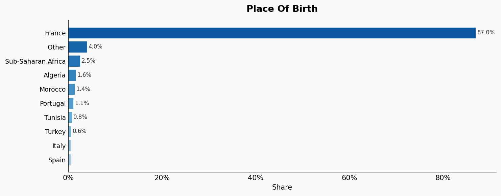

# France

**11 features:** age, sex, language, marital status, education, occupation, housing tenure, location, religion, place of birth, and sexuality.

## Age

| Option | Share |
|---|---:|
| 0-4 | 5.5% |
| 5-9 | 5.9% |
| 10-14 | 6.2% |
| 15-19 | 6.2% |
| 20-24 | 6.4% |
| 25-29 | 6.5% |
| 30-34 | 6.6% |
| 35-39 | 6.7% |
| 40-44 | 6.5% |
| 45-49 | 7.1% |
| 50-54 | 6.9% |
| 55-59 | 6.5% |
| 60-64 | 6.3% |
| 65-69 | 5.5% |
| 70-74 | 4.6% |
| 75-79 | 3.1% |
| 80-84 | 2.1% |
| 85+ | 1.9% |

## Sex

| Option | Share |
|---|---:|
| Female | 51.5% |
| Male | 48.5% |

## Language

| Option | Share |
|---|---:|
| French | 87.6% |
| Arabic | 5.2% |
| Portuguese | 1.7% |
| Spanish | 1.3% |
| Berber/Amazigh | 1.2% |
| Turkish | 0.9% |
| Other | 0.9% |
| Italian | 0.7% |
| German | 0.5% |

## Marital Status

| Option | Share |
|---|---:|
| Married | 43.0% |
| Single (never married) | 29.0% |
| Divorced | 11.0% |
| Widowed | 10.0% |
| Civil partnership (PACS) | 7.0% |

## Education

| Option | Share |
|---|---:|
| CAP/BEP (vocational certificate) | 23.0% |
| Baccalauréat | 17.0% |
| No qualifications | 15.0% |
| Short higher education (BTS/DUT) | 14.0% |
| CEP/BEPC (primary/lower secondary) | 12.0% |
| Master's degree or Grande école | 11.0% |
| Bachelor's degree | 8.0% |

## Occupation

| Option | Share |
|---|---:|
| Employees (clerical and service) | 27.0% |
| Intermediate professions | 25.0% |
| Management and executives | 19.0% |
| Manual workers | 19.0% |
| Artisans, traders and entrepreneurs | 6.2% |
| Other | 2.5% |
| Farmers | 1.3% |

## Housing Tenure

| Option | Share |
|---|---:|
| Owner with mortgage | 29.5% |
| Owner-occupied (outright) | 28.5% |
| Private rented | 23.0% |
| Social rented (HLM) | 16.0% |
| Other | 3.0% |

## Location

| Option | Share |
|---|---:|
| Paris | 32.7% |
| Lyon | 6.0% |
| Marseilles | 4.6% |
| Toulouse | 3.5% |
| Bordeaux | 3.2% |
| Small | 3.1% |
| Nice | 2.6% |
| Nantes | 2.5% |
| Strasbourg | 2.0% |
| Rennes | 1.9% |
| Grenoble | 1.8% |
| Rouen | 1.7% |
| Toulon | 1.6% |
| Montpellier | 1.6% |
| Douai | 1.4% |
| Avignon | 1.4% |
| SaintEtienne | 1.4% |
| Tours | 1.3% |
| Clermont-Ferrand | 1.3% |
| Nancy | 1.1% |
| Other | 23.4% |

## Religion

| Option | Share |
|---|---:|
| Catholic | 41.3% |
| No religion | 39.3% |
| Muslim | 9.5% |
| Protestant | 3.0% |
| Other | 3.0% |
| Other Christian | 1.8% |
| Buddhist | 1.2% |
| Jewish | 0.9% |

## Place Of Birth

| Option | Share |
|---|---:|
| France | 87.0% |
| Other | 4.0% |
| Sub-Saharan Africa | 2.5% |
| Algeria | 1.6% |
| Morocco | 1.4% |
| Portugal | 1.1% |
| Tunisia | 0.8% |
| Turkey | 0.6% |
| Italy | 0.5% |
| Spain | 0.5% |

## Sexuality

| Option | Share |
|---|---:|
| Heterosexual | 93.0% |
| Other | 2.9% |
| Bisexual | 2.5% |
| Homosexual | 1.6% |

## Sources

- [Recensement de la population 2021, INSEE (2021)](https://www.insee.fr/fr/statistiques/serie/000436389)
  *Covers: `age`, `sex`, `marital status`, `education`, `occupation`, `housing tenure`*
- [Enquête sur les pratiques linguistiques 2017, INSEE (2017)](https://www.insee.fr/fr/statistiques/2588632)
  *Covers: `language`*
- [INSEE - Institut National de la Statistique et des Études Économiques](https://www.insee.fr/fr/statistiques/3303318?sommaire=3353488)
  *Covers: `location`*
- [Baromètre politique IFOP 2021 (2021)](https://www.ifop.com/publication/la-france-une-nation-en-qute-de-sens/)
  *Covers: `religion`*
- [Tableau de bord de l'immigration en France, INSEE (2021)](https://www.insee.fr/fr/statistiques/3633212)
  *Covers: `place of birth`*
- [Enquête sur la sexualité en France, INED (2006)](https://www.ined.fr/fr/tout-savoir-population/memos-demo/faq/prevalence-homosexualite-france/)
  *Covers: `sexuality`*