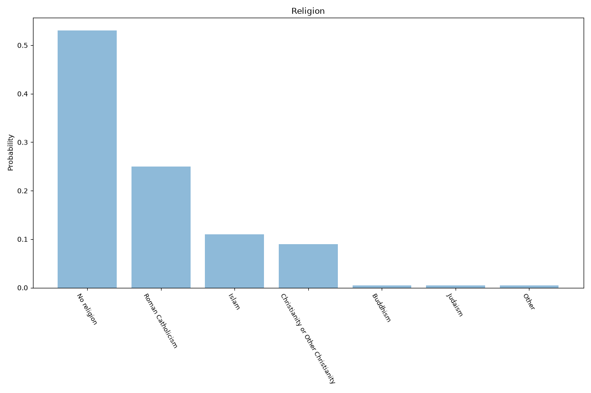
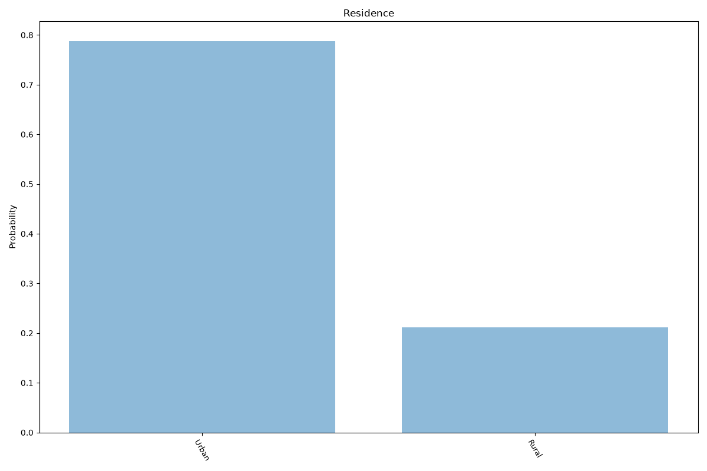

# France
**10 features:** age, sex, religion, language, marital status, education, occupation, housing tenure, location and residence.

## Age

## Sex

## Religion

## Language

## Marital Status

## Education

## Occupation

## Housing Tenure

## Location

## Residence

## Sources

- [Recensement de la population 2021, INSEE (2021)](https://www.insee.fr/fr/statistiques/serie/000436389) — age, sex, marital status, education, occupation, housing tenure
- [Transmission familiale des langues, INSEE (2023)](https://www.insee.fr/fr/statistiques/6793260) — language
- [Estimation de la population par département au 1er janvier 2023, INSEE (2023)](https://www.insee.fr/fr/statistiques/1893198) — location
- [Urban population (% of total population), World Bank (2025)](https://data.worldbank.org/indicator/SP.URB.TOTL.IN.ZS) — residence
- [Trajectoires et Origines 2 (TeO2), INED-INSEE (2020)](https://teo.site.ined.fr/en/) — religion