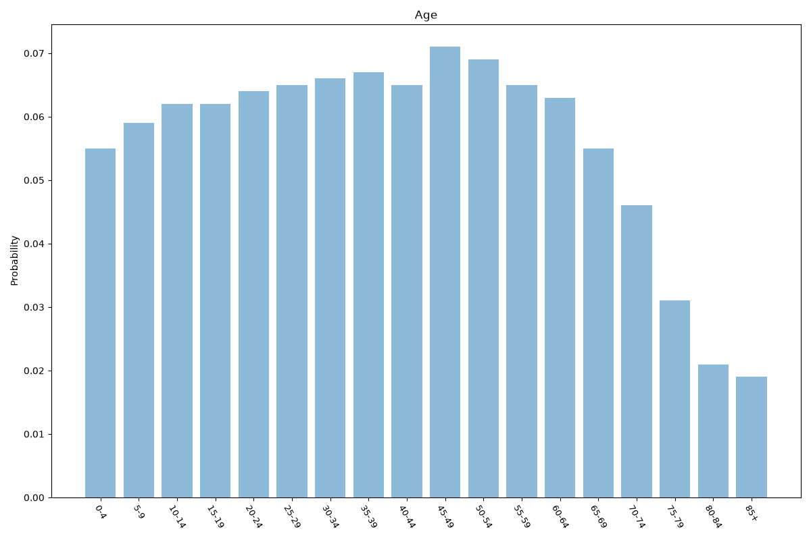
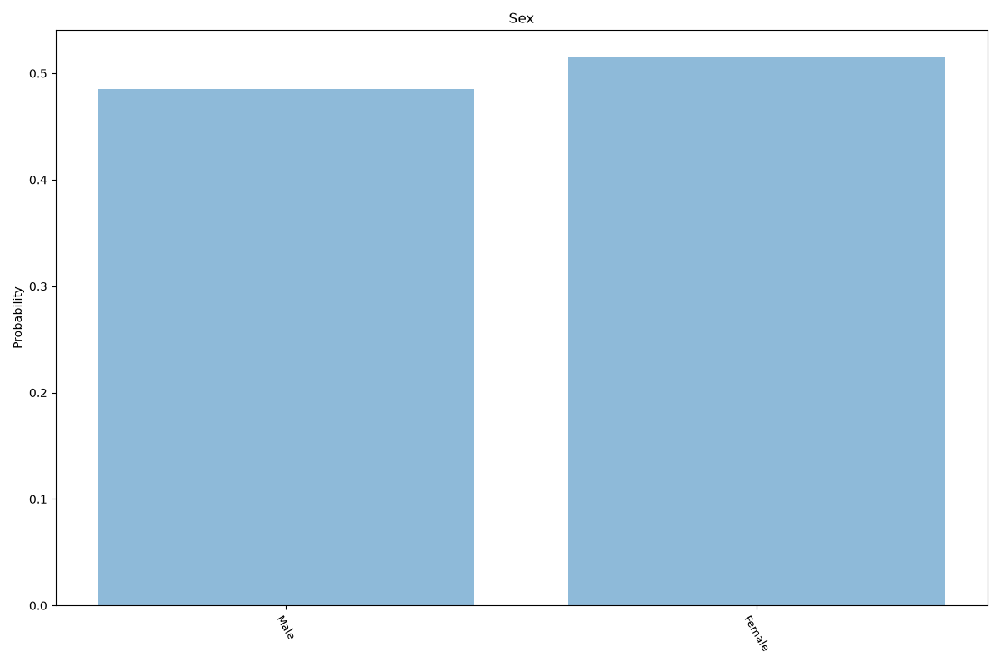
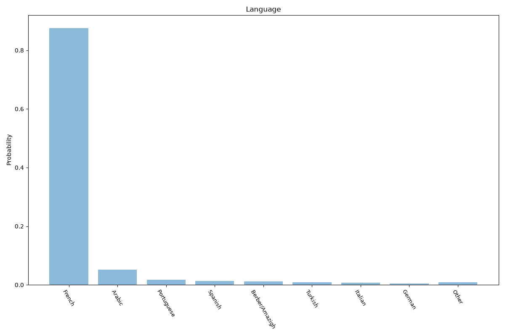
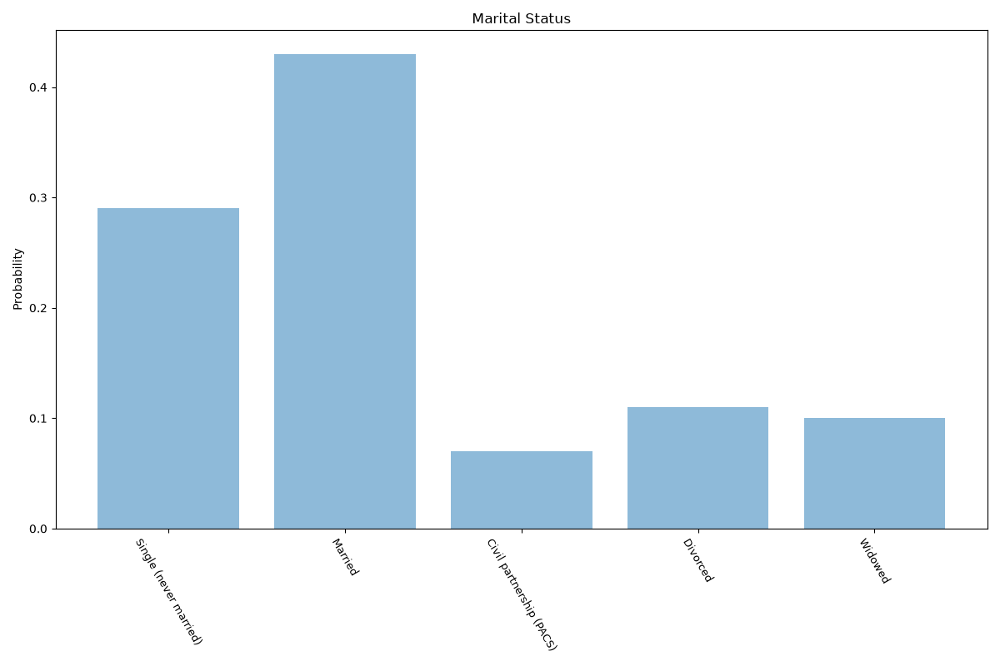
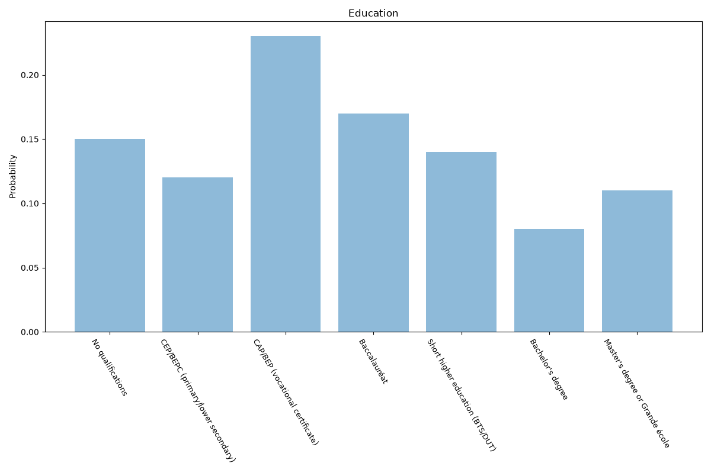
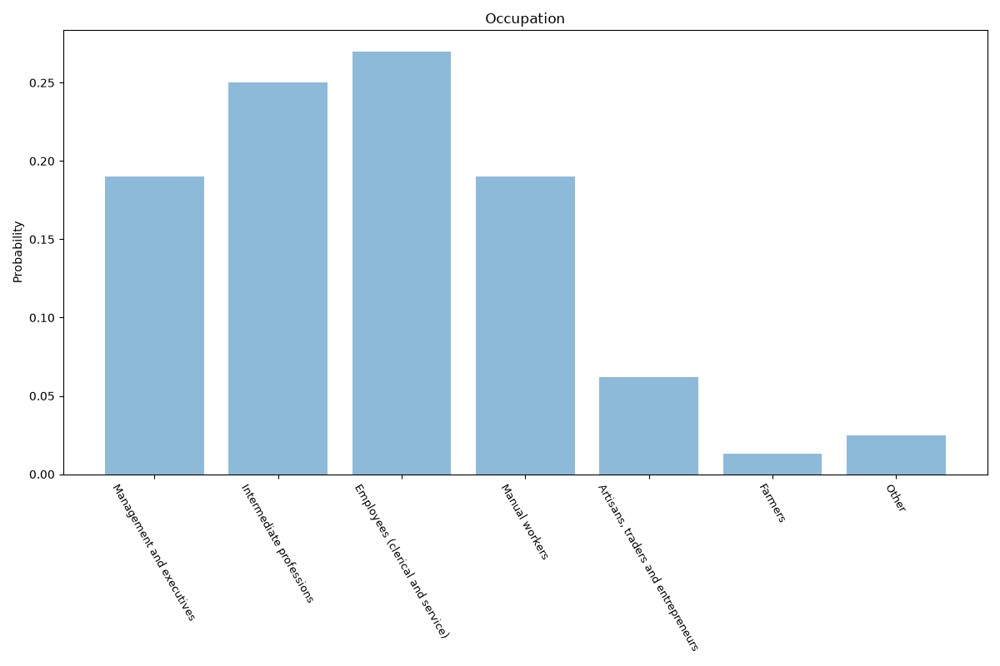
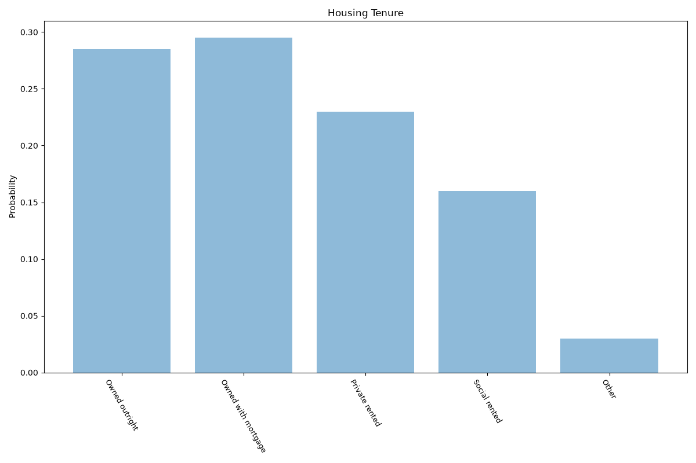
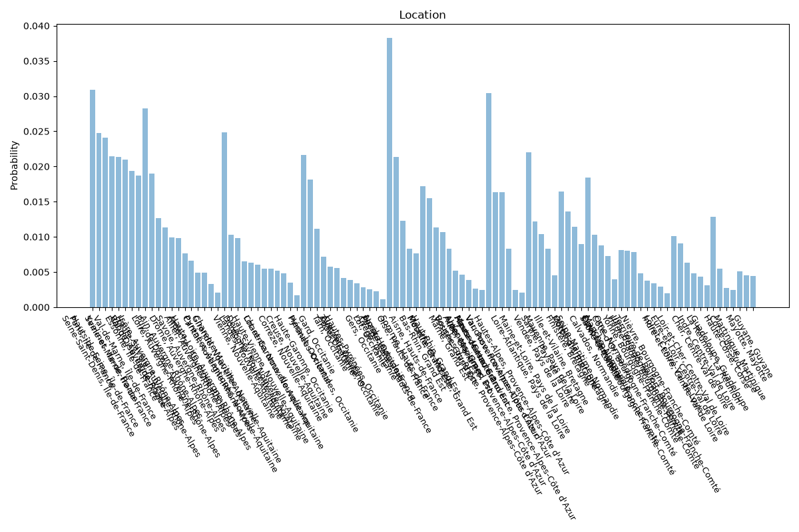

# France
**8 features:** age, sex, language, marital status, education, occupation, housing tenure and location.

## Age

## Sex

## Language

## Marital Status

## Education

## Occupation

## Housing Tenure

## Location

## Sources

- [Recensement de la population 2021, INSEE (2021)](https://www.insee.fr/fr/statistiques/serie/000436389) — age, sex, marital status, education, occupation, housing tenure
- [Transmission familiale des langues, INSEE (2023)](https://www.insee.fr/fr/statistiques/6793260) — language
- [Estimation de la population par département au 1er janvier 2023, INSEE (2023)](https://www.insee.fr/fr/statistiques/1893198) — location