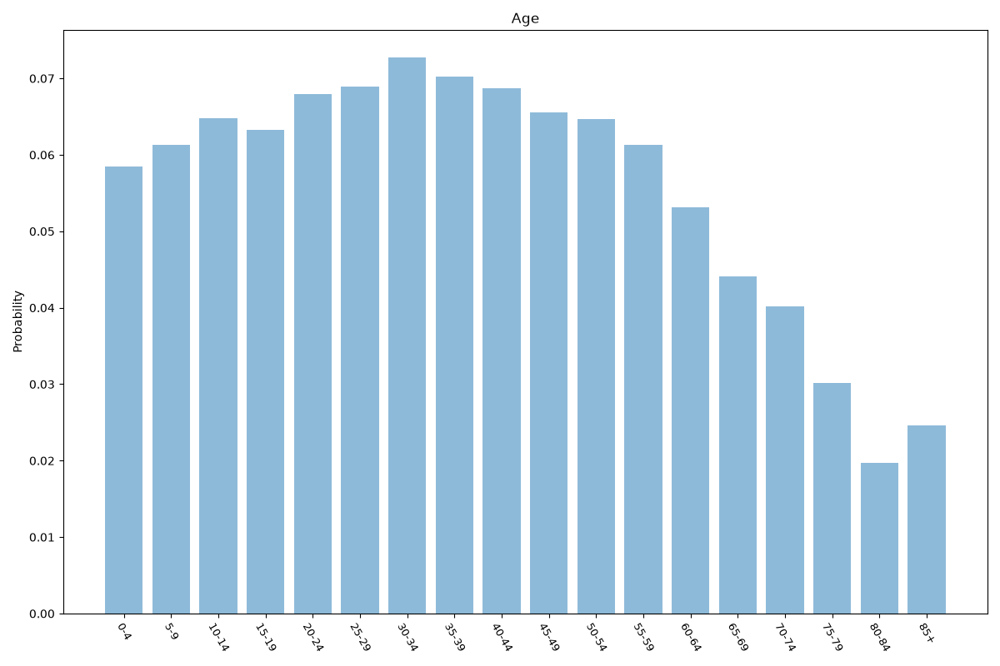
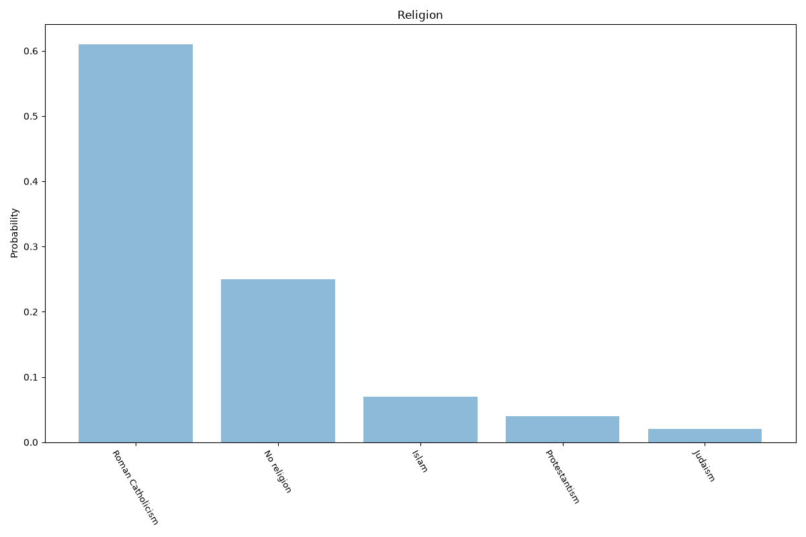

# Paris
**3 features:** age, religion and location.

## Age

## Religion

## Location

## Sources

- [Population by age, Île-de-France (NUTS 2 FR10), Eurostat (2023)](https://ec.europa.eu/eurostat) — age
- [Religious affiliation in the Paris Region (Île-de-France), IFOP survey (2011)](https://www.ifop.com/) — religion
- [Population légale des arrondissements, INSEE (2021)](https://www.insee.fr/) — location