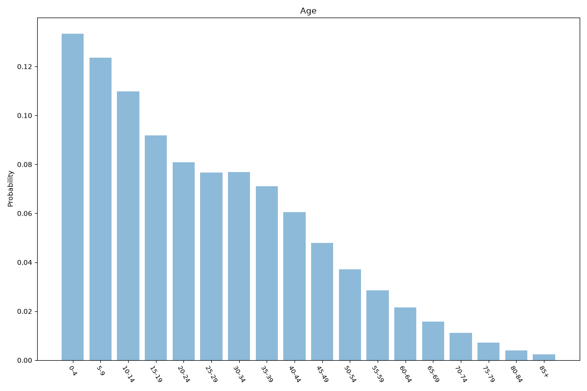
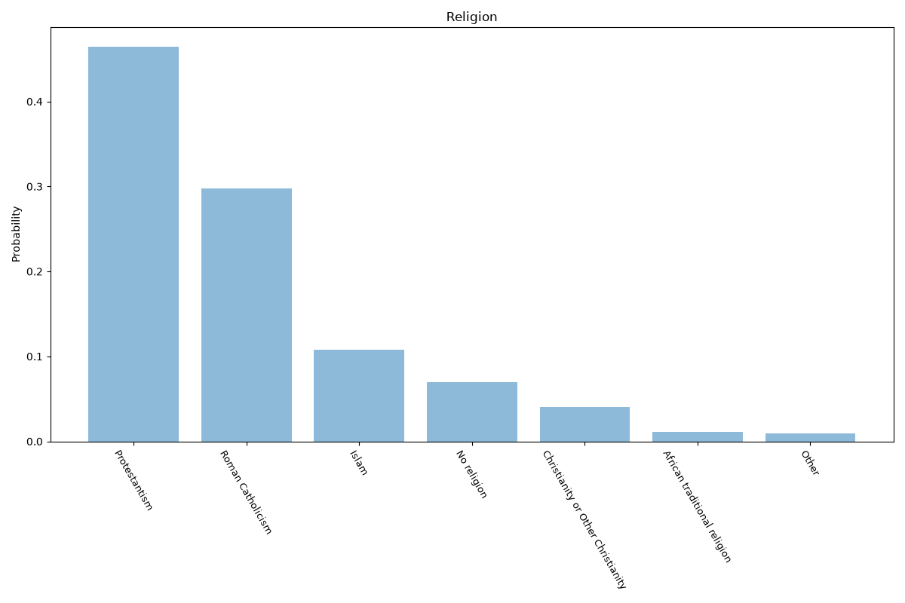
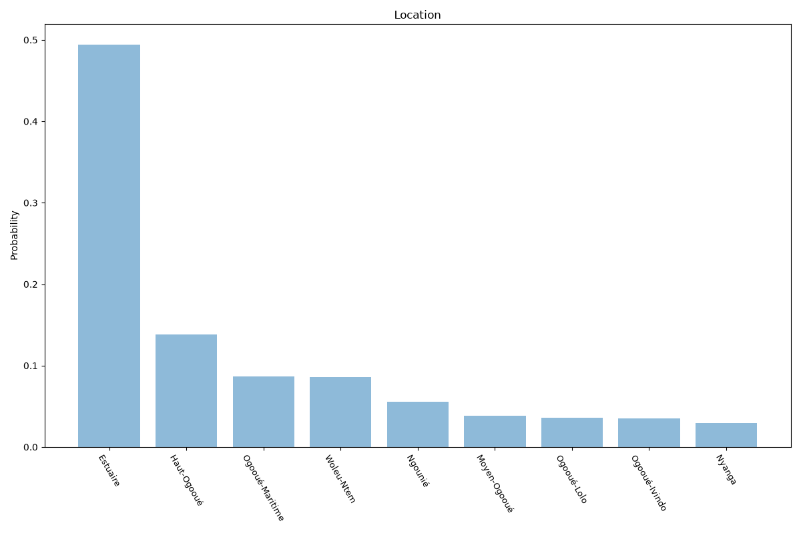

# Gabon
**4 features:** age, sex, religion and location.

## Age

## Sex

## Religion

## Location

## Sources

- [World Population Prospects 2024, United Nations (2024)](https://population.un.org/wpp/) — age, sex
- [Gabon Demographic and Health Survey (2021)](https://dhsprogram.com/) — religion
- [2013 Census, Direction Générale de la Statistique (Gabon) (2013)](https://www.stat-gabon.ga/) — location