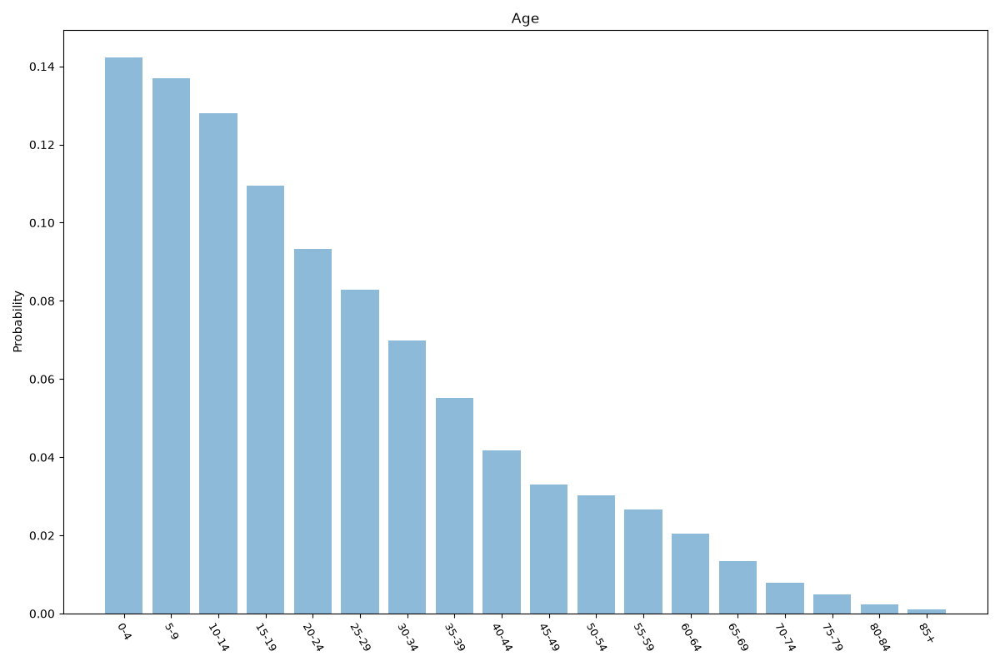
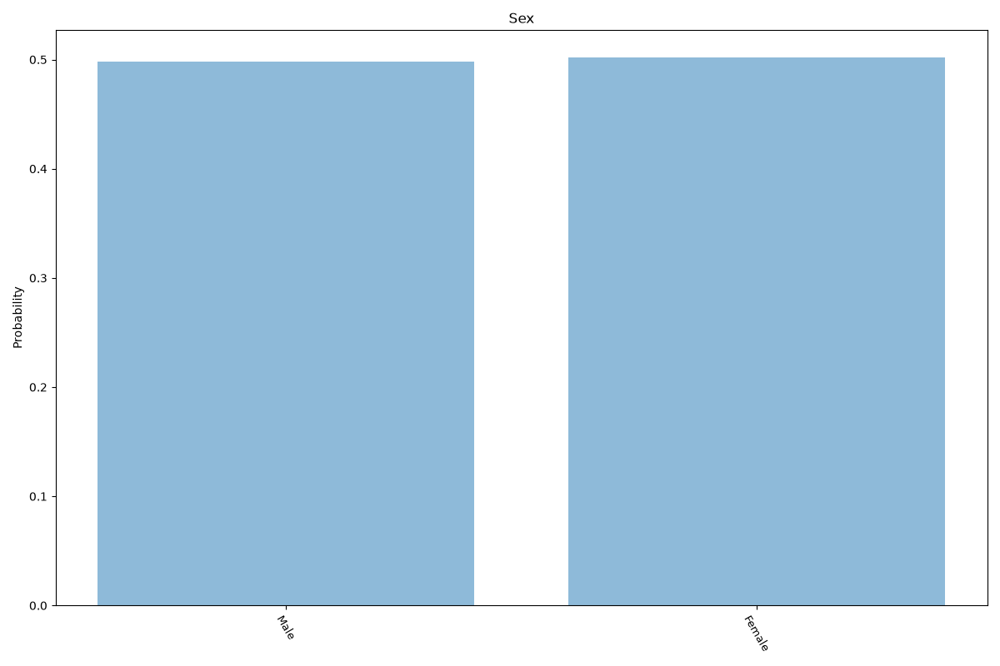
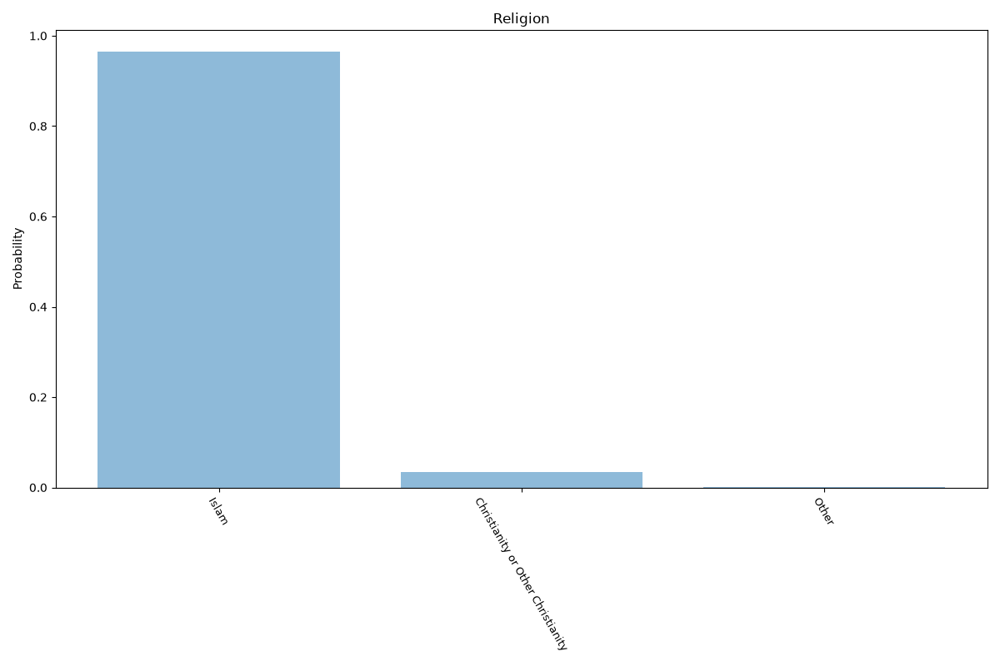
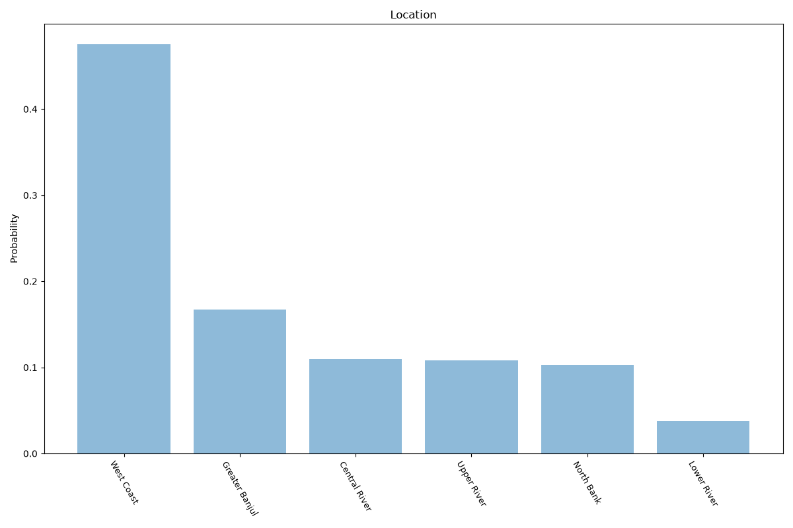

# Gambia
**4 features:** age, sex, religion and location.

## Age

## Sex

## Religion

## Location

## Sources

- [World Population Prospects 2024, United Nations (2024)](https://population.un.org/wpp/) — age, sex
- [The World Factbook: The Gambia (religion), CIA (2019)](https://www.cia.gov/the-world-factbook/countries/gambia-the/) — religion
- [2024 Census, Gambia Bureau of Statistics (2024)](https://www.gbosdata.org/) — location