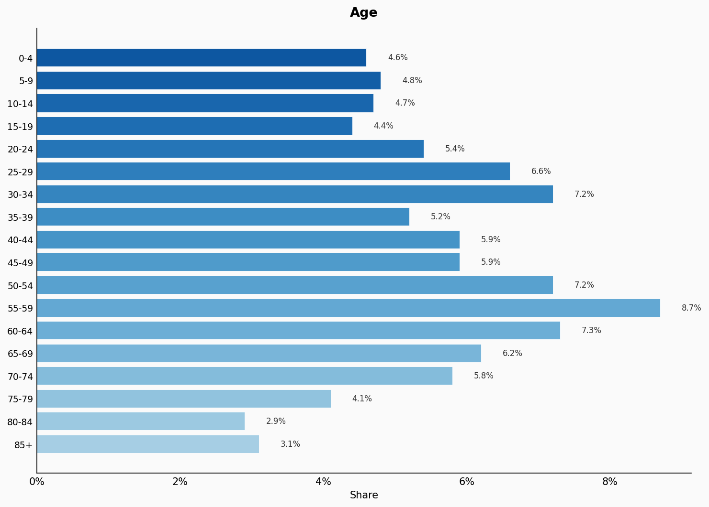
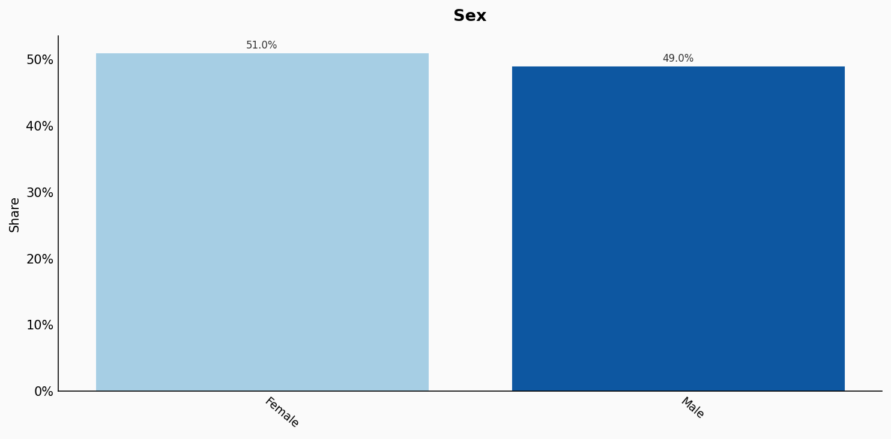
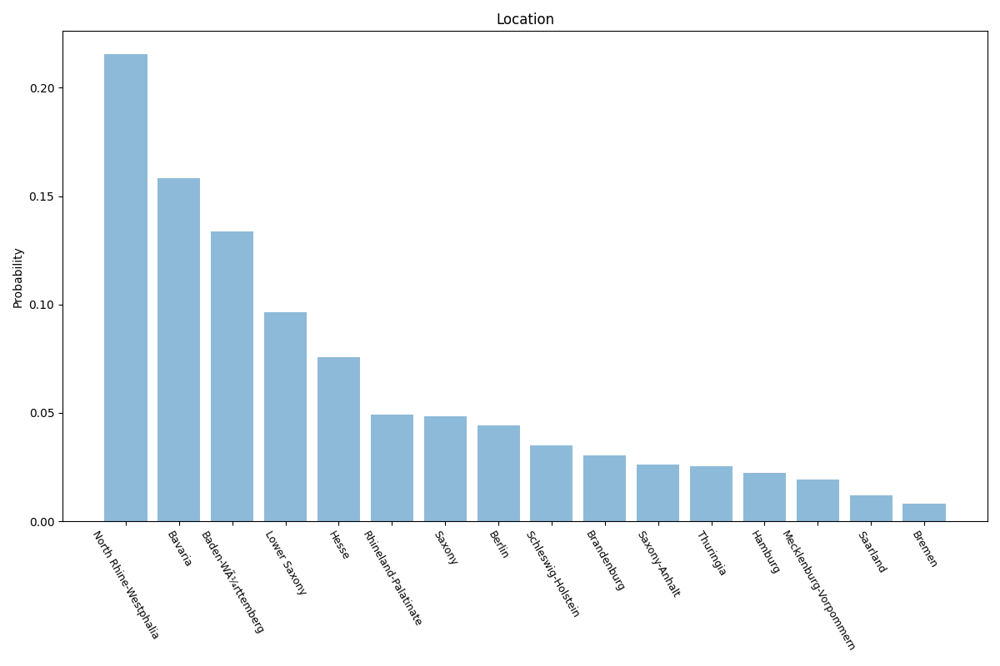
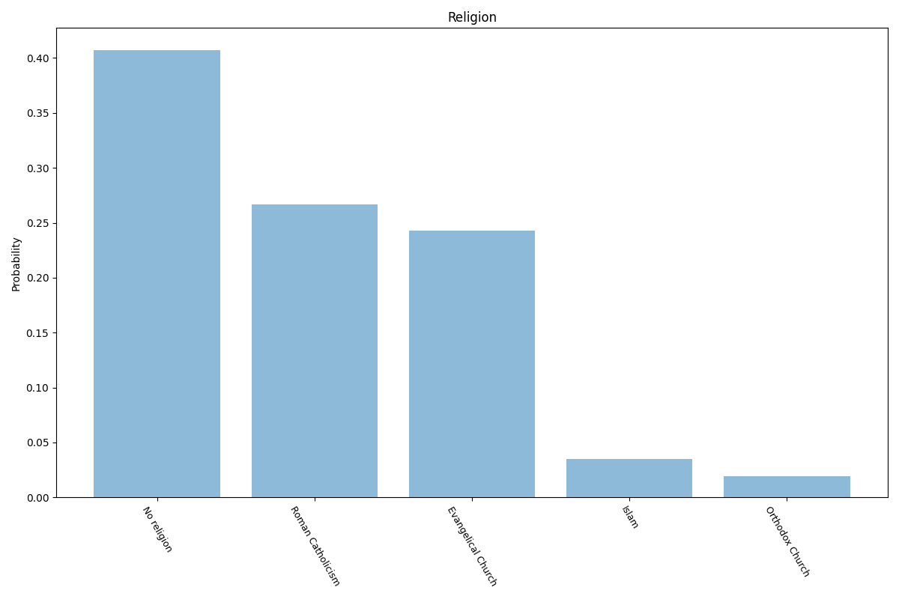
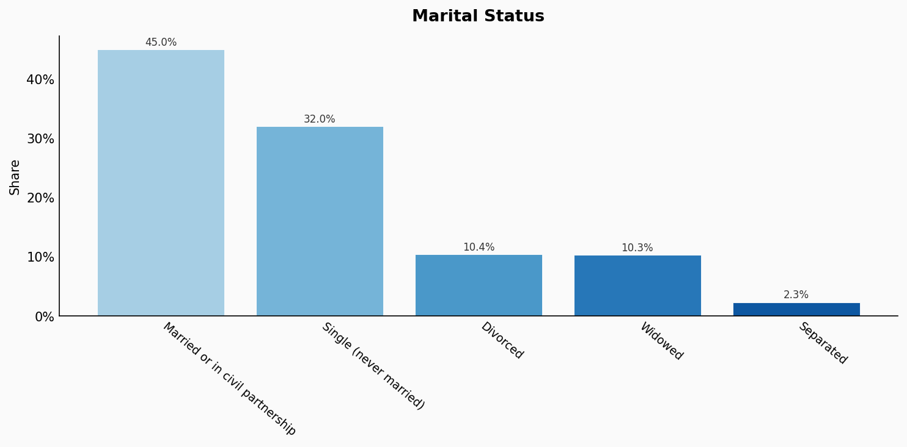
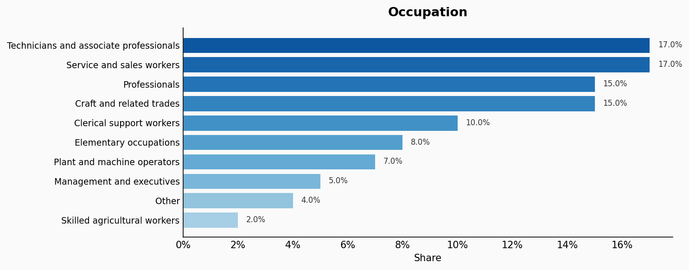
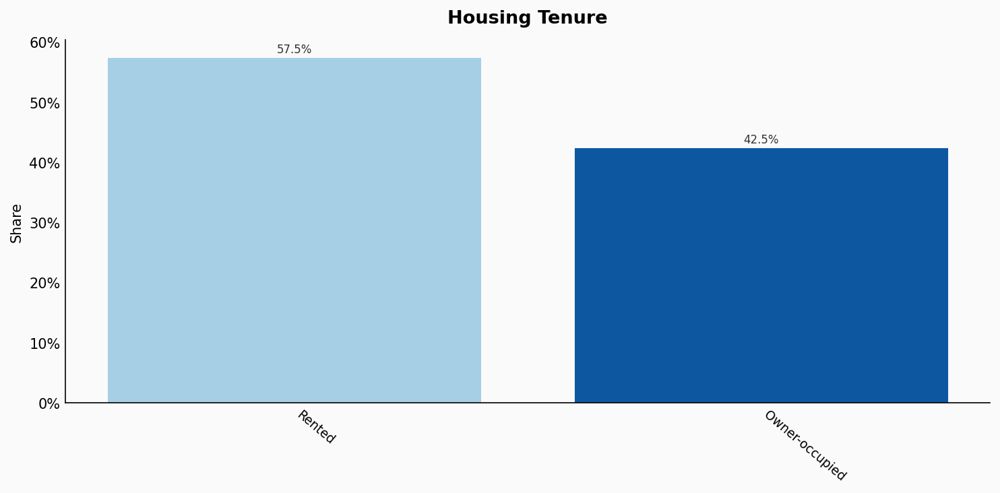
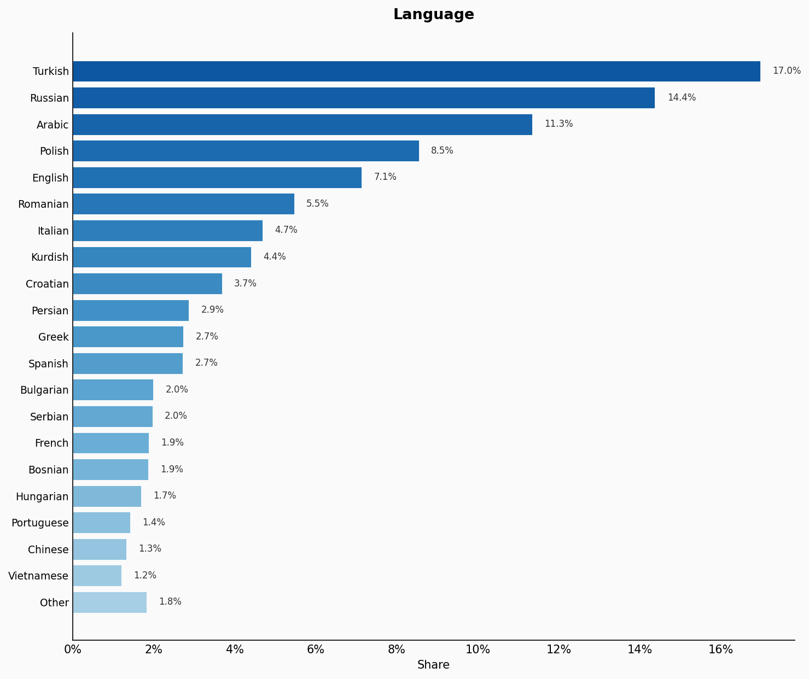
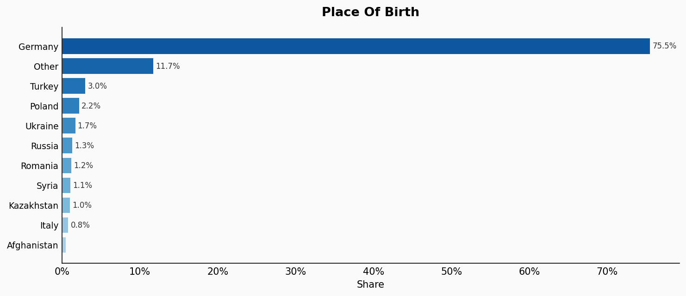

# Germany

**11 features:** age, sex, location, religion, marital status, education, occupation, housing tenure, language, place of birth, and sexuality.

## Age

| Option | Share |
|---|---:|
| 0-4 | 4.6% |
| 5-9 | 4.8% |
| 10-14 | 4.7% |
| 15-19 | 4.4% |
| 20-24 | 5.4% |
| 25-29 | 6.6% |
| 30-34 | 7.2% |
| 35-39 | 5.2% |
| 40-44 | 5.9% |
| 45-49 | 5.9% |
| 50-54 | 7.2% |
| 55-59 | 8.7% |
| 60-64 | 7.3% |
| 65-69 | 6.2% |
| 70-74 | 5.8% |
| 75-79 | 4.1% |
| 80-84 | 2.9% |
| 85+ | 3.1% |

## Sex

| Option | Share |
|---|---:|
| Female | 51.0% |
| Male | 49.0% |

## Location

| Option | Share |
|---|---:|
| North Rhine-Westphalia | 21.5% |
| Bavaria | 15.8% |
| Baden-Württemberg | 13.4% |
| Lower Saxony | 9.6% |
| Hesse | 7.6% |
| Rhineland-Palatinate | 4.9% |
| Saxony | 4.9% |
| Berlin | 4.4% |
| Schleswig-Holstein | 3.5% |
| Brandenburg | 3.0% |
| Saxony-Anhalt | 2.6% |
| Thuringia | 2.5% |
| Hamburg | 2.2% |
| Mecklenburg-Vorpommern | 1.9% |
| Saarland | 1.2% |
| Bremen | 0.8% |

## Religion

| Option | Share |
|---|---:|
| No religion | 41.9% |
| Roman Catholicism | 27.5% |
| Evangelical Church | 25.0% |
| Islam | 3.6% |
| Orthodox Church | 2.0% |

## Marital Status

| Option | Share |
|---|---:|
| Married or in civil partnership | 45.0% |
| Single (never married) | 32.0% |
| Divorced | 10.4% |
| Widowed | 10.3% |
| Separated | 2.3% |

## Education

| Option | Share |
|---|---:|
| Vocational training (Berufsausbildung) | 29.0% |
| Middle secondary (Mittlere Reife) | 24.6% |
| University degree | 17.4% |
| Lower secondary (Hauptschulabschluss) | 15.8% |
| Upper secondary (Abitur/Fachabitur) | 8.3% |
| Other | 2.9% |
| No formal qualification | 2.0% |

## Occupation

| Option | Share |
|---|---:|
| Technicians and associate professionals | 17.0% |
| Service and sales workers | 17.0% |
| Professionals | 15.0% |
| Craft and related trades | 15.0% |
| Clerical support workers | 10.0% |
| Elementary occupations | 8.0% |
| Plant and machine operators | 7.0% |
| Management and executives | 5.0% |
| Other | 4.0% |
| Skilled agricultural workers | 2.0% |

## Housing Tenure

| Option | Share |
|---|---:|
| Rented | 57.5% |
| Owner-occupied | 42.5% |

## Language

| Option | Share |
|---|---:|
| Turkish | 17.0% |
| Russian | 14.4% |
| Arabic | 11.3% |
| Polish | 8.5% |
| English | 7.1% |
| Romanian | 5.5% |
| Italian | 4.7% |
| Kurdish | 4.4% |
| Croatian | 3.7% |
| Persian | 2.9% |
| Greek | 2.7% |
| Spanish | 2.7% |
| Bulgarian | 2.0% |
| Serbian | 2.0% |
| French | 1.9% |
| Bosnian | 1.9% |
| Hungarian | 1.7% |
| Portuguese | 1.4% |
| Chinese | 1.3% |
| Vietnamese | 1.2% |
| Other | 1.8% |

## Place Of Birth

| Option | Share |
|---|---:|
| Germany | 75.5% |
| Other | 11.7% |
| Turkey | 3.0% |
| Poland | 2.2% |
| Ukraine | 1.7% |
| Russia | 1.3% |
| Romania | 1.2% |
| Syria | 1.1% |
| Kazakhstan | 1.0% |
| Italy | 0.8% |
| Afghanistan | 0.5% |

## Sexuality

| Option | Share |
|---|---:|
| Heterosexual | 93.0% |
| Bisexual | 3.0% |
| Gay or Lesbian | 2.0% |
| Other | 2.0% |

## Sources

- [Bevölkerung und Erwerbstätigkeit, Destatis (2021)](https://www.destatis.de/EN/Themes/Society-Environment/Population/Current-Population/_node.html)
  *Covers: `age`, `sex`, `marital status`*
- [Zensus 2022, Destatis (German Federal Statistical Office) (2022)](https://www.destatis.de/EN/Themes/Society-Environment/Population/Census2022/_node.html)
  *Covers: `education`, `occupation`, `housing tenure`*
- [Bevölkerung nach Nationalität und Bundesländern, Destatis](https://www.destatis.de/DE/Themen/Gesellschaft-Umwelt/Bevoelkerung/Bevoelkerungsstand/Tabellen/bevoelkerung-nichtdeutsch-laender.html)
  *Covers: `location`*
- [Migrationshintergrund, Destatis (Federal Statistical Office)](https://www.destatis.de/DE/Themen/Gesellschaft-Umwelt/Bevoelkerung/Migration-Integration/Publikationen/Downloads-Migration/migrationshintergrund-2010220217004.pdf)
  *Covers: `language`*
- [Religionszugehörigkeiten 2020, Fowid](https://fowid.de/meldung/religionszugehoerigkeiten-2020)
  *Covers: `religion`*
- [Zensus 2022, Destatis (German Federal Statistical Office) (2022)](https://www.destatis.de/EN/Themes/Society-Environment/Population/Census2022/_node.html)
  *Covers: `place of birth`*
- [Sozio-oekonomisches Panel (SOEP), DIW Berlin (2020)](https://www.diw.de/de/diw_01.c.841562.de/nachrichten/sexuelle_orientierung_und_psychische_gesundheit_in_deutschland.html)
  *Covers: `sexuality`*