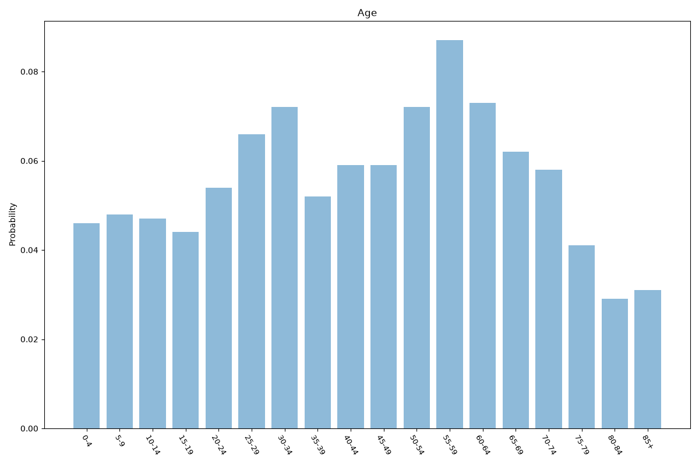
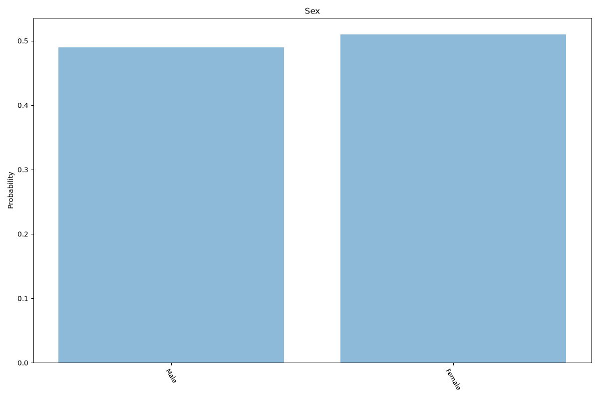
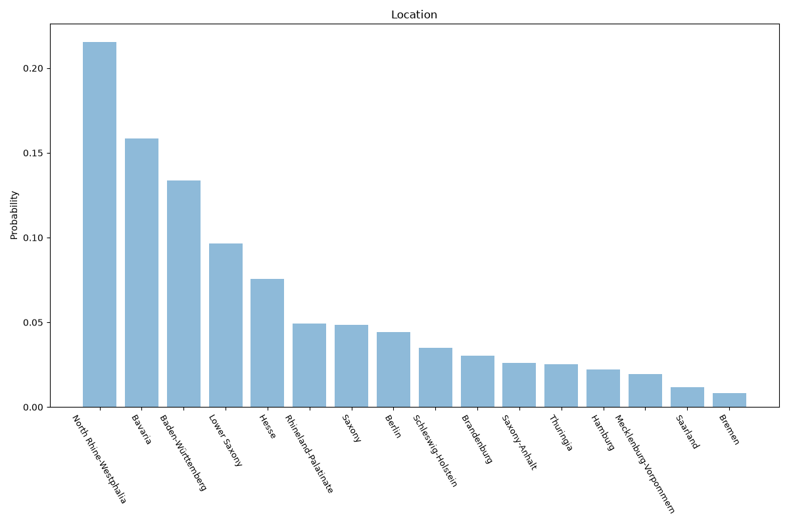
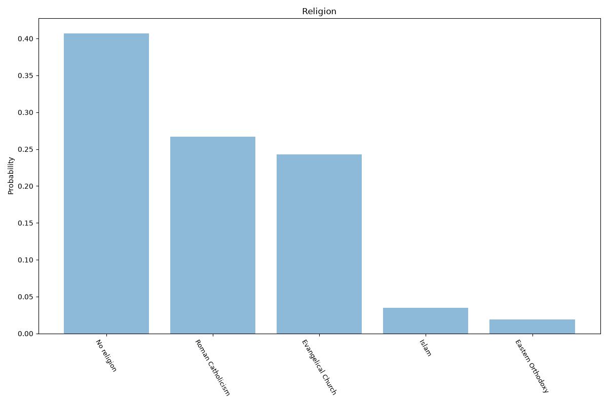
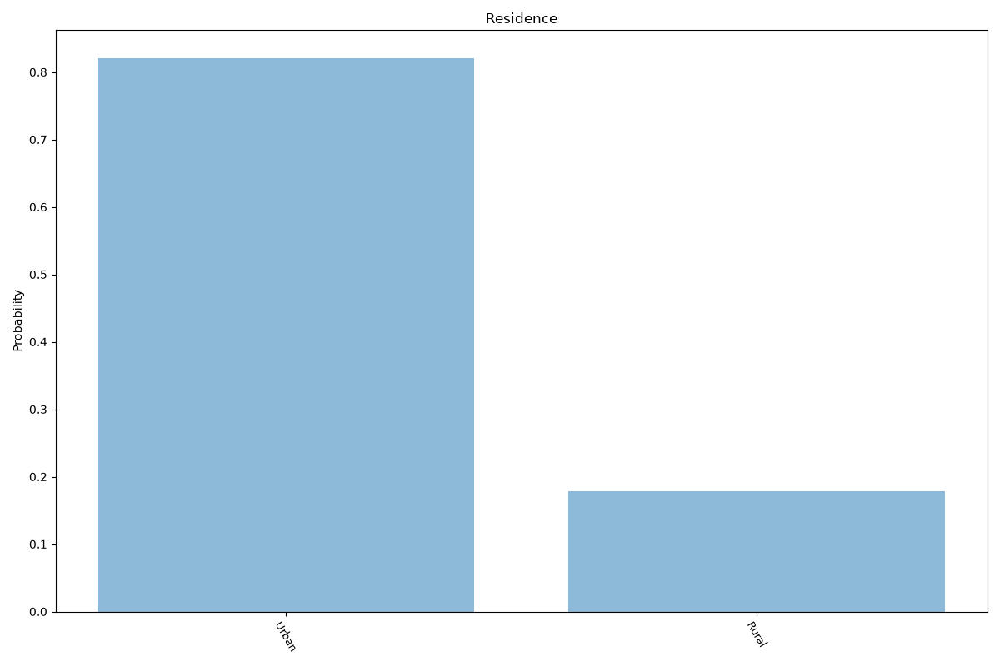
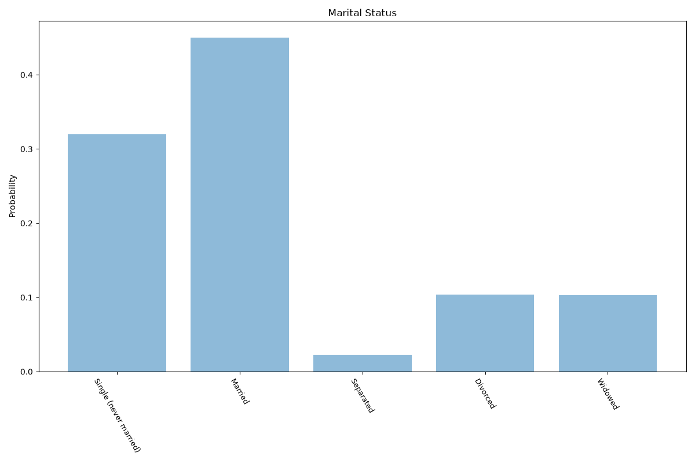
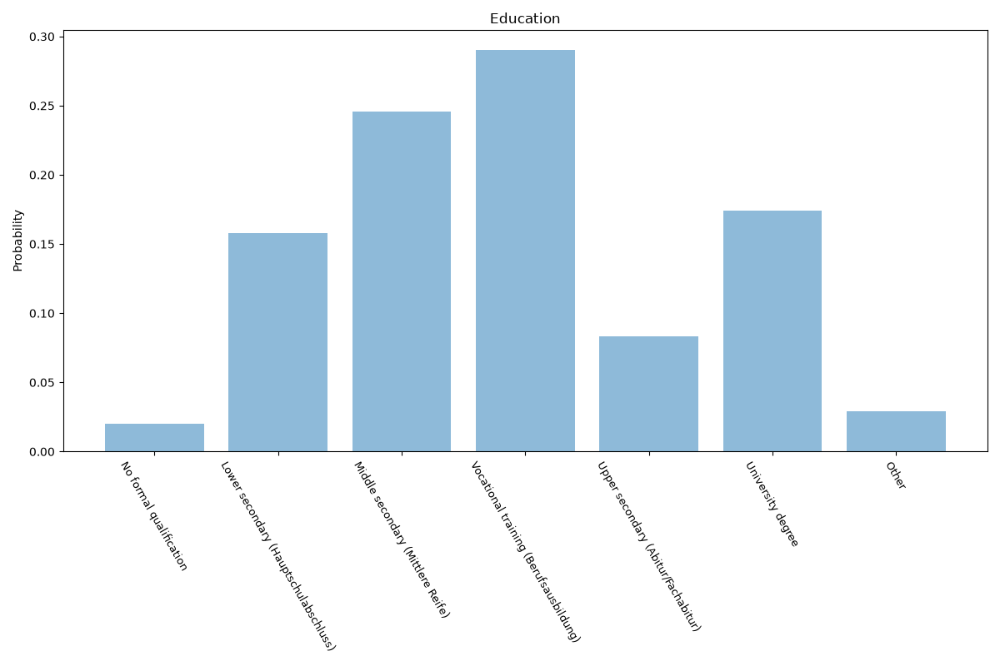
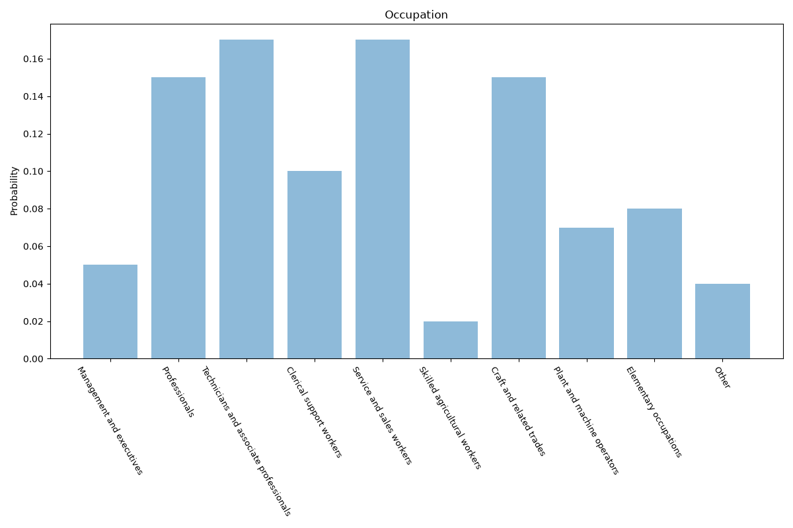
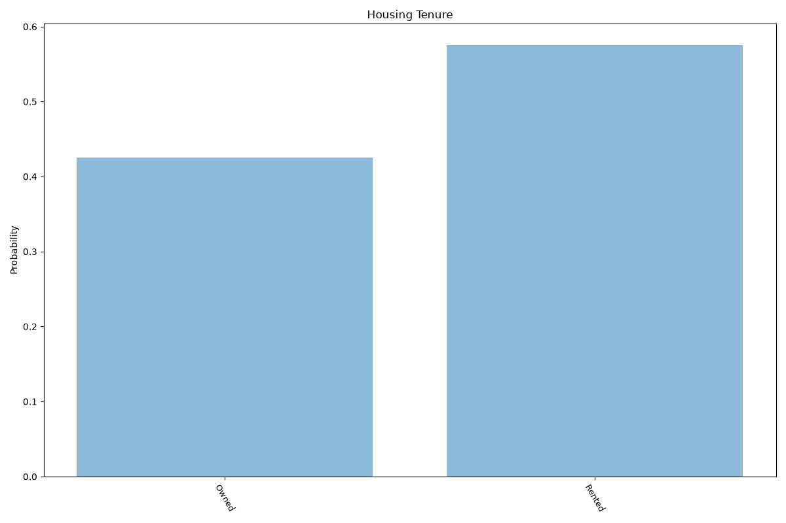
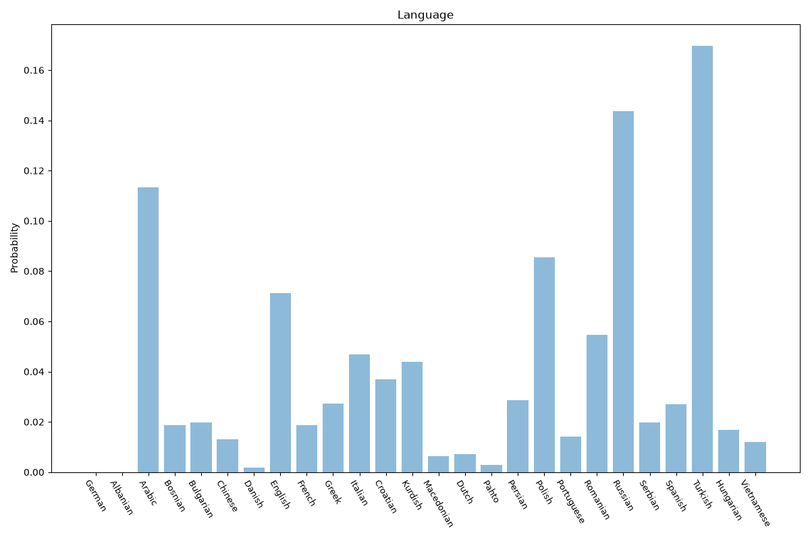

# Germany
**10 features:** age, sex, location, religion, residence, marital status, education, occupation, housing tenure and language.

## Age

## Sex

## Location

## Religion

## Residence

## Marital Status

## Education

## Occupation

## Housing Tenure

## Language

## Sources

- [Bevölkerung und Erwerbstätigkeit, Destatis (2021)](https://www.destatis.de/EN/Themes/Society-Environment/Population/Current-Population/_node.html) — age, sex, marital status
- [Zensus 2022, Destatis (German Federal Statistical Office) (2022)](https://www.destatis.de/EN/Themes/Society-Environment/Population/Census2022/_node.html) — education, occupation, housing tenure
- [Bevölkerung nach Geschlecht und Staatsangehörigkeit, Zensus 2022, Destatis (2022)](https://www.destatis.de/DE/Themen/Gesellschaft-Umwelt/Bevoelkerung/Bevoelkerungsstand/Tabellen/liste-zensus-geschlecht-staatsangehoerigkeit.html) — location
- [Bevölkerung mit Migrationshintergrund, Destatis (2021)](https://www.destatis.de/DE/Themen/Gesellschaft-Umwelt/Bevoelkerung/Migration-Integration/Publikationen/Downloads-Migration/migrationshintergrund-2010220217004.pdf) — language
- [Religionszugehörigkeiten 2020, Fowid (2020)](https://fowid.de/meldung/religionszugehoerigkeiten-2020) — religion
- [Urban population (% of total population), World Bank (2025)](https://data.worldbank.org/indicator/SP.URB.TOTL.IN.ZS) — residence