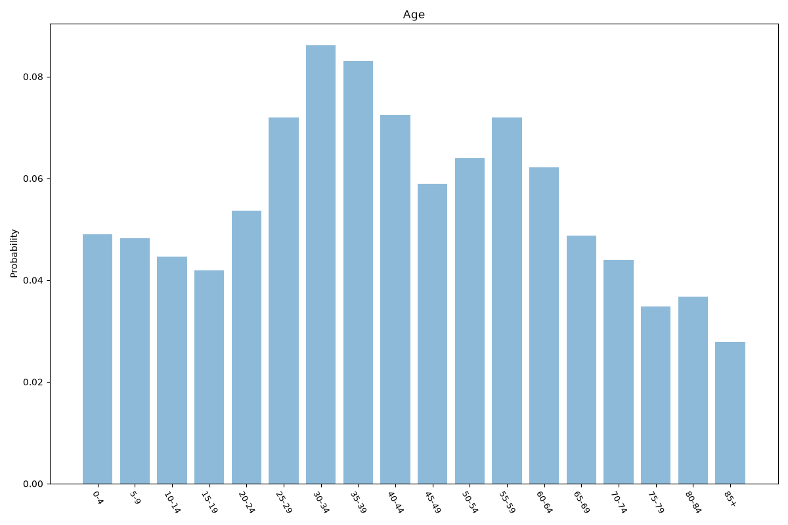
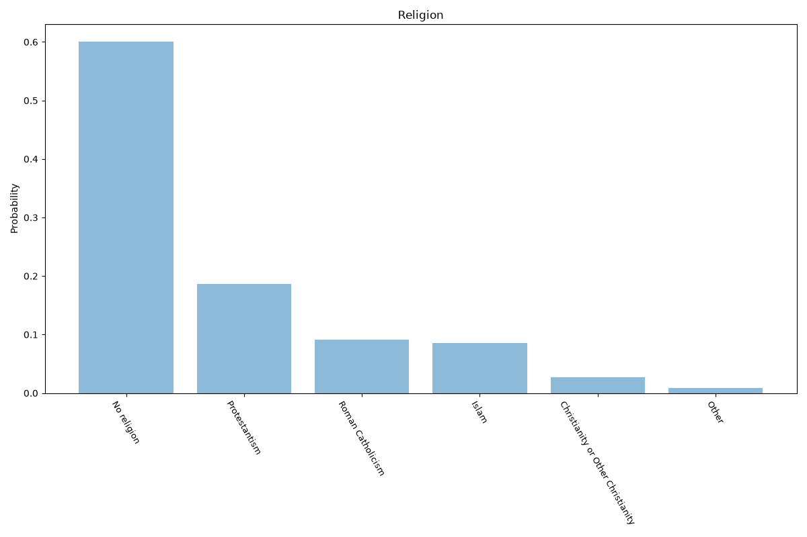
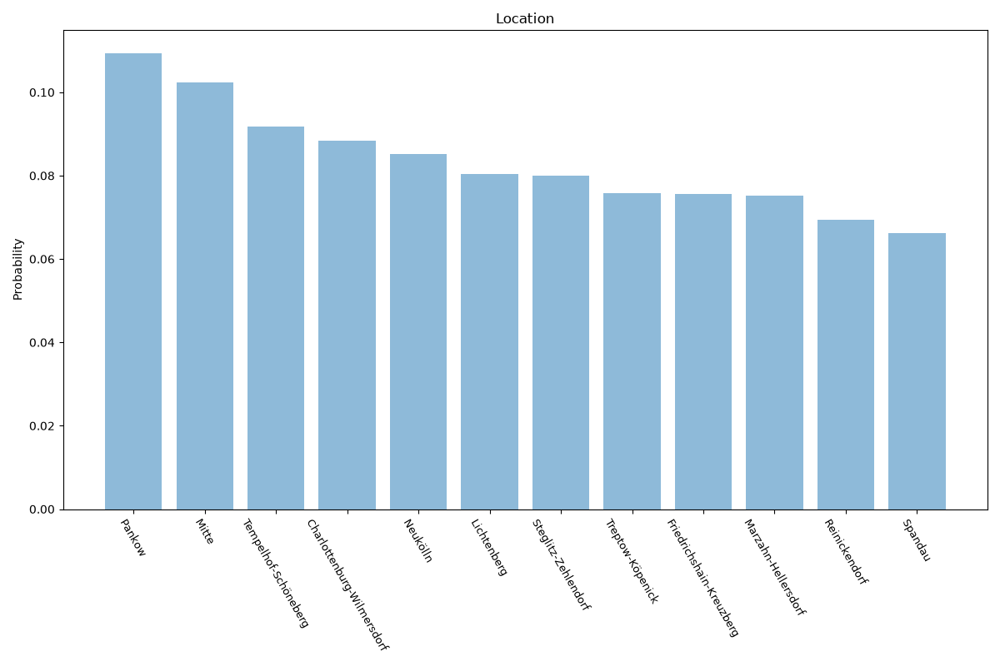

# Berlin
**4 features:** age, religion, residence and location.

## Age

## Religion

## Residence

## Location

## Sources

- [Population by age, Berlin (NUTS 2 DE30), Eurostat (2023)](https://ec.europa.eu/eurostat) — age
- [Religious affiliation (church membership and estimates), Amt für Statistik Berlin-Brandenburg (2010)](https://www.statistik-berlin-brandenburg.de/) — religion
- [Population by borough, Amt für Statistik Berlin-Brandenburg (2023)](https://www.statistik-berlin-brandenburg.de/) — location
- [World Urbanization Prospects 2018, United Nations (2018)](https://population.un.org/wup/) — residence