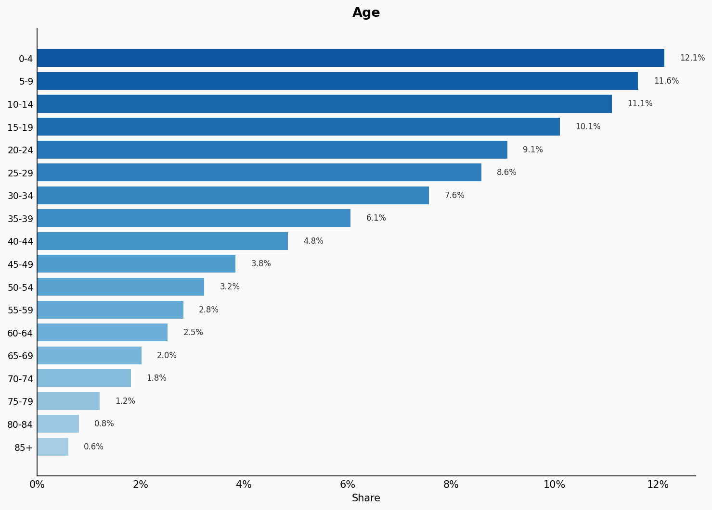
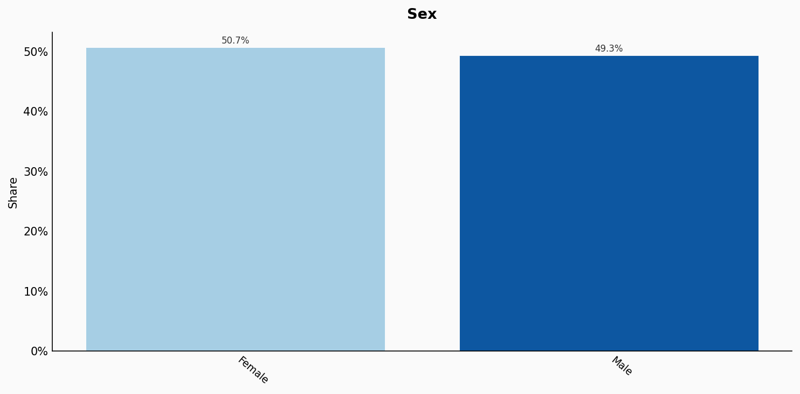
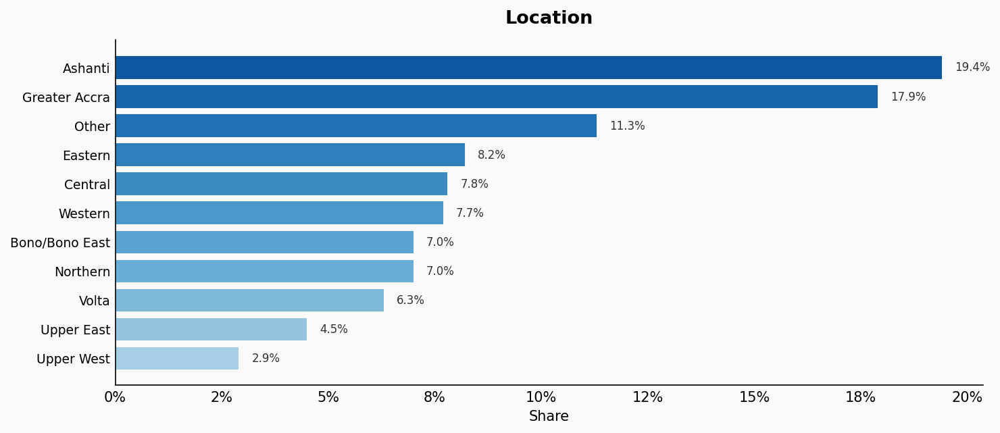
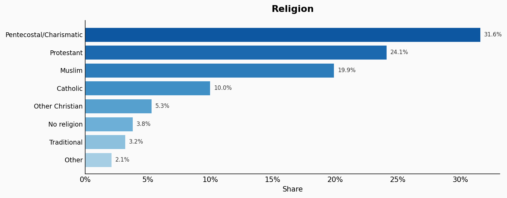
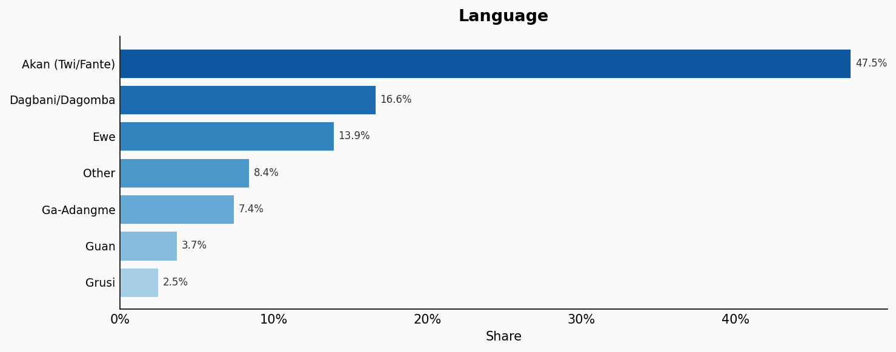
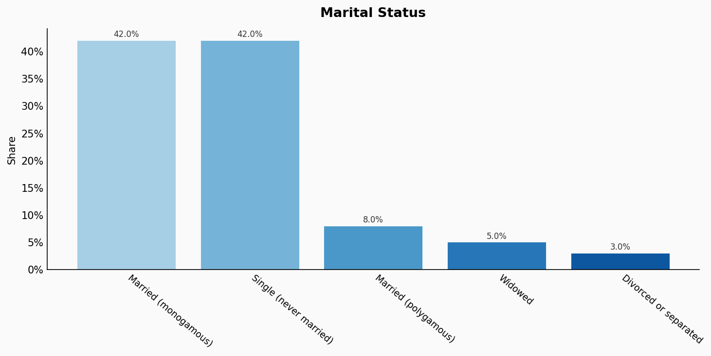
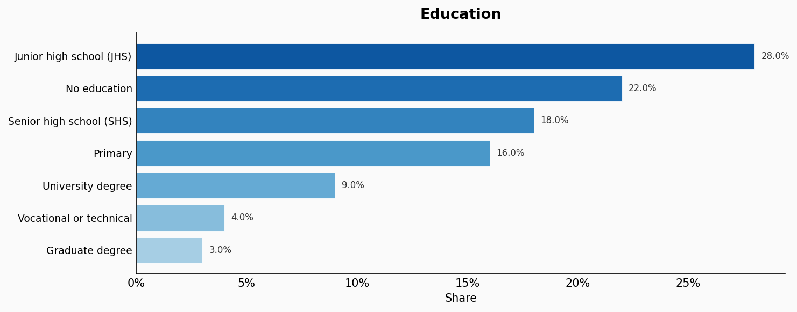
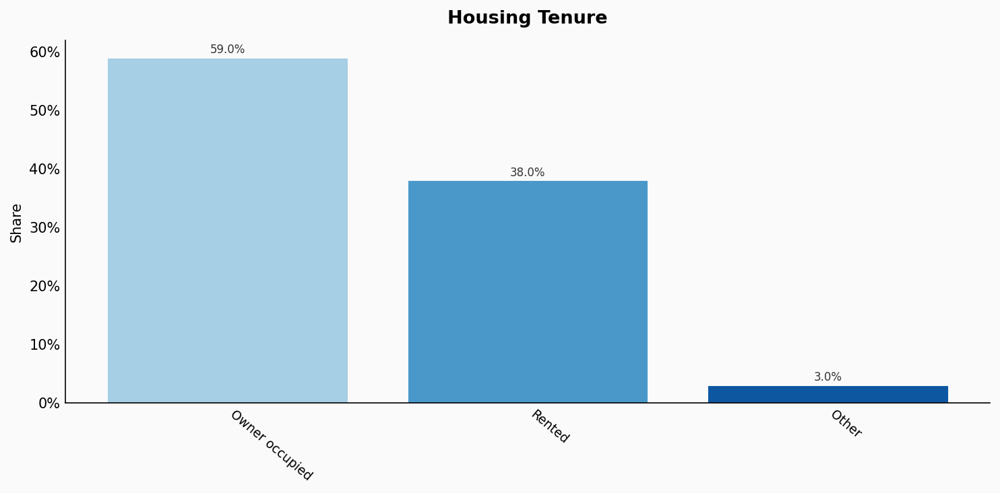
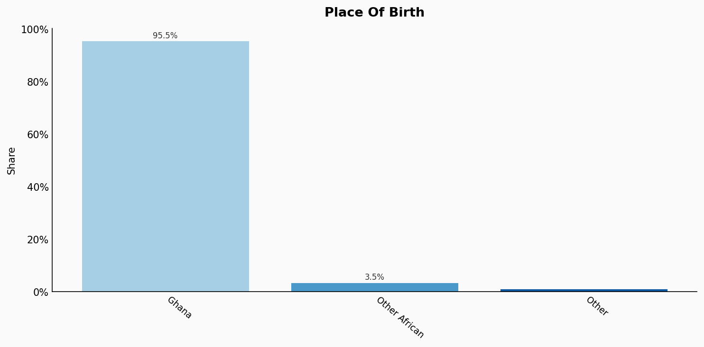
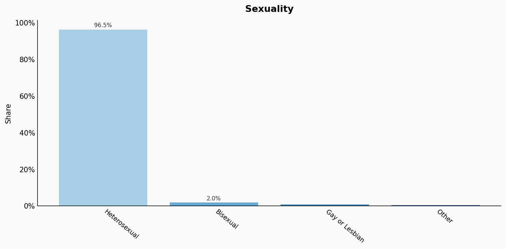

# Ghana

**11 features:** age, sex, location, religion, language, marital status, education, occupation, housing tenure, place of birth, and sexuality.

## Age

| Option | Share |
|---|---:|
| 0-4 | 12.1% |
| 5-9 | 11.6% |
| 10-14 | 11.1% |
| 15-19 | 10.1% |
| 20-24 | 9.1% |
| 25-29 | 8.6% |
| 30-34 | 7.6% |
| 35-39 | 6.1% |
| 40-44 | 4.8% |
| 45-49 | 3.8% |
| 50-54 | 3.2% |
| 55-59 | 2.8% |
| 60-64 | 2.5% |
| 65-69 | 2.0% |
| 70-74 | 1.8% |
| 75-79 | 1.2% |
| 80-84 | 0.8% |
| 85+ | 0.6% |

## Sex

| Option | Share |
|---|---:|
| Female | 50.7% |
| Male | 49.3% |

## Location

| Option | Share |
|---|---:|
| Ashanti | 19.4% |
| Greater Accra | 17.9% |
| Other | 11.3% |
| Eastern | 8.2% |
| Central | 7.8% |
| Western | 7.7% |
| Bono/Bono East | 7.0% |
| Northern | 7.0% |
| Volta | 6.3% |
| Upper East | 4.5% |
| Upper West | 2.9% |

## Religion

| Option | Share |
|---|---:|
| Pentecostal/Charismatic | 31.6% |
| Protestant | 24.1% |
| Muslim | 19.9% |
| Catholic | 10.0% |
| Other Christian | 5.3% |
| No religion | 3.8% |
| Traditional | 3.2% |
| Other | 2.1% |

## Language

| Option | Share |
|---|---:|
| Akan (Twi/Fante) | 47.5% |
| Dagbani/Dagomba | 16.6% |
| Ewe | 13.9% |
| Other | 8.4% |
| Ga-Adangme | 7.4% |
| Guan | 3.7% |
| Grusi | 2.5% |

## Marital Status

| Option | Share |
|---|---:|
| Married (monogamous) | 42.0% |
| Single (never married) | 42.0% |
| Married (polygamous) | 8.0% |
| Widowed | 5.0% |
| Divorced or separated | 3.0% |

## Education

| Option | Share |
|---|---:|
| Junior high school (JHS) | 28.0% |
| No education | 22.0% |
| Senior high school (SHS) | 18.0% |
| Primary | 16.0% |
| University degree | 9.0% |
| Vocational or technical | 4.0% |
| Graduate degree | 3.0% |

## Occupation

| Option | Share |
|---|---:|
| Agriculture | 33.0% |
| Service and sales | 20.0% |
| Elementary | 15.0% |
| Craft and trades | 12.0% |
| Professionals | 7.0% |
| Technicians | 5.0% |
| Administrative | 4.0% |
| Plant and machine operators | 3.0% |
| Management | 1.0% |

## Housing Tenure

| Option | Share |
|---|---:|
| Owner occupied | 59.0% |
| Rented | 38.0% |
| Other | 3.0% |

## Place Of Birth

| Option | Share |
|---|---:|
| Ghana | 95.5% |
| Other African | 3.5% |
| Other | 1.0% |

## Sexuality

| Option | Share |
|---|---:|
| Heterosexual | 96.5% |
| Bisexual | 2.0% |
| Gay or Lesbian | 1.0% |
| Other | 0.5% |

## Sources

- [Population and Housing Census 2021, Ghana Statistical Service (GSS) (2021)](https://census2021.statsghana.gov.gh/)
  *Covers: `age`, `sex`, `location`, `marital status`, `housing tenure`, `place of birth`, `religion`*
- [Ghana Living Standards Survey 7 (GLSS7), GSS (2017)](https://www.statsghana.gov.gh/gssmain/fileUpload/pressrelease/GLSS7%20MAIN%20REPORT.pdf)
  *Covers: `education`, `occupation`*
- [Population and Housing Census 2021 - Ethnicity, GSS (2021)](https://census2021.statsghana.gov.gh/)
  *Covers: `language`*
- [Afrobarometer Ghana 2022 (2022)](https://www.afrobarometer.org/country/ghana/)
  *Covers: `sexuality`*