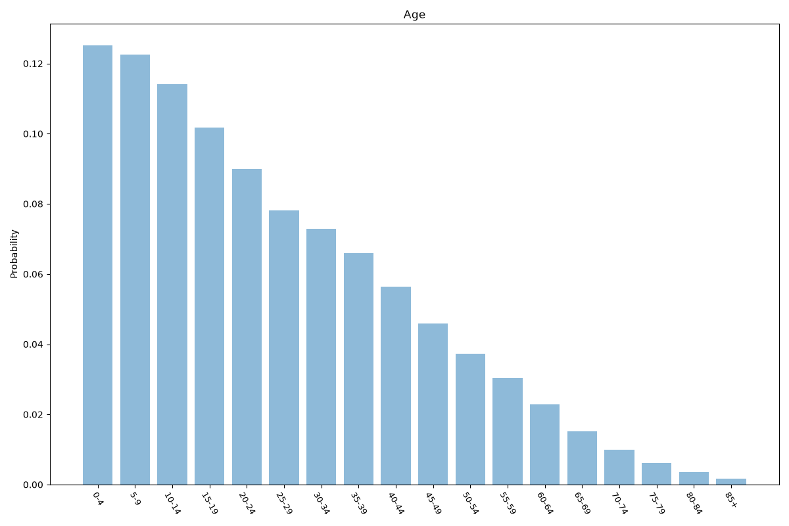
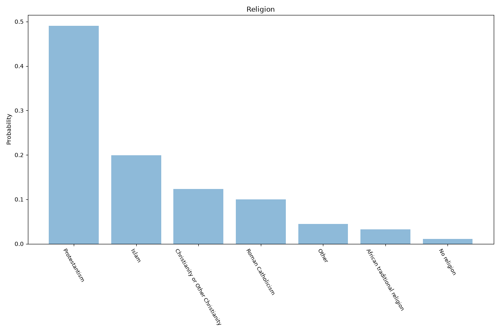
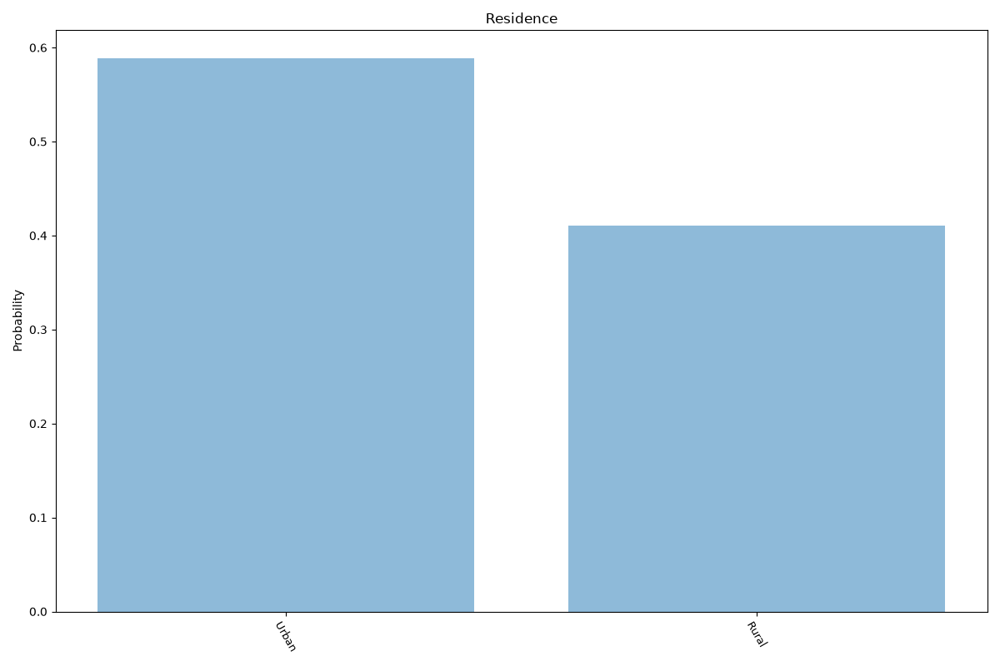
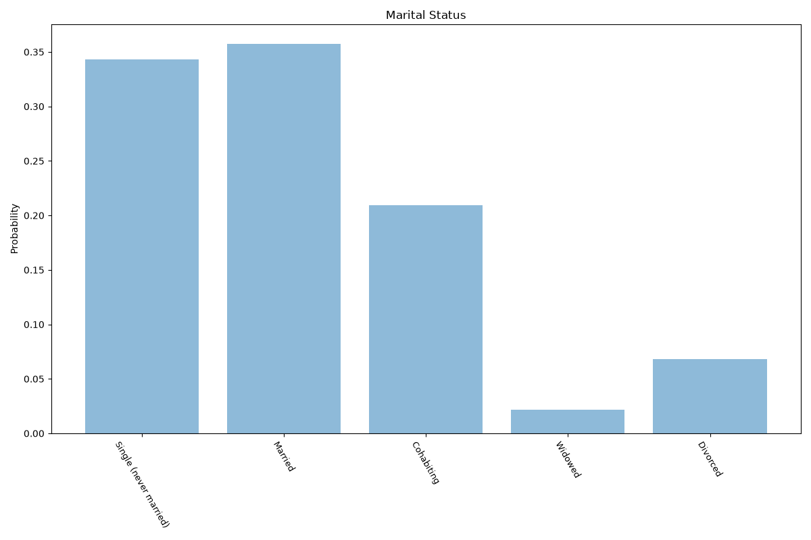
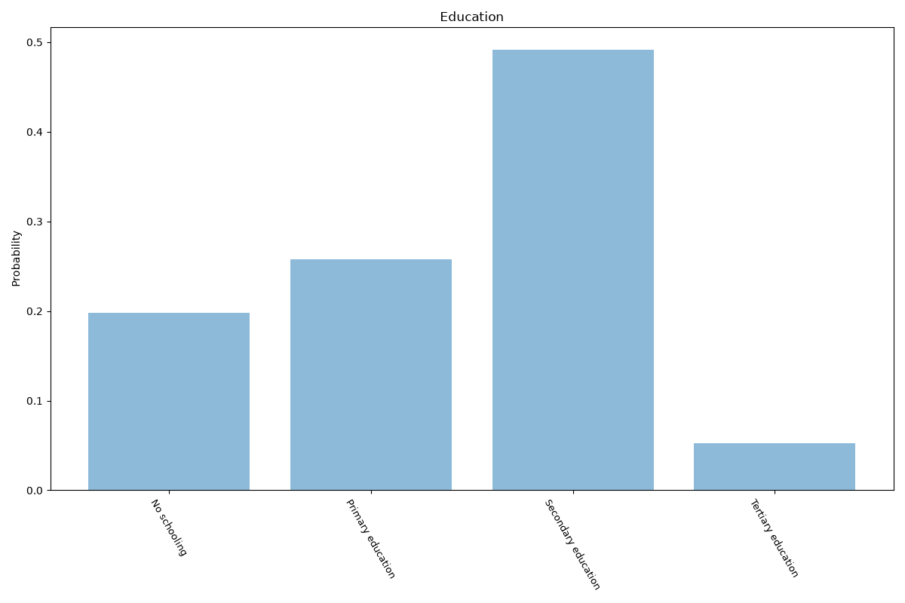
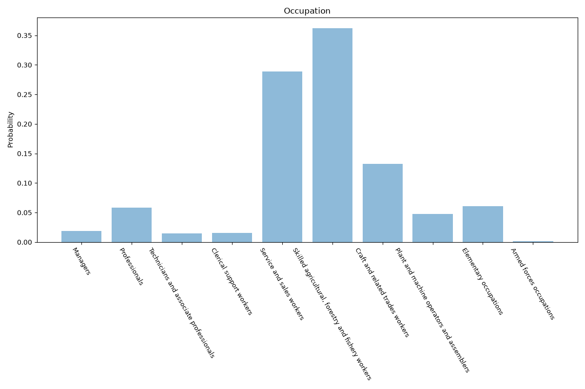
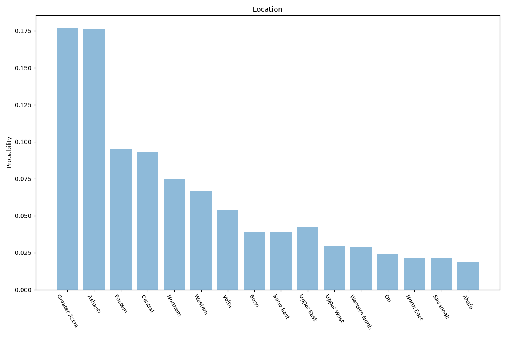

# Ghana
**8 features:** age, sex, religion, residence, marital status, education, occupation and location.

## Age

## Sex

## Religion

## Residence

## Marital Status

## Education

## Occupation

## Location

## Sources

- [World Population Prospects 2024, United Nations (2024)](https://population.un.org/wpp/) — age, sex
- [2021 Population and Housing Census (religion), Ghana Statistical Service (2021)](https://www.statsghana.gov.gh/) — religion
- [2021 Population and Housing Census, Ghana Statistical Service (2021)](https://www.statsghana.gov.gh/) — location
- [Urban population (% of total population), World Bank (2025)](https://data.worldbank.org/indicator/SP.URB.TOTL.IN.ZS) — residence
- [World Marriage Data 2019, United Nations (2017)](https://www.un.org/development/desa/pd/data/world-marriage-data) — marital status
- [Wittgenstein Centre Human Capital Data Explorer (Version 3.0, SSP2 scenario), IIASA (2020)](https://dataexplorer.wittgensteincentre.org/wcde-v3/) — education
- [Employment by sex and occupation (ISCO-08), ILOSTAT, International Labour Organization (2024)](https://ilostat.ilo.org/data/) — occupation