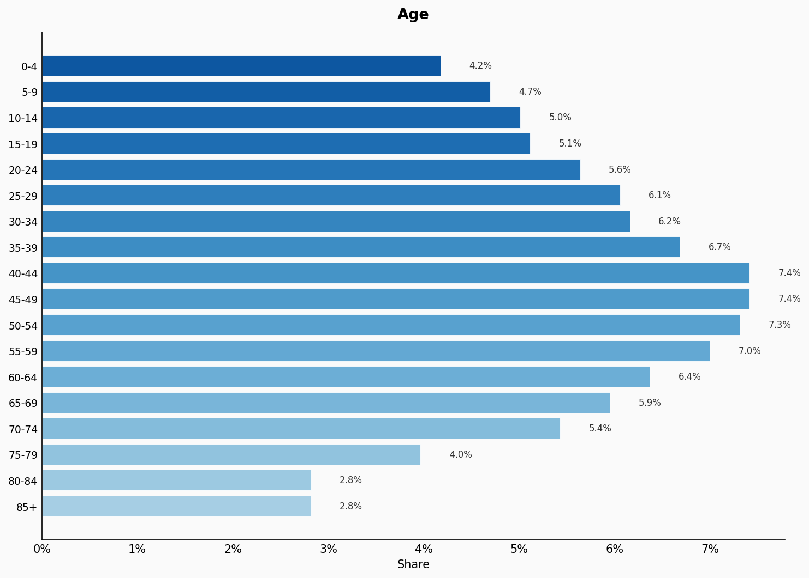
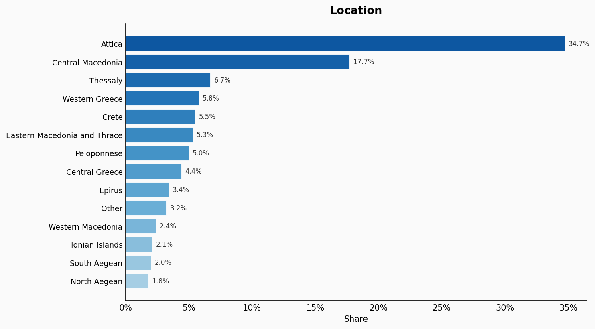
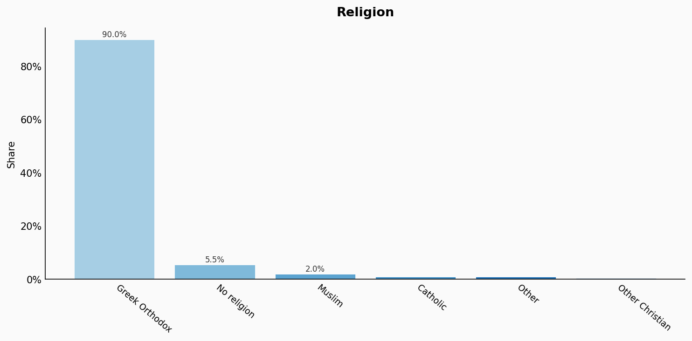
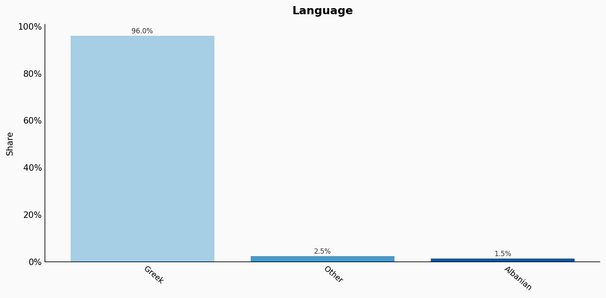
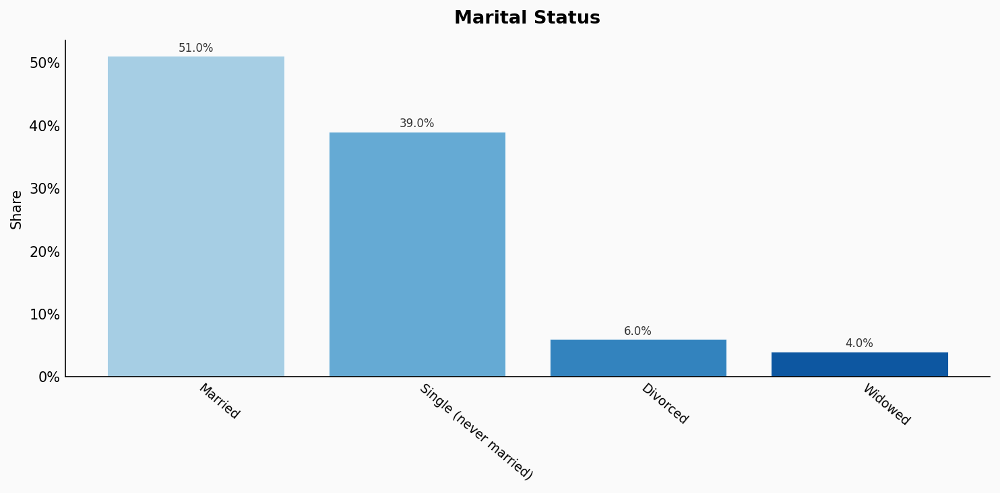
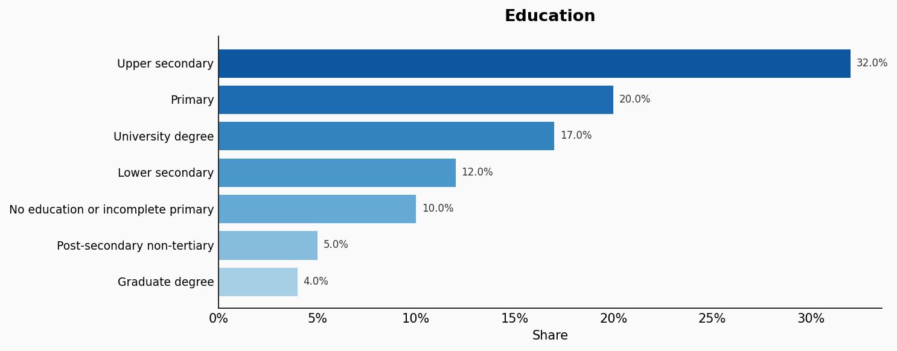
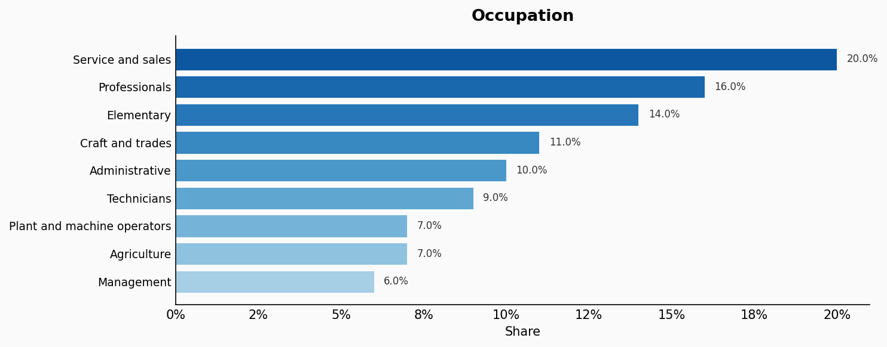
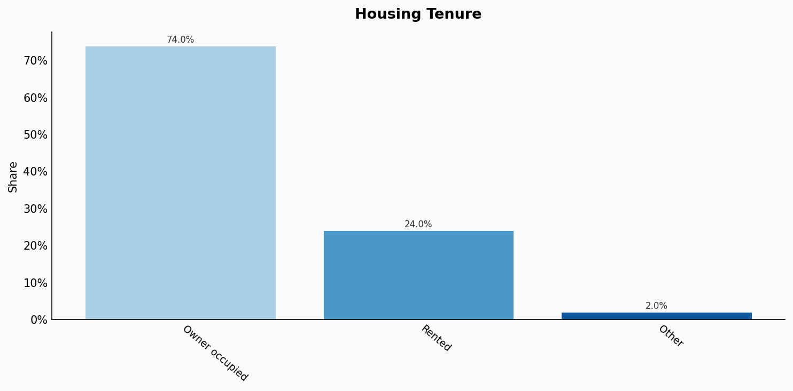
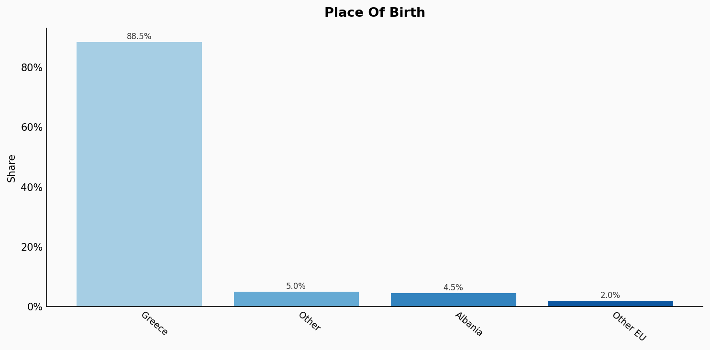
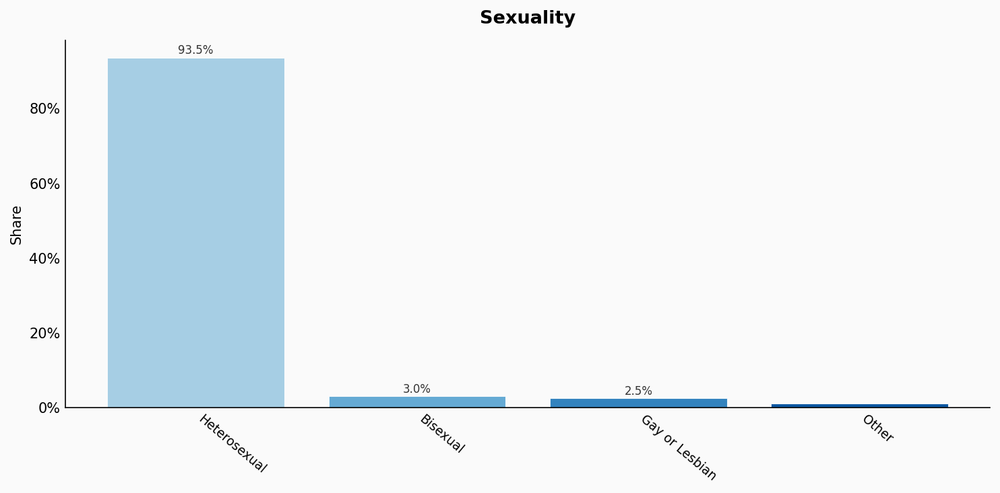

# Greece

**11 features:** age, sex, location, religion, language, marital status, education, occupation, housing tenure, place of birth, and sexuality.

## Age

| Option | Share |
|---|---:|
| 0-4 | 4.2% |
| 5-9 | 4.7% |
| 10-14 | 5.0% |
| 15-19 | 5.1% |
| 20-24 | 5.6% |
| 25-29 | 6.1% |
| 30-34 | 6.2% |
| 35-39 | 6.7% |
| 40-44 | 7.4% |
| 45-49 | 7.4% |
| 50-54 | 7.3% |
| 55-59 | 7.0% |
| 60-64 | 6.4% |
| 65-69 | 5.9% |
| 70-74 | 5.4% |
| 75-79 | 4.0% |
| 80-84 | 2.8% |
| 85+ | 2.8% |

## Sex

| Option | Share |
|---|---:|
| Female | 51.5% |
| Male | 48.5% |

## Location

| Option | Share |
|---|---:|
| Attica | 34.7% |
| Central Macedonia | 17.7% |
| Thessaly | 6.7% |
| Western Greece | 5.8% |
| Crete | 5.5% |
| Eastern Macedonia and Thrace | 5.3% |
| Peloponnese | 5.0% |
| Central Greece | 4.4% |
| Epirus | 3.4% |
| Other | 3.2% |
| Western Macedonia | 2.4% |
| Ionian Islands | 2.1% |
| South Aegean | 2.0% |
| North Aegean | 1.8% |

## Religion

| Option | Share |
|---|---:|
| Greek Orthodox | 90.0% |
| No religion | 5.5% |
| Muslim | 2.0% |
| Catholic | 1.0% |
| Other | 1.0% |
| Other Christian | 0.5% |

## Language

| Option | Share |
|---|---:|
| Greek | 96.0% |
| Other | 2.5% |
| Albanian | 1.5% |

## Marital Status

| Option | Share |
|---|---:|
| Married | 51.0% |
| Single (never married) | 39.0% |
| Divorced | 6.0% |
| Widowed | 4.0% |

## Education

| Option | Share |
|---|---:|
| Upper secondary | 32.0% |
| Primary | 20.0% |
| University degree | 17.0% |
| Lower secondary | 12.0% |
| No education or incomplete primary | 10.0% |
| Post-secondary non-tertiary | 5.0% |
| Graduate degree | 4.0% |

## Occupation

| Option | Share |
|---|---:|
| Service and sales | 20.0% |
| Professionals | 16.0% |
| Elementary | 14.0% |
| Craft and trades | 11.0% |
| Administrative | 10.0% |
| Technicians | 9.0% |
| Plant and machine operators | 7.0% |
| Agriculture | 7.0% |
| Management | 6.0% |

## Housing Tenure

| Option | Share |
|---|---:|
| Owner occupied | 74.0% |
| Rented | 24.0% |
| Other | 2.0% |

## Place Of Birth

| Option | Share |
|---|---:|
| Greece | 88.5% |
| Other | 5.0% |
| Albania | 4.5% |
| Other EU | 2.0% |

## Sexuality

| Option | Share |
|---|---:|
| Heterosexual | 93.5% |
| Bisexual | 3.0% |
| Gay or Lesbian | 2.5% |
| Other | 1.0% |

## Sources

- [Απογραφή Πληθυσμού 2021, ELSTAT (2021)](https://www.statistics.gr/en/2021-census-pop-hous)
  *Covers: `age`, `sex`, `location`, `marital status`, `housing tenure`, `place of birth`*
- [Έρευνα Εργατικού Δυναμικού 2022, ELSTAT (2022)](https://www.statistics.gr/en/statistics/-/publication/SJO01/2022-Q4)
  *Covers: `education`, `occupation`*
- [European Social Survey (Greece) 2020 (2020)](https://www.europeansocialsurvey.org/)
  *Covers: `religion`*
- [Απογραφή Πληθυσμού 2001, ELSTAT (2001)](https://www.statistics.gr/en/statistics/-/publication/SAM03/-)
  *Covers: `language`*
- [Eurobarometer Special Survey on Discrimination 2019, European Commission (2019)](https://europa.eu/eurobarometer/surveys/detail/2251)
  *Covers: `sexuality`*