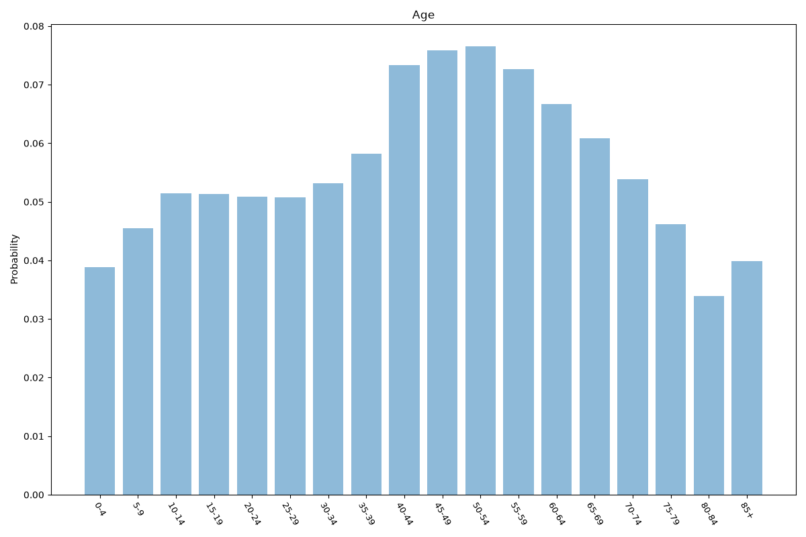
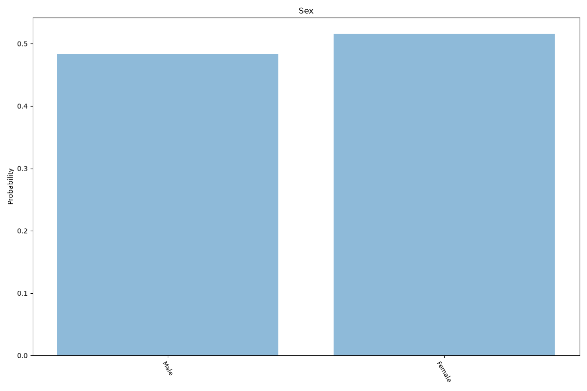
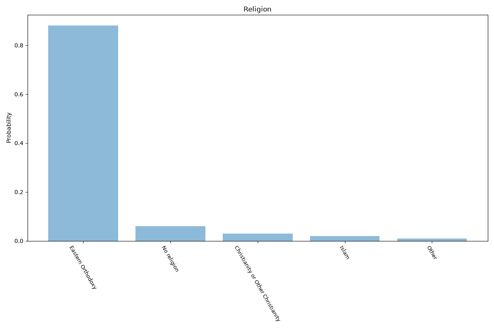
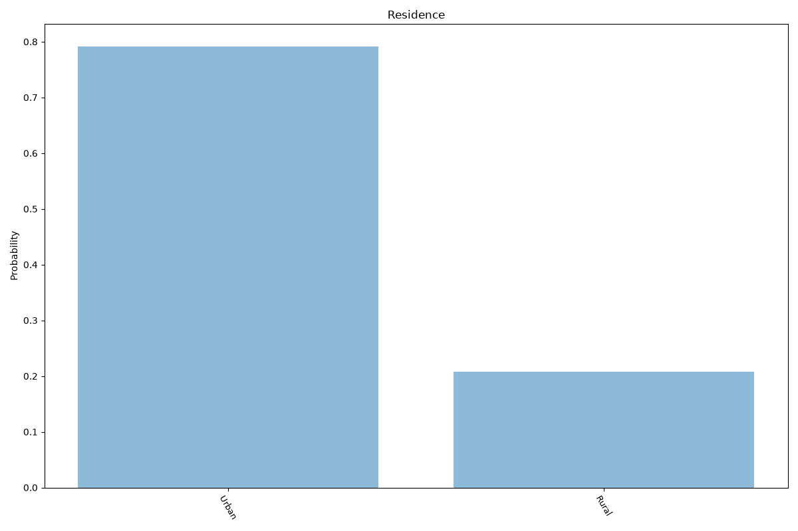
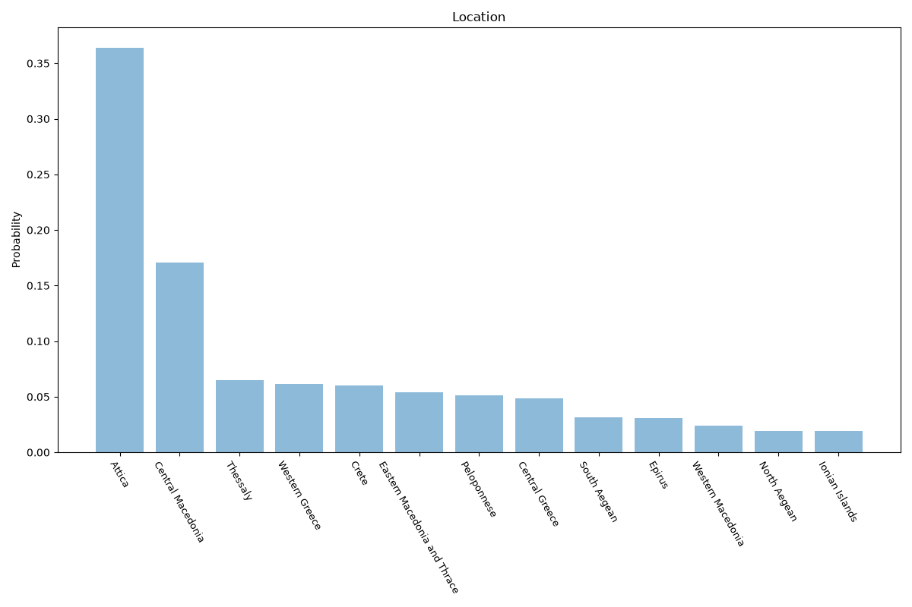

# Greece
**5 features:** age, sex, religion, residence and location.

## Age

## Sex

## Religion

## Residence

## Location

## Sources

- [World Population Prospects 2024, United Nations (2024)](https://population.un.org/wpp/) — age, sex
- [2022 International Religious Freedom Report: Greece, US Department of State (2022)](https://www.state.gov/reports/2022-report-on-international-religious-freedom/greece/) — religion
- [Population estimates 2024, Hellenic Statistical Authority (ELSTAT) (2024)](https://www.statistics.gr/en/home) — location
- [Urban population (% of total population), World Bank (2025)](https://data.worldbank.org/indicator/SP.URB.TOTL.IN.ZS) — residence