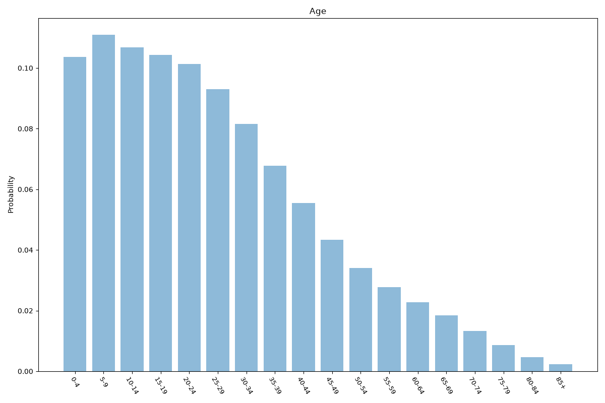
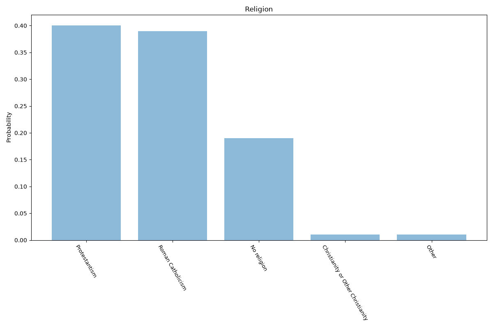
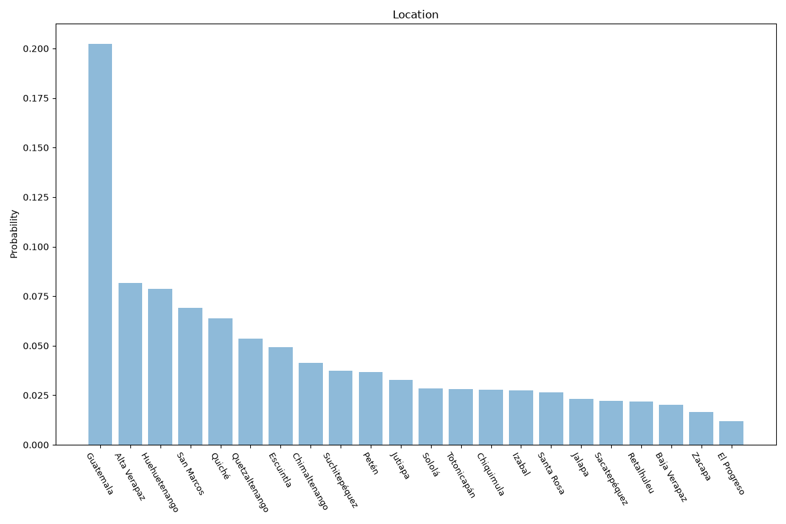

# Guatemala
**4 features:** age, sex, religion and location.

## Age

## Sex

## Religion

## Location

## Sources

- [World Population Prospects 2024, United Nations (2024)](https://population.un.org/wpp/) — age, sex
- [Latinobarómetro (2024)](https://www.latinobarometro.org/) — religion
- [2018 Census, Instituto Nacional de Estadística (INE Guatemala) (2018)](https://www.ine.gob.gt/) — location