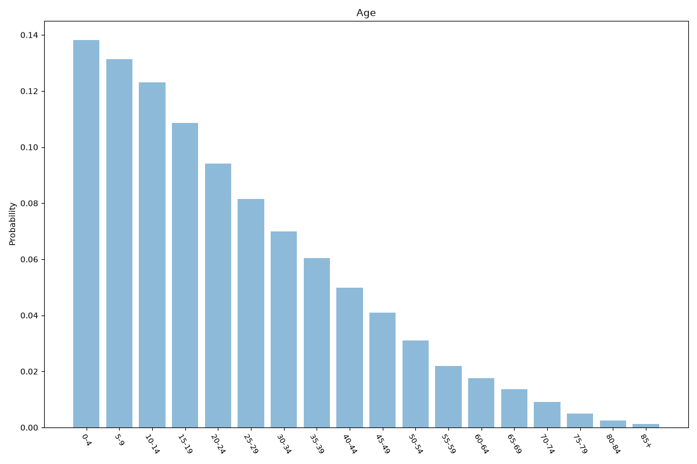
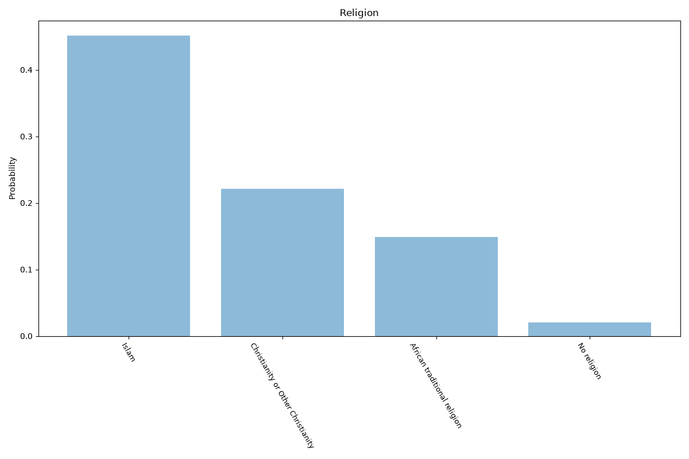
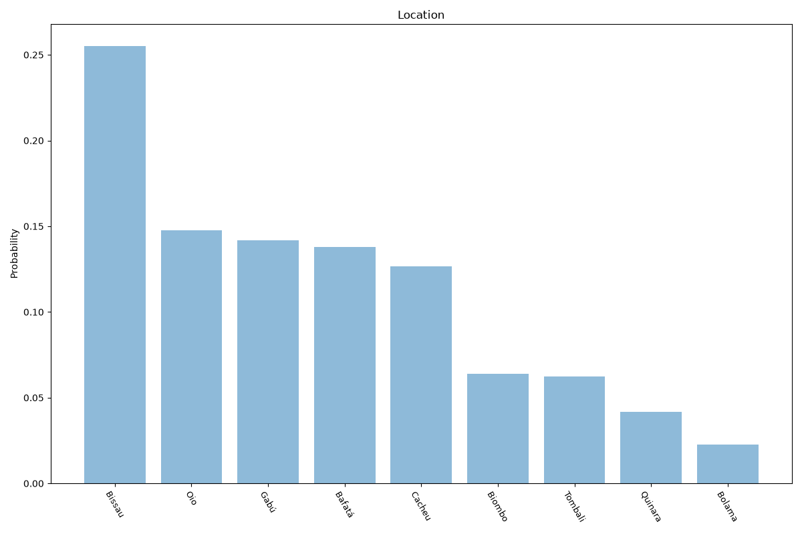

# Guinea Bissau
**4 features:** age, sex, religion and location.

## Age

## Sex

## Religion

## Location

## Sources

- [World Population Prospects 2024, United Nations (2024)](https://population.un.org/wpp/) — age, sex
- [2009 Census (religion), Instituto Nacional de Estatística (Guinea-Bissau) (2009)](https://www.stat-guinebissau.com/) — religion
- [2009 Census, Instituto Nacional de Estatística (Guinea-Bissau) (2009)](https://www.stat-guinebissau.com/) — location