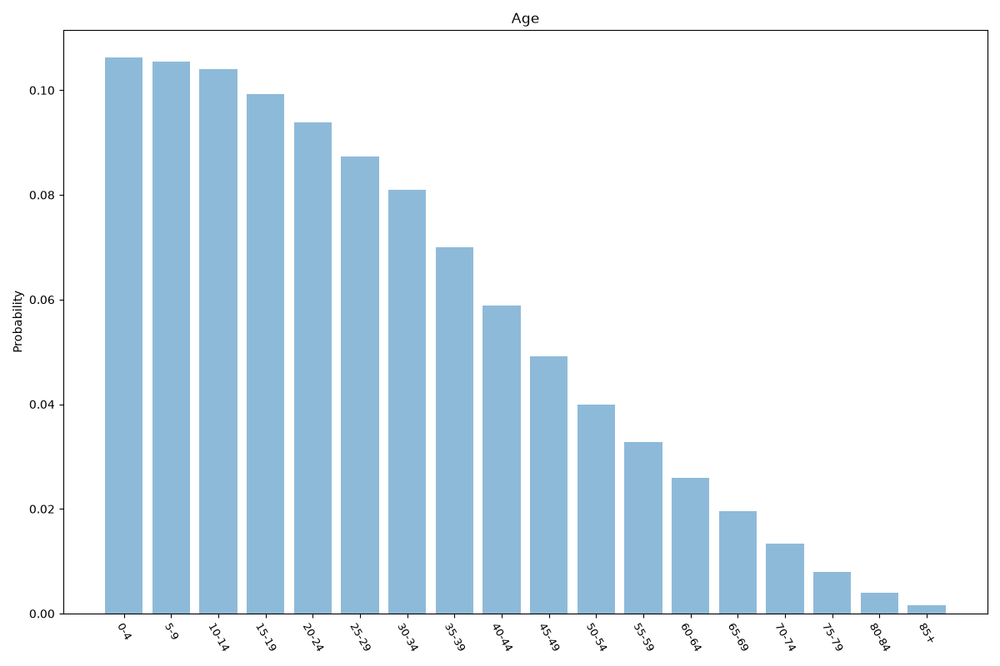
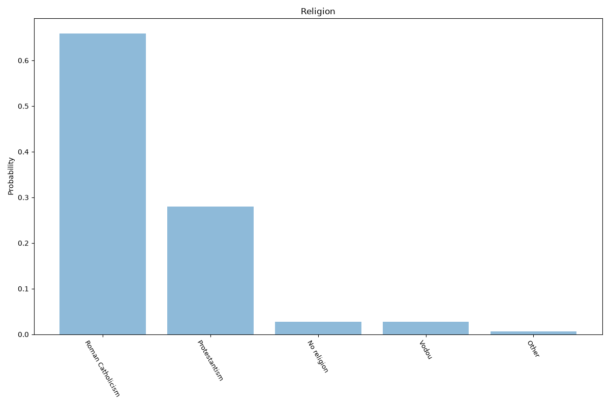
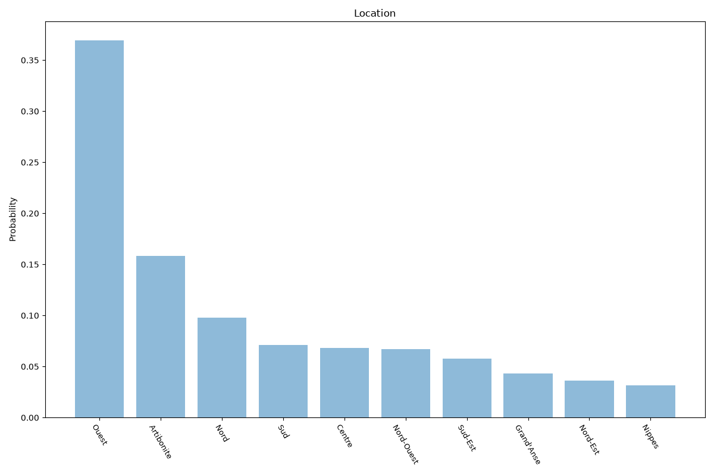

# Haiti
**4 features:** age, sex, religion and location.

## Age

## Sex

## Religion

## Location

## Sources

- [World Population Prospects 2024, United Nations (2024)](https://population.un.org/wpp/) — age, sex
- [World Religions Database (2020)](https://www.worldreligiondatabase.org/) — religion
- [Population estimates 2015, Institut Haïtien de Statistique et d'Informatique (IHSI) (2015)](https://www.ihsi.gouv.ht/) — location