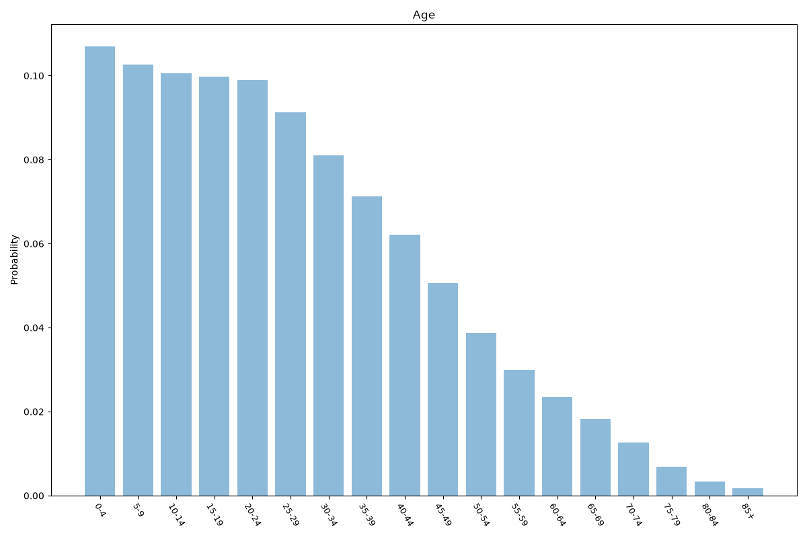
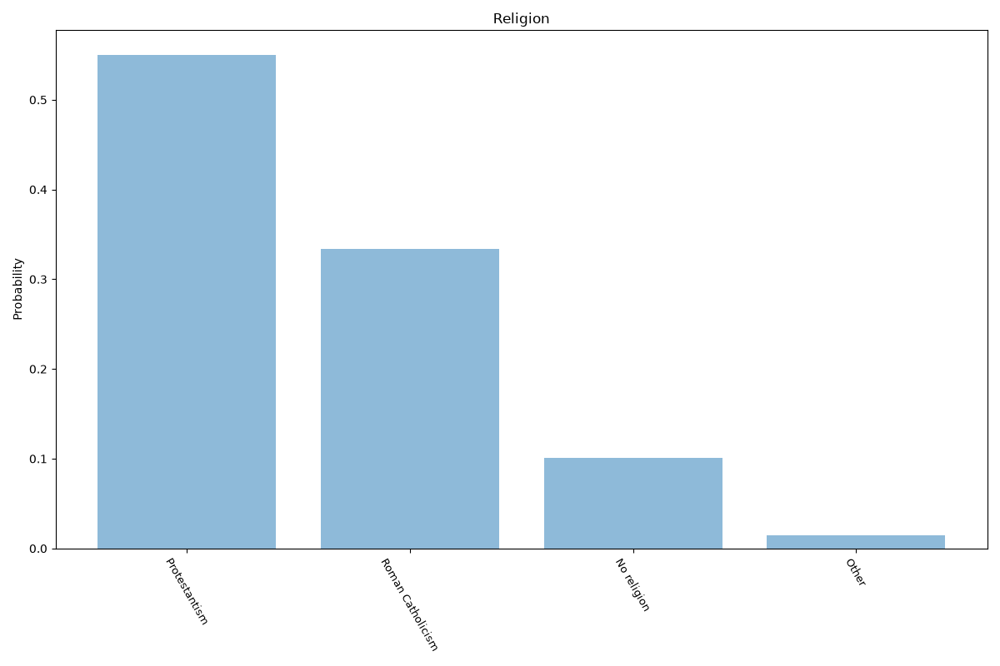
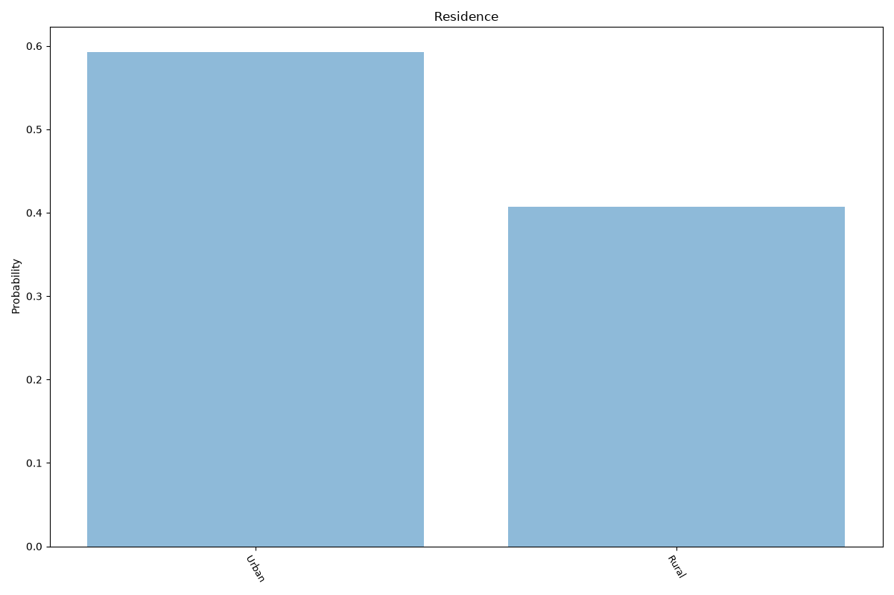
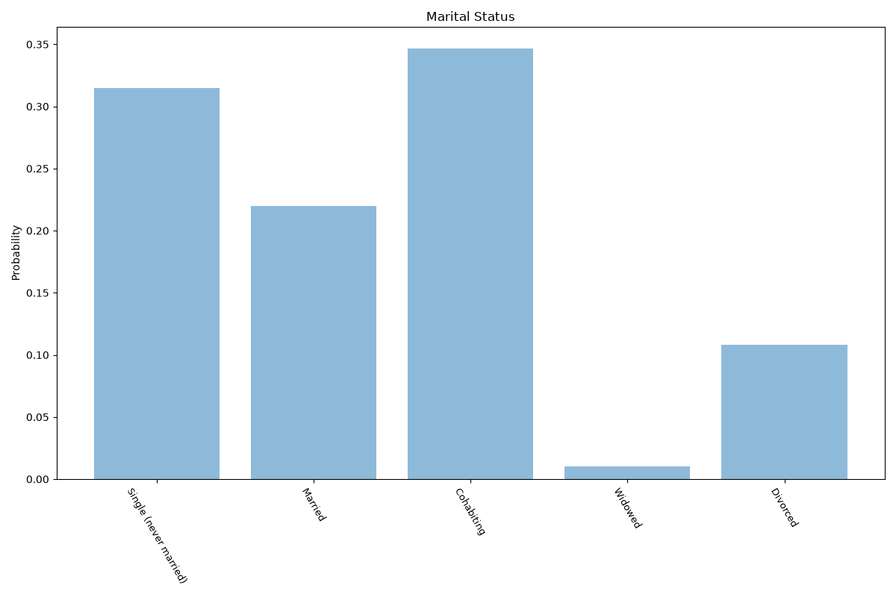
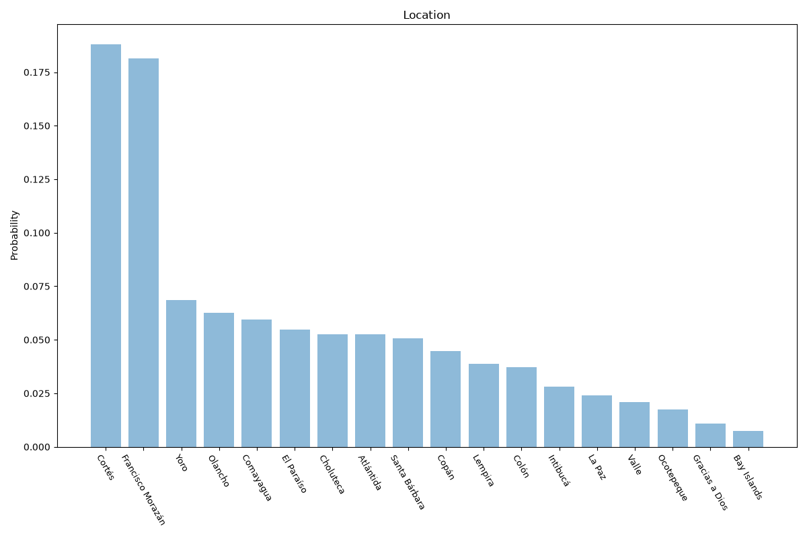

# Honduras
**6 features:** age, sex, religion, residence, marital status and location.

## Age

## Sex

## Religion

## Residence

## Marital Status

## Location

## Sources

- [World Population Prospects 2024, United Nations (2024)](https://population.un.org/wpp/) — age, sex
- [The World Factbook: Honduras (religion), CIA (2023)](https://www.cia.gov/the-world-factbook/countries/honduras/) — religion
- [2013 Census, Instituto Nacional de Estadística (INE Honduras) (2013)](https://www.ine.gob.hn/) — location
- [Urban population (% of total population), World Bank (2025)](https://data.worldbank.org/indicator/SP.URB.TOTL.IN.ZS) — residence
- [World Marriage Data 2019, United Nations (2011)](https://www.un.org/development/desa/pd/data/world-marriage-data) — marital status